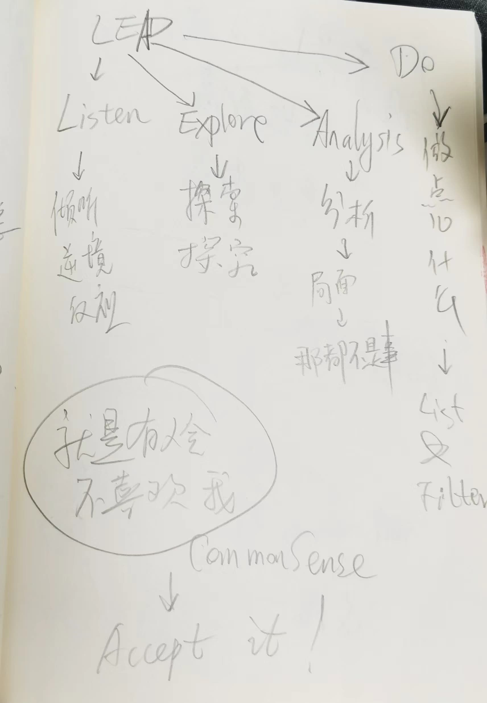

% 学习笔记：LEAD框架
% 王福强
% 2024-09-30

前天学到一个新的概念（对，就是花了银子买的课程里讲的某个内容）， 也就是标题上的这个LEAD框架。 当然，这肯定是个缩写，否则不就成了领导力框架了嘛， 其实它是一个应对处境的心理学层面的思维框架。

LEAD四个字母分别对应是：

- L：Listen，即倾听
- E：Explore，即探索，探究
- A：Analysis，即分析
- D：Do，即做点儿什么

这个LEAD框架可以帮你在人生低谷的时候，重新梳理自己的思维和心态，尤其是，倾听（L）自己在逆境中的反应，并探索和探究（E）当前处境中的因素，比如，哪些因素是因为自己导致的，哪些因素不是，哪些地方自己可以做的更好，哪些问题和损失自己应该担责，等等， 之后，就可以考虑分析（A）这种处境会持续多长时间，对自己的影响有多少是可以控制的，有多少是自己不可控的，有了这个分析之后，就可以考虑做点儿什么（D）来尝试做出改变。

当然，在你状态很好的时候，这些东西其实都是很枯燥的框架概念，估计等你真的遇到某种逆境的时候（别觉得我是诅咒你，人多少都会遇到些许逆境的时候，要不谈什么至暗时刻？），这些枯燥的概念就会变得具象了。 当然，希望你永远不需要真的在那种境遇下来使用这种心理框架。

不是心理学家，所以，没啥深入的研究和探查，只是看到笔记里的这个概念，尝试重塑下内容，对你有帮助更好。

