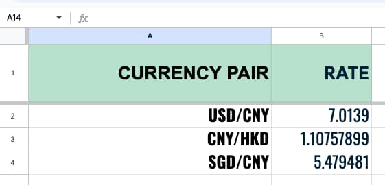

% Google Sheet里几个有趣的Google函数
% 王福强
% 2024-09-30

至于函数怎么用，大家应该都比较清楚了吧？ 就是在Cell（单元格）里用`=`开头输入函数名。

## GOOGLEFINANCE

`=GOOGLEFINANCE("CURRENCY:USDCNY")` => 单元格里填充美元与人名币汇率

可以指定刷新间隔，不指定也会按照默认值定时刷新。 

把自己关心的货币对都放到一个Google Sheet里就有了一个你自己的汇率大盘。



## GOOGLETRASLATE

`=GOOGLETRANSLATE("Dead in the water","en", "zh")` => 用目标文本翻译后的结果填充单元格

- 第一个参数是要翻译的文本
- 第二个参数是要翻译的文本的语言
- 第三个参数是要翻译成目标文本的语言


## IMAGE

`=IMAGE("https://afoo.me/.../92.png")` => 从目标地址拉取图像填充当前目标单元格

IMAGE函数一共有4个参数，后面三个参数都是可选的。

尤其是，第二个参数，表示填充模式(mode)，一种有四种：

 ```
mode - [ OPTIONAL - 1 by default ] - The sizing mode for the image

1 resizes the image to fit inside the cell, maintaining aspect ratio.

2 stretches or compresses the image to fit inside the cell, ignoring aspect ratio.

3 leaves the image at original size, which may cause cropping.

4 allows the specification of a custom size.

Note that no mode causes the cell to be resized to fit the image.
 ```

默认是1，也就是按照比例缩放以满足单元格要求，2是变形满足单元格（但不遵循原有比例）， 3是保持图像原比例，但参考单元格的高度或者宽度，图像有可能会被裁剪。 4则是指定明确的宽和高，这个4模式一般跟IMAGE函数的第三个和第四个参数一起使用，比如：`=IMAGE("https://afoo.me/.../92.png", 4, 400, 400)`

不过，所有mode里没有一个是用来指定说，让单元格自动调整来适配图像的。 

参考文档： [https://support.google.com/docs/answer/3093333?sjid=17730544343245977538-AP](https://support.google.com/docs/answer/3093333?sjid=17730544343245977538-AP)


