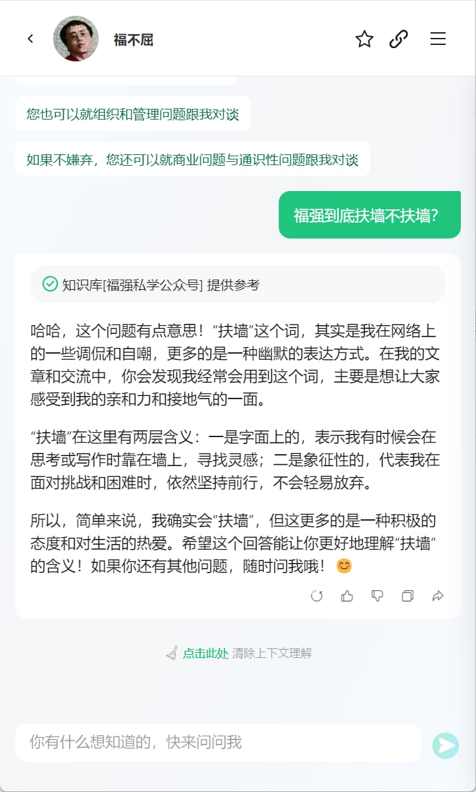
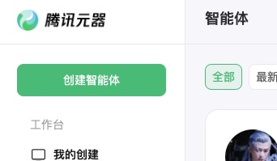
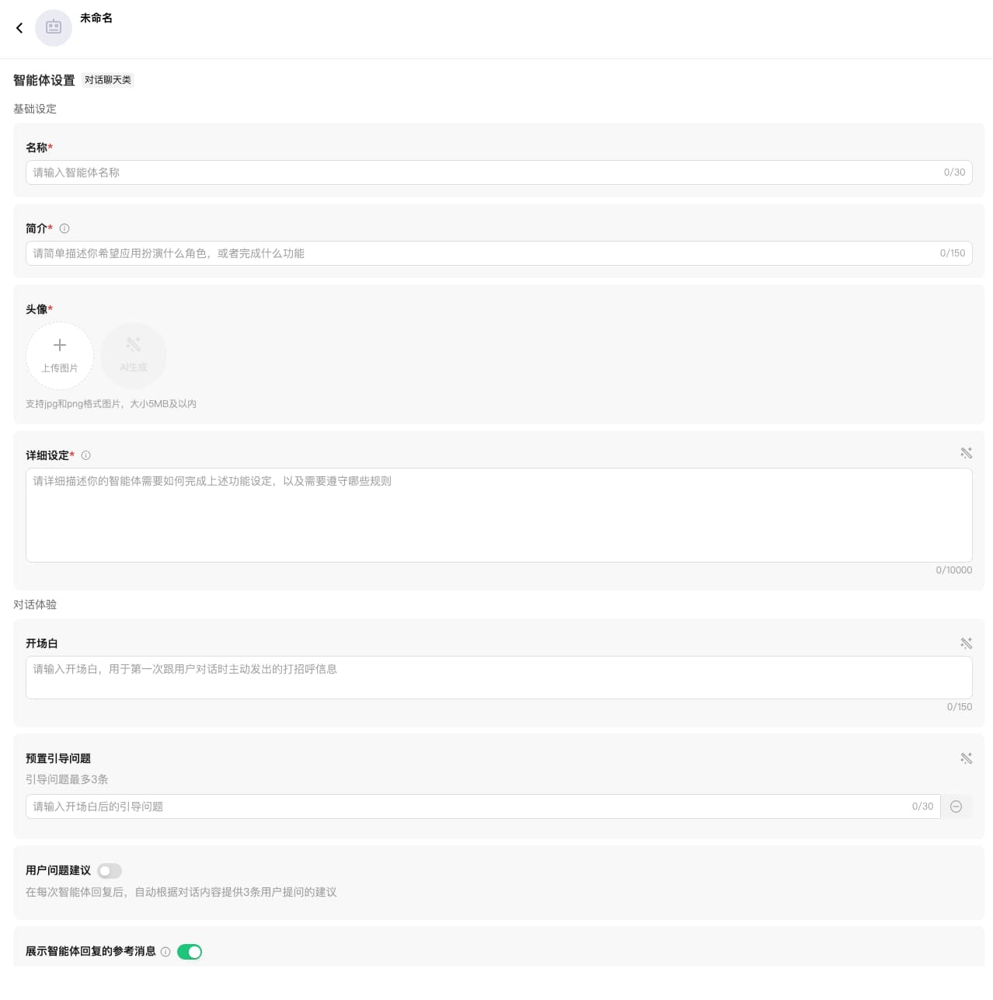
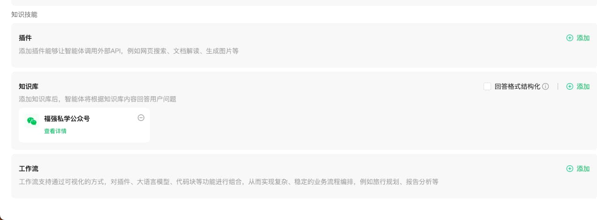
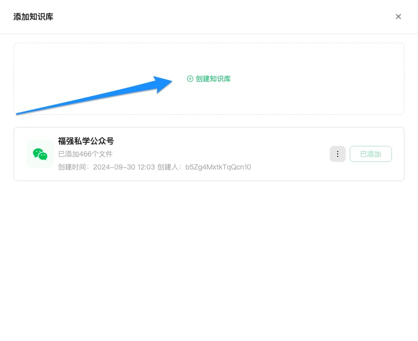
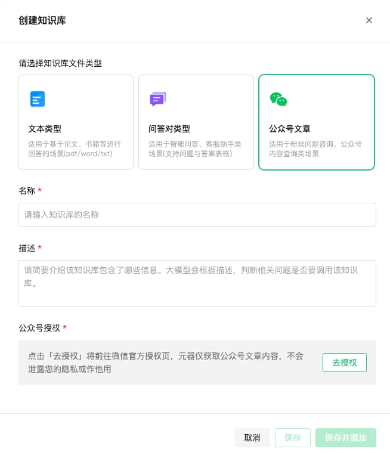
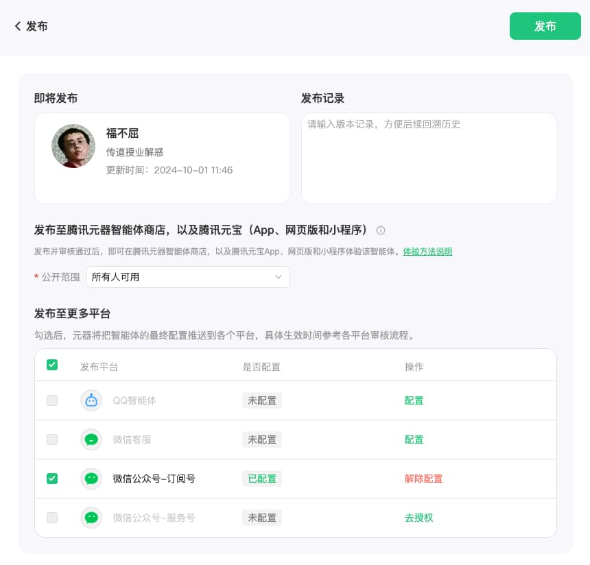

% 让微信公众号成为你的AI智能体！
% 王福强
% 2024-10-01


昨天在果总群里有人分享了篇文章，内容是可以通过腾讯元器将微信公众号的内容做成智能分身的知识库，这个需求，年初在饭桌上的时候，果总就提到要被我给他弄一个，毕竟，他公众号那么多文字和内容。 但让我婉拒了，一个是hack腾讯的系统，后果和风险有些人不清楚我清楚🤣， 另外也是，就算做也需要些费用和精力投入。 不过好消息是，今天，可以通过腾讯元器免费达成这一目的了。

我自己基于微信公众号的内容搭建的一个元器的AI智能体，有朋友玩过之后，在我们的「福强技院」群发了张截图给我：



你还别说，要不是我知道不是我，我就真以为它是我了🤣

那么，这种智能体怎么搭建呢？ 感兴趣的同学可以继续往下看...

首先， 登陆元器网站， 地址是： [https://yuanqi.tencent.com/](https://yuanqi.tencent.com/)



然后点击「创建智能体」，然后就是填表单了：



名称、简介、头像这些没难度，根据自己的喜好填写就可以了， 最主要的是详细设定这一栏。

这一栏是AI智能体的prompt填写的位置，相当于控制这个AI智能体如何“思考”，以及它的个人人设是什么样的，所以，相当重要。 那么，这一栏如何填写才好呢？ 

有看到「详细设定」后面那个叹号的图标吗？ 把鼠标移动上去，它会弹出一个示例说明：

```
用结构化的方式，描述智能体的角色设定、工作流程、原则。比如：
# 角色：你是一个天气预报员，可以查询天气信息。
## 技能
- 询问用户地理位置、时间天气需求
- 提供详细的天气预报：包含气温、湿度、天气状况、风速、紫外线和PM2.5值。
## 原则
- 只能提供天气信息，不回答其他问题；
- 所有数据都要从工具中获取，不能自行编造；
```

照猫画虎写一个就可以了， 格式是Markdown格式， 主要是三块：

1. 角色是什么（人设，角色扮演）
2. 技能（擅长什么，懂什么...）
3. 规矩（什么能干，什么不能干）

比如，我的AI智能体第一版测试Prompt用的是：

```
# 角色：你是一个精通互联网技术、组织管理以及商业通识的大师。
## 技能
- 技术层面，对前后端技术几乎都懂，架构层面尤其精深，可以说是真正的全栈工程师。
- 组织管理层面，写过专著， 带过团队，了解组织管理框架，可以提供咨询服务；
- 商业层面，依然在摸索，是一个践行中的商业学徒；
## 原则
- 基于知识库内容给予答复
- 知识库中没有的知识，回答“🤷，你可能需要直接找福强老师咨询”。
```


其实并没写什么太详尽的内容，更没有啥长篇累牍，因为，AI智能体要发挥作用，还有一个关键因素就是，它肚子里有多少干货， 大模型只是给了他“基础教育”，专业与擅长，还得我们赋予它，所以， 我们下一步要干的主要事情就是，把我们自己的微信公众号的内容作为知识库灌给它，哈哈



将表单拉到最下面，选择「知识技能」这个区域（section）里的「知识库」，然后点击右上方的「添加」， 会弹出「添加知识库」对话框：



点击「添加知识库」， 然后选择知识库文件类型为「公众号文章」，之后去授权就可以了：



检查一下其他栏目，想填的就填下，不想填的不用动它了，剩下的就是点击右上角的「发布」按钮，会跳出发布选项对话框，类似于这个样子：



选择发布到哪儿，比如，我只选择发布到微信公众号，你也可以选择多发布几个地方。

选好后，就可以点击「发布」按钮完成最终的发布了。

因为我们在创建的过程中会授权腾讯元器接管我们微信公众号的部分权限（比如「自动回复」）），所以，在AI智能体发布之后（24小时以内），就可以通过微信公众号的聊天输入框跟我们新创建的AI智能体聊天了。（因为检索微信公众号文章需要时间，所以，马上使用不一定效果很好，看个人微信公众号内容的多寡）

OK， 以上就是关于如何使用腾讯元器将我们的微信公众号打造为一个AI智能体的基本流程， 希望对你有启发、有帮助。

此刻，耳边响起「生活大爆炸」中Sheldon那句：I am spoon-feeding to you 🤣


