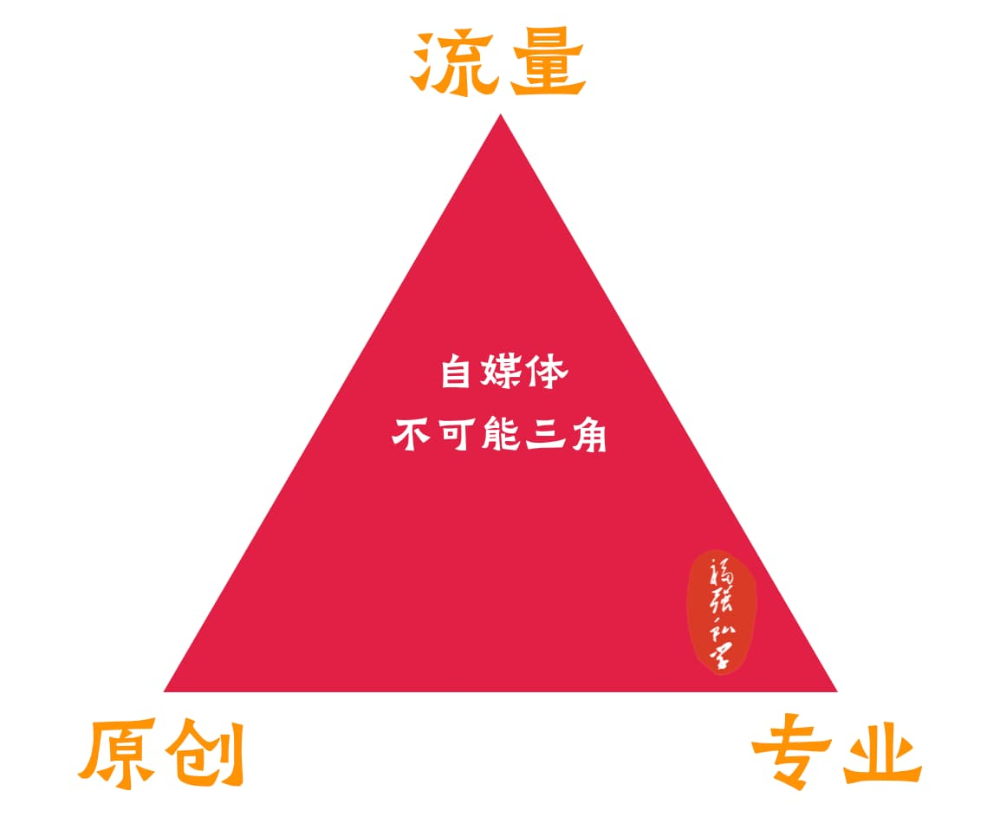

% AB面
% 王福强
% 2024-10-08

任何事物都有其两面性，彼之蜜糖，汝之砒霜，只知一起不知其二，那你只看到了镜子的一面。

# 数据与人性

搞科研讲究数据与事实， 但数据对于很多人来说又是冰冷的，所以，有人就会尝试把冰冷的数据转化下，让其可以迎合有温度的人性。

> “把冰冷的科学数据，转换成有温度的人性“

就像拟人化这东西，在讲故事的人手里是利器，在搞科研的人手里就是垃圾。🤣

# 有毒的逻辑 与 随机漫步的傻瓜

这两天读的两本书挺有意思，一个是《随机漫步的傻瓜》，一个是《有毒的逻辑》，都是比较老的经典书籍，但我确实一直拖着没看，看过之后才发现，这俩货居然也像是一面镜子的两面一样，一个在讲概率和认知，一个在讲怎么避免有毒的人性逻辑， 不过，对于后者来说，我倒是更觉得它在讲的是善于利用人性的人背后用了什么逻辑，比如...

# 超爽短剧 与 专业内容

超爽短剧就是把有毒的逻辑具像化的最好例证，你觉得有毒没关系，用户觉得爽就行呗，你站在边上干瞪眼，我赚得可是盆满钵满 🤣

独立思考与专业内容虽好，但也是少数人觉得好， 毕竟，自媒体不可能三角里，你要么要流量，要么要专业，都想要？ no way！

# 韭菜 与 菠菜

2024年国庆节前后的狂欢，有人看到的是韭菜，有人看到的是菠菜，有人趁风气赚钱，有人看风力避之不及， 都是各自的选择。 一切皆由命，万般不由人，有人选择顺势，有人选择逆行。

# 免费 与 付费

有人就是相信并且喜欢免费里淘金子，有人就乐意花钱买个直接（比如入手[「福强私学」](https://afoo.me/kb.html)的同学），也是各自的选择， 你觉得对的，有人觉得错，自己乐意就好。 

