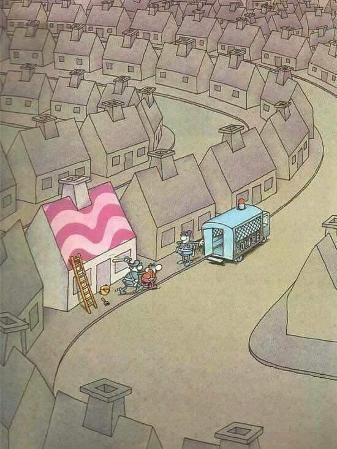

% 《素食者》凭什么赢得2024年的诺贝尔文学奖？
% 王福强
% 2024-10-14

## 引子

其实，我没想看的。

但昨天群里有人说看不懂，倒是多少激起了我的某种（煞笔式）胜负欲，“小说能有多难理解？”，所以，今天就把2024年诺贝尔文学奖得主韩江的这篇《素食者》给看完了，其实一共三篇，读完《素食者》之后本来就想打住不读了，因为没那么难理解，无非就是讲述一个被压迫惯了不想被再束缚的女性的挣扎。 但因为鬼使神差地看了第二篇的开头，隐约猜到这三篇里的人物其实都跟女主英惠身边的人有关，而且第一篇里也都出现过，所以，这三篇应该是一个整体， 只不过通过不同人的视角来讲述同一个故事，所以，我就盯着眼睛有可能要瞎的风险，读完了整个内容，你还别说，整个读完，确实比单独读第一篇要更有味道。

其实整个读下来还是挺压抑的，嗯，就是**压抑**。 

所以，不想“自讨苦吃”的同学不建议读。

下面是自己读完的一些观点，感兴趣倒是可以看看...

## “人这个动物，不是个好东西”

我有个群友叫阿朱，当然，不是真名，真姓吕，原用友研究院院长， 他曾经说过一句话（我还帮他整理了个[语录](https://afoo.me/azhu.html)），就是：

> 人这个动物，不是个好东西

《素食者》里所有的人，反映的其实就是这句话所描述的东西。

一个就是系统性的迫害，这种系统性迫害从社会系统到家庭成员，无处不在， 原本只想清静做自己的一个女子，却被这种系统性迫害搞得想死死不了、想活活不好。 

比如从小就在家庭里被他爹“迫害”， 结婚了被丈夫冷漠， 突破世俗后被她姐和精神病院“合谋”迫害， 总之，就是一个字，惨😭

所以，“人这个动物，不是个好东西”

还有就是很多女人嘴里的，“你们男人都不是什么好东西”， 起码，这个文学内容里，男的确实没几个好东西，作者把多个男人心底的隐秘想法直接揭了，不过，话说回来了，又何止是男人？ 所有人都心里都是都很隐秘，悄悄地藏着自己的不堪与肮脏，因为高尚不需要藏，善良也是。

所以，“人这个动物，不是个好东西”

其实，这个世界是不能用某种平等的视角去看的，否则，你根本没法活，光心理负担都把你给压死。 所以，弱肉强食就弱肉强食吧，都是给自己找点儿心理安慰和借口罢了。 你啥动物做吃食，可以给自己找理由，当你被外星人做吃食的时候，你是不是得反过来骂外星人不是东西了？ 哈哈哈哈，双标狗，到处有。

所以，“人这个动物，不是个好东西”

其实，如果非要给英惠扣个精神病的帽子，不如扣成“厌人症”，她宁愿做一棵树，因为...

## 习得性无助

巴普洛夫的狗这个实验大家应该都多少听说过吧？ 当巴普洛夫把狗锁进笼子，并用电棍无规律、无理由地点击它很长时间之后，即使笼子开着，它也不会跑出去了，因为它“认命”了（现在好像叫“躺平”），这种状态就叫“习得性无助”。 

其实人也一样，当个体与迫害方力量相差很悬殊的情况下，大多会呈现出习得性无助的特征。

英惠其实应该也是进入了这种状态，尤其是当她请求她姐姐接她出去，而她姐姐因为自己的私心不想接她出去的时候，她就彻底死心了，因为唯一的希望灭了。

至于说她姐姐背负各种道德枷锁，无助到想抛弃孩子却还有负疚感，其实也是一种习得性无助，想要改变，却又无可奈何，终至麻木。

其实，很多人心里比什么都明白，但却就是无力改变，所以只能习得性无助。 

不记得哪里看到过一句话：

> 当生存环境足够恶劣的时候，动物就会停止繁衍，并开始迁徙。

但是，当你迁徙都不能到时候，又会如何？ 

## 遇贼掏枪，遇佛烧香

我倒觉得，不要学英惠，虽然她的苦我们无法感同身受，但把自己的命运寄托在他人身上（即使是家人），还是不要的好。

人和人其实是很难互相理解甚至感同身受的，当有人还在心情雀跃地期盼惊喜的时候，另一个人可能恰好心在地狱。

所以，自己的舵还是得自己掌， “遇贼掏枪，遇佛烧香”， 有人侵犯了自己的利益，就得亮出獠牙，不服就干呗，观念想要改变，有些时候也是比登天还难：

跟懂道理的讲道理，跟不讲道理的拔剑就好了，秀才遇到兵为啥有理说不清？人家不跟你讲理啊，不服就干，干不过就认怂或者玩阴的，嘟嘟囔囔肯定不解决问题 😈

