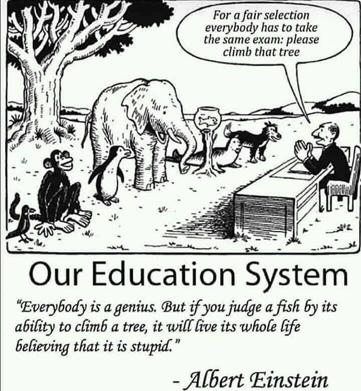
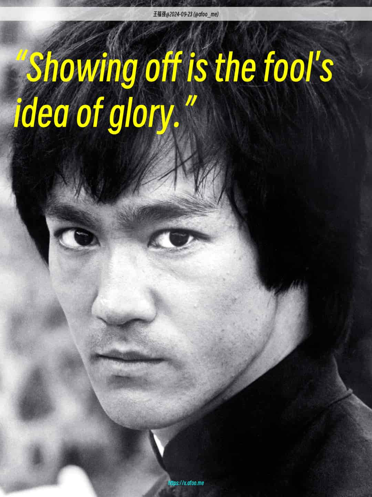

% 为什么学历越高的人越难取得商业上的成功？
% 王福强
% 2024-10-16

其实原来的话题是「为什么学历越高越难成功？」， 我给加了个定语「商业上」的成功，因为学历高不高跟商业上成不成功没有必然关系，就跟头发多少跟对方是不是一个厉害的程序员也没半毛钱关系一样。

把这两个因素非要强拉硬扯到一起来做对比，显然要么自己脑子不清亮，要么为了流量制造低智话题（更多是后者，我估计）。

其实，学历高的也有商业上成功的，学历低的也有， 甚至于学历高的确实有商业上不成功的，学历低的也有，它只是这两个因素画出来的坐标系里的四个象限分布而已，但这个象限分布其实没有任何意义，唯一的意义就是制造话题和流量。

实际上，学历更多偏治学的路线， 商业上成功与否更多偏营商路线，二者没啥可比性，比如，你把诺贝尔文学奖得主跟一个企业主放一起比，怎么比？ 文学成就上显然前者更成功，口袋里的钱肯定后者多些（也可能是负得更多）。

这个问题只是把不同人放到一个标准下做对比突出自己的优越性而已， 但这个世界上的人其实原本就有不一样的追求。

 **不同人群，不同话语体系，不同思维模式，不同利益诉求。**

不同才是常态。

人的成功其实个人觉得就三个因素（非要弄成两个也可以，因为有一个确实可以算是derived衍生变量）：

1. 个人特质（gift）
2. 比较优势（advantages， 也就是derived variable）
3. 概率（运气）

个人特质是“命”，是定数， 但你投入到哪里决定你在哪里的比较优势如何，加上概率因素，就是“运”的成分，是变数。 这两个加起来决定了你在哪里回成功，如果都要以商业上的成功为唯一标准，那么只有猴子是唯一的霸主。

恨人有，笑人无， 其实也是因为这套价值衡量体系的单一性衍生出来的。

其实，商业上的成功也是分代际的，比如国内冯仑那批人，有高学历的，也有低学历的，但低学历的应该相对多些，但新一代的企业家，高学历的就比较多了。 

但这并不意味着是因为高学历多了才企业成功，而是任何时代都有成功企业，至于成功企业的掌舵人是什么属性标签（比如学历），很多时候不是关键因素。

所以，*这个问题本身就有问题，仅此而已*，稍微读读我的[《深度思考揭秘》](https://afoo.me/books.html)也不至于这么“嗔”（完了，我也showoff了🤣）

