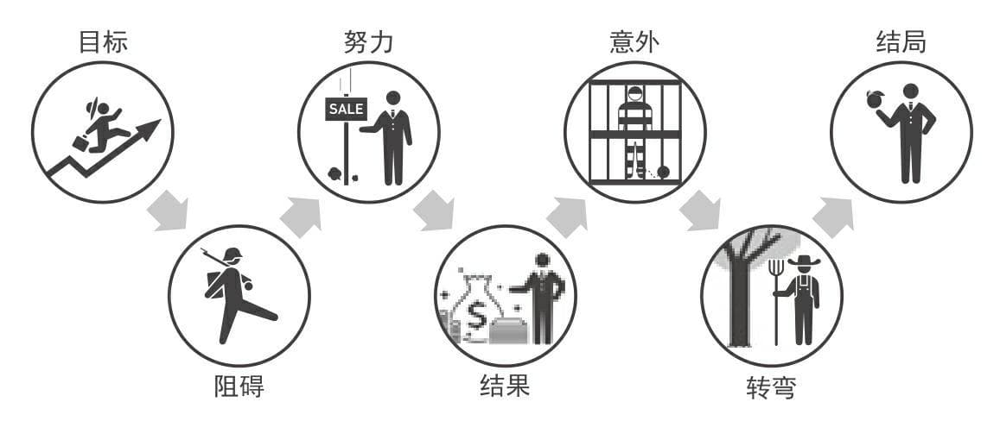
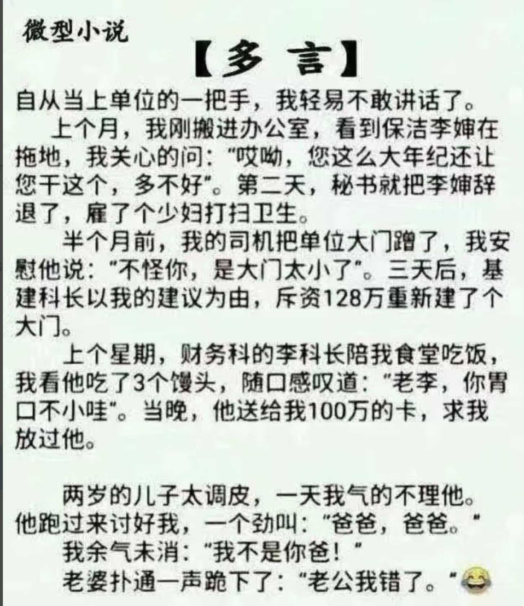

% 努力跟意外，一个都不能少！
% 王福强
% 2024-10-18

早上看到一篇文章，提到某个团队怎么快速在5个月时间内上线APP并开展业务（当然，肯定是家很大的企业）， 具体内容没看，这个话题触动我想写点儿什么的点是这样的...

前阵子看了本讲故事的书（也就是怎么搞故事创作，毕竟，大家都喜欢听故事嘛）， 里面提到了一个七步法，也就是：

1. 目标
2. 阻碍
3. 努力
4. 结果
5. 意外
6. 转弯
7. 结局

然后如果觉得这七步法创作故事还是复杂，那么，可以进一步把这个七步拆解为两个四步法，即：

1. 目标
2. 阻碍
3. 努力
4. 结果

和

1. 目标
5. 意外
6. 转弯
7. 结局

而这两个四步法呈现出来的故事形态分别就是“努力人”模式和“意外人”模式， 什么意思？

“努力人”模式的故事很简单，就是单线的努力，故事的精彩程度跟阻碍的大小有正相关，比如：

`出身寒微，不是耻辱。能屈能伸，方为丈夫。`的邓艾，自身经历就是一个“努力人”模式的好故事，出身寒微要出人头地（目标），但前面氏族林立，机会有限（阻碍），但还是通过自己的战功（攻蜀）和努力，在历史和当时的朝堂取得一定程度的功名。 

然后要想进一步强化努力人模式的故事的感染力，那就提高阻碍的难度，或者提高最终结果的成就。 比如，把邓艾换成朱元璋，那努力人的故事就更上一层了，家里穷的屁都没有了，亲人去世找块地皮安葬都没有，连活下去都那么卑微，但通过自身努力，竟然当了皇帝，这个努力人模式的故事是不是又不一样了？🤣

“意外人”模式是什么？ 

就是各种反转和意外呀，或者说惊喜，主打就是一个意想不到。

比如，开始追寻目标A（登喜马拉雅），但阴差阳错，被判亲离，跌入人生低谷，然后突然遇到一个美女或者贵人，就找到真爱或者事业有成了。其实最初目标不是目的，最后的结局才是🤣

现在国内很多爽剧脚本其实都是主打一个“意外人”模式，没有逻辑，只有惊喜。🤣

其实，努力人和意外人就像是一个人从基层努力工作，到某个转折点，换一个人生活法一样，它不一定就是孤立的，把两种模式组合起来可能才是更精彩的故事。

至于开头的5个月上线，其实，那么大的公司和团队，养一个专业团队，这个专业团队日常的一个主要职能就是通过努力提高效率，有仗要打的时候，才会不掉链子，这是很正常的努力人模式。 你要是掉链子，那就是另一个故事了🤣

其实就是熟练工，但是熟练工到一定程度之后要转型或者转行，这就是意外，而意外往往不可避免，就跟圣诞节火鸡一样

