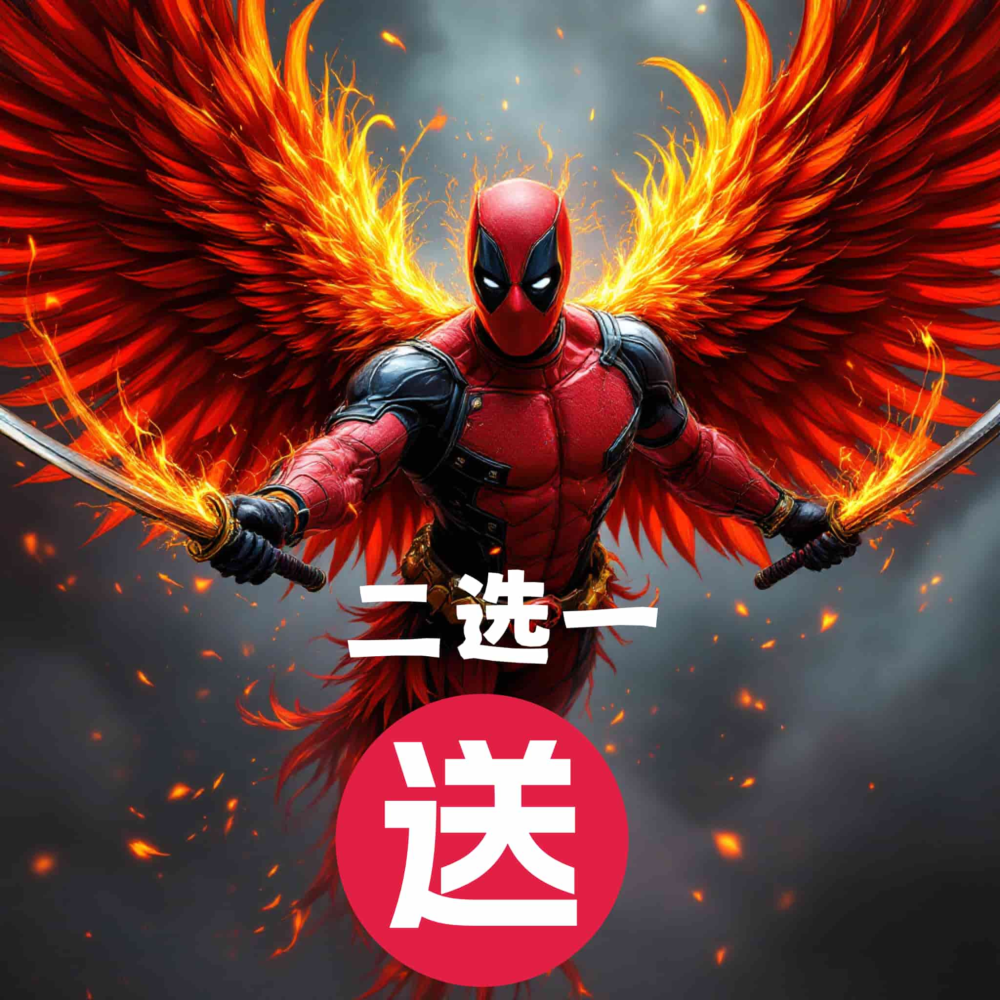
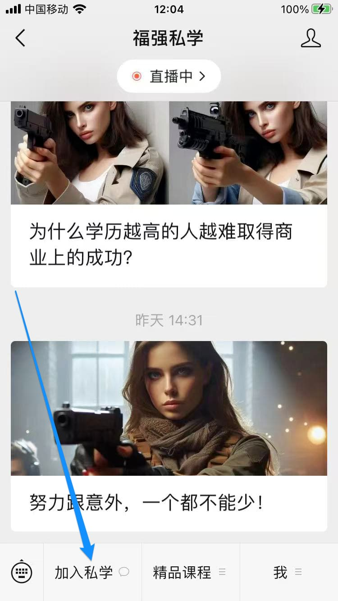

% 福强私学双十一活动： 二选一送！
% 王福强
% 2024-10-19

从即日起到2024年11月11日24时止， 「福强私学」开展双十一活动。 

## 活动简报

无折扣，但**二选一送**

无折扣是因为尊重之前原价付费的同学，而且产品价值持续增加，也不适合采用降价促销的方式做活动 😊

**送**的产品有两个，但只能二选一：

1. 小报童上的「AI通识课」
2. Simple Svelte （纯英文）

## 送

购买之后会有邮件通知，加福强微信说明想要送的权益，直接微信交付。

在您下单购买之后也可以通过邮件说明，后续也会以邮件的形式通知您领取兑换码或者直接邮件里说明交付方式。

### 送 小报童

小报童上的「AI通识课」将带您领略AI之路上的实际风景，直达AI产品与技术的本质，帮您屏蔽AI恐慌，只享受AI带来的惊喜与便利。

「AI通识课」只能送出 **5 个名额，先到先得**。

读者在获得付费兑换码后，可以在小报童微信服务号内，点击菜单「我的」 - 「兑换码」进行兑换。

### 送 [Simple Svelte](https://afoo.me/books.html)

Svelte是继React和Vue之后呼声最高的前端SPA框架， [Simple Svelte](https://afoo.me/books.html)是逼着在上海lockdown期间写的一本纯英文技术书，相对系统及结构化的形式介绍了Svelte这个框架，对于想要了解Svelte框架的同学，Simple Svelte会是一个很好的开始，既习得了新技能，还同时巩固了自己的英语阅读能力，一举三得 😉

## 活动范围

「福强私学」终身权益享受此次活动权益，年度订阅不在此次活动之列。 

## 下单

### 「福强私学」微信公众号下单

如果没有还没有关注「福强私学」微信公众号的同学，可以先通过搜索「福强私学」微信公众号并点击关注，或者直接扫描下方二维码关注：

之后，像下图所示点击菜单「加入私学」，根据链接指引操作就可以完成下单：

### afoo.me 网站下单

也可以直接访问 [https://afoo.me/kb](https://afoo.me/kb) 根据页面指引下单即可。

### 微信小程序下单

更可以在微信小程序搜「小福强」， 点击首页「福强私学」入口完成下单。

