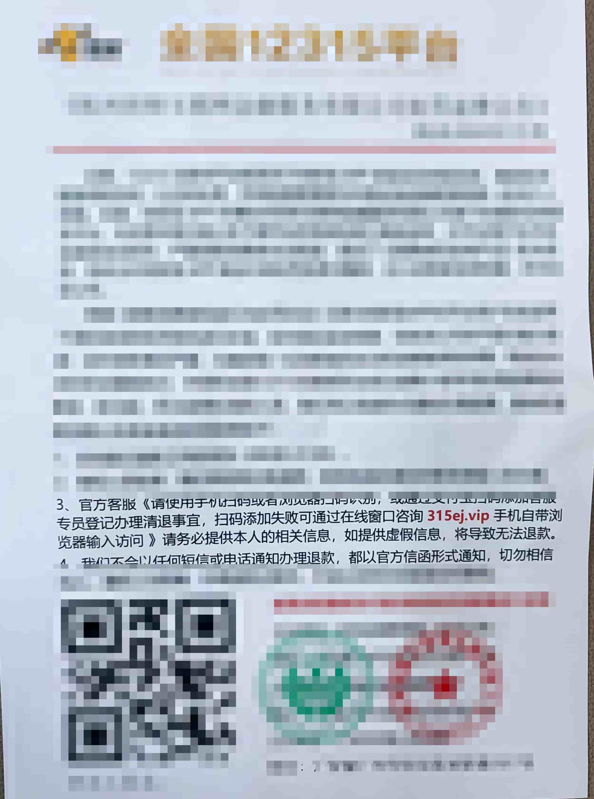

% 我都无语了...
% 王福强
% 2024-10-28

拜托，带点儿脑子好不好？

今天在某财的离职群里，又有人发几乎同一张诈骗通知的照片，我tmd都在这个群里看到这同一件事的三个版本了吧？

每个版本感觉好像就换了个域名，比如这张：

你要说一个人问也就罢了，这tmd居然三四次都在一个群里问，而且是不同的人在同一个群里问，“这是不是真的？”，真你妹啊，有点儿常识好不好？ 

政府的域名后缀都是`gov.cn`，这些制造的所谓官方退费处罚公告，给你的联系方式都是什么`.xyz`啦, `.vip`啦之类烂七八糟的域名后缀，一看就假的一逼，你们还一次次的扔群里问是不是真的，我tmd也是醉了。

而且，人家还特意高亮显示，生怕你看不清，为啥？ 降低筛选难度提高筛选“质量”啊！

这种老把戏都玩了几十年了吧？ 早年美国邮寄股票预测，不就是这么回事嘛？

---

比如，第一批开始先投放10000人，分两拨发送，每一拨5000人，第一拨人发送某一批股票推荐：

> 客户您好，我们是某某股票交易私募基金，我们的股票预测100%准确，把钱投给我们，绝对包赚不陪， 收益率200%!
> 
> 为了展示我们的专业性，特推荐您投资如下股票：
> 
> 股票代码：100086
> 股票代码：...

第二拨发送另一批股票推荐：

> 客户您好，我们是某某股票交易私募基金，我们的股票预测100%准确，把钱投给我们，绝对包赚不陪， 收益率200%!
> 
> 为了展示我们的专业性，特推荐您投资如下股票：
> 
> 股票代码：009527
> 股票代码：...

然后，等过了一段时间，根据最新股票涨势情况，剔除上次推荐的股票代码中没涨的那批人，选择上次推荐股票涨了的那拨人，然后5000人再划分成两拨，同样话术再来一遍，发送...

这样，过了一段时间，再选择股票涨了那拨人（现在是2500人）， 可以发送直接逼单的话术邮件，如果觉得还要继续加强信仰（毕竟，这批人已经见识到你两次推荐都涨了，可信度已经至少超了50%），可以再划分两拨，以此类推，总之，只要筛选每次股票涨势都符合发送邮件中的股票推荐那批人就行，只有这批人才是真正对你有信仰的，100万打底？太少了，至少一个小目标吧？

至于收到投资款后怎么办？ 骗子比你知道该怎么办🤣

---

不过话说回来，这些同学有一个好，就是知道在群里问，知道路在鼻子下面。 

但比较搞笑的是，tmd 你们居然还在某财干过，也还好有这么个离职群可以问...

要不说，平常多读书，少看点儿垃圾，心里那块地天天被人种草，都荒了好久了吧？

要不先入手个[「福强私学」](https://afoo.me/kb.html)吧？ 买个终身权益，相当于每天就几分钱，保一辈子啊🤣

