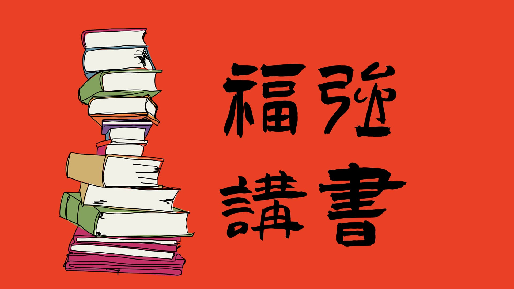

% 最新产品发布：「福强讲书」！
% 王福强
% 2024-11-15

《独裁者手册》这本书昨天看完了， 感触很深...

大家有没有想过：

- 为什么贪官永远不绝？
- 为什么以色列总是能以少胜多？
- 为什么我们出不了一个马斯克？
- 为什么美军每一个士兵的装备至少值20万美元？
- 义务教育的本质是什么？
- 为什么Trump上台后撤了教育部？

所有这些问题，都可以在我们今天要讲的这本书中（或者说在我们针对这本书的解读中）

仿照樊登，借着这本书的契机，开始录制讲书类内容，并决定发布新的内容产品： 「福强讲书」

暂时是测试阶段，所以，没有完整的入口和交付流程。

感兴趣的同学可以通过红包付费，然后，交付给你一个Private List链接（当然，前提是你得先有个油管注册账号）。

测试嘛，就得先最小闭环，如果需求能够支撑这个产品起来，再考虑打造定制化的体验。

讲书类产品的价值在于，

1. 推荐书， 但是推荐书之后你要自己读，你很可能不愿意读， 或者读了之后也只是自己读感悟，获取不到更多内容和启发
2. 丰富书的内容密度，通过讲书，加入跟书相关的更多思考和案例故事，让书的内容密度更高，而不单单是书本身的内容
3. 不愿读，可以听

Anyway，先草草上场，希望能获得大家的喜欢和支持 🤓

