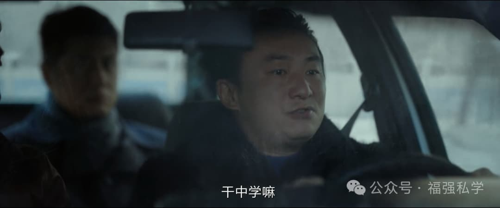

% 《漂白》
% 王福强
% 2025-01-26

## 关键时刻，都是情绪占据理性

看漂白里俩警察非得跑前面截停这操作，只能叹息一声，还是年轻啊 ，不注意工作方法

当然， 不光被货车差点儿撞死的那两位，也包括主人公

## 祸从口出

很多女的，最后死就死在那张嘴上。 

邓立钢和石毕杀的第一个女的，都这种情况...

## 为人父母

甄珍那个妈把傻逼中国式家长演绎的淋漓尽致啊

内外都受打压的孩子，结局能好到哪儿去？

## 专业人士的悲歌

这三老爷们儿好像都是专业人士出身，为啥最后却走上漂白这条路？ 

## 亲亲相隐与义气

黄老琪这个人挺靠谱儿，其实

## 时移势易

陷入弱势，都是纸老虎，无论之前有多嚣张。

