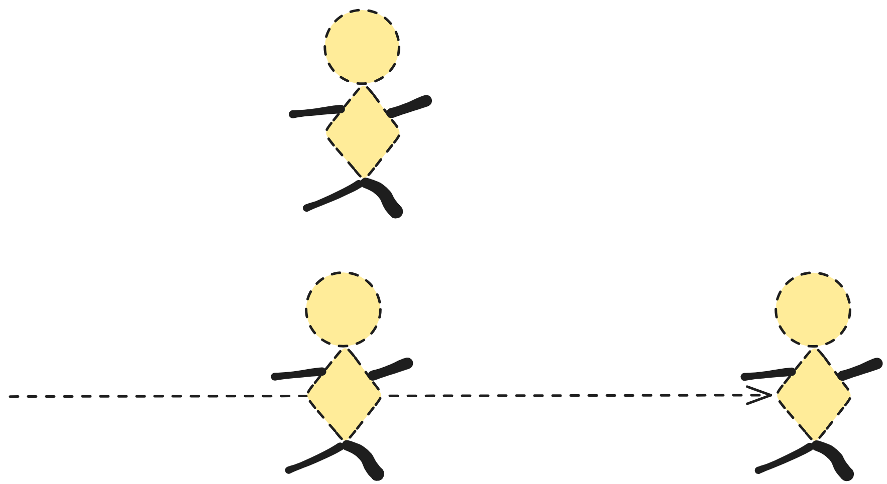

% 哪吒的痛苦
% 王福强
% 2025-02-01

三个人，三种视角

## 阿朱

> 哪吒魔童、黑悟空、大鱼海棠、李白长安三万里，都有一个通用的中国模式：努力奋斗反抗情绪激动-付出奉献牺牲-折翼颓废，都有一种用力过猛的不适感。

## 饺子(哪吒导演)

> 过程虽然是艰苦的痛苦的，但它总有出路。痛苦的过程就在于，不知道什么时候才有灵感，得持续地去经历痛苦。灵感一定会有，但它不知道什么时候来。

## 还在事中挣扎的那个人

我没觉得他可能更大概率会选择隐忍。

假如他想要跟人倾吐，那会让我想起之前看到过的一个段子：

> A失恋了（抑或是投资失败了）， 找他朋友B倾诉，“你说这个世界还会好吗？”， 他这个朋友B回了他一句，“你的世界好不好我不知道，我的世界还行”

其实，痛苦与事儿能不能成或者说会不会收获世俗上的成功，并没有必然的联系。

但事成之后，人往往会把成功归于那个阶段的痛苦，把那些痛苦合理化（Rationalize it）。

## 后话

哪吒之所以口碑好，是因为确实让大多数人看到了自己的影子。

万物之中，希望至美嘛！

假如你处在痛苦挣扎中，那希望确实是一剂良药，但这个药其实也很难说是解药亦或者是慢性毒药。

假如你希望再加点儿药，那么，我可以再送两句：

- **日子有好的时候就有不好的时候，所以，在不好的时候依然要心存希望。**
- **人和人的悲欢并不相通，与其寻求他人的共情，不如“自求”多福。**

最后，给大家拜个年，善龙蛇之变。

