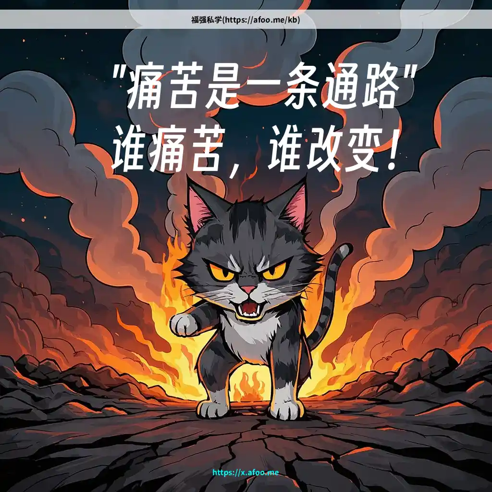

% 关于“孝顺”的三层认知
% 王福强
% 2025-02-04

这个词儿现在在年轻人甚至觉醒了的中年人那里是很恶臭的一个词儿，不过，我倒是想从三个层面谈谈个人对这个词儿的看法...

## 第一层：愚孝

原本是愚孝， 但在第一层的人群里，孝顺是好词儿。

他们不会觉得这个东西是**单向**的道德绑架甚至情绪勒索。

不但在这一层的家庭粒度里是这种关系和认知， 在周边的网状关系里也是，基本属于没有思考，浑然不知，但直觉上其实他们知道自己有利可图。

Anyway，绝大部分人可能还困在这团雾里。

## 第二层：觉醒与厌恶

随着信息流动的加快与多样性，越来越多的人开始意识到“老祖宗”的孝顺文化其实就是散发着恶臭的愚孝，从而**单向**的厌恶和否定。

当然，脱离了某类环境，这类觉醒估计也不难。 😉

只是，觉醒到什么程度，那估计人跟人也不一样，太高层面，就算你觉醒了也改变不了啥。

## 第三层：孝顺的对等

传统的孝顺其实是**单向**的勒索，从来没有问过当事人愿意不愿意，虽然也有古代明白人说：

> 百善孝为先，论心不论迹，论迹贫家无孝子；
> 
> 万恶淫为首，论迹不论心，论心世上少完人。

但依然没有松开那条**单向**的绑架的绳索。

其实，我觉得，孝顺这个词儿得分开看才合理。

- 孝的主体应该是子女，关系的方向是子女到父母，至于有没有心，主动方在子女，这样的关系就比较合理，也没有了过去单向勒索与绑架的意味；
- 顺的主体倒应该是父母，父母不是要子女顺，而是应该主动的顺应子女的天性，假如方向反了，那又成了过去的单向勒索与绑架关系，导致的结果就是，各自都活反了，结局嘛，...

也就是，孝顺更应该是， **孝给老的，顺给小的**，而且后者更重要，因为你要延续不是吗？

所以，顺应小的天性，支撑和托举，才能延续，也只有小的好了，才有能力孝（如果有心的话）。

任何和睦的关系都是**双向**，假如有一方执迷不悟，另一方对自己负责，最简单的做法就是远离。

> 一个人再出色，长期在很差的关系和环境中浸泡，也会变得暗淡无光，神经兮兮，歇斯底里，更何况平平无奇的自己，人要到能托举和滋养你的地方去。 

人是环境的动物，find the right place for yourself.

