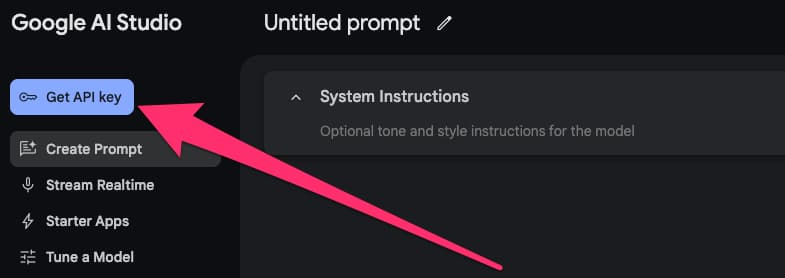

% 50岁程序员教你如何在Java程序中使用Gemini
% 王福强
% 2025-02-15

aka.

- 构建基于Gemini的java ai应用
- Gemini与Java（以及Scala/Kotlin/Clojure/...）
- 构建基于Gemini的java ai应用

转自「福强私学」：[福强AI学堂 之 “使用Java访问Gemini API”](https://kb.afoo.me/ai/102-%E7%A6%8F%E5%BC%BAai%E5%AD%A6%E5%A0%82/gemini/0000-gemini-with-java/)

## 关于Gemini

Google开发的大语言模型序列，包括但不限于：

- Gemini 1.5 
- Gemini 1.5 Pro
- Gemini 2.0 
- Gemini 2.0 Pro
- Gemini 2.0 Thinking
- etc.

主要特点就是超大的上下文窗口（百万tokens），基于Gemini模型的应用也部分支持多模态。

## 如何访问Gemini？

Gemini作为大语言模型，可以通过三种方式访问：

1. <https://gemini.google.com/app>， 这是基于gemini模型构建的gemini专属web应用，通常是模型或者能力成熟之后上线新模型；
2. <https://aistudio.google.com/>， aistudio相当于google的ai模型试验场，很多测试阶段的模型也会放到这里，用户也可以在这里访问和使用gemini模型，当然，aistudio里还可以访问google家的其它AI模型，比如gemma系列AI模型
3. <https://cloud.google.com/vertex-ai>, google cloud的vertex ai也提供gemini模型的访问，不过计费走的是google cloud的体系。

> 以上内容我之前其实在各处都有介绍过。

## 如何在Java程序中访问Gemini API？

为什么要强调Java程序呢？ 

因为python生态已经很成熟了，不需要过多赘述，再一个就是Java/Scala我熟啊，我日常如果写程序或者工具，都是写Scala，所以，我会更多关注如何在Java程序中（Scala/Kotlin同理）使用Gemini构建AI应用。

Google围绕着Gemini打造的JavaSDK有两个：

- Android SDK（基于Kotlin编写的）
- Vertex AI Java SDK

前者只适合在Android程序中使用，后者虽然可以在服务器端程序使用，但必须走Google Cloud的计价体系， 像Spring AI 以及 Langchain4j 这些为Java而生的AI框架，其实底层都是基于Vertex AI的这个Java SDK进行封装的， 所以，它们都是走Google Cloud服务体系，配置和使用的时候自然也都需要先在Google Cloud上新建project，然后才能获得必须的配置参数：

- project id
- location
- api key或者credentials


不过， 我不打算用Vertex AI Java SDK的方式（以及它的衍生方式）， 而是直接使用HTTP + APIKEY的方式访问Gemini API， 因为这个更简单，对我来说灵活度也更大。

这种方式主要基于aistudio， 因为我们可以在aistudio中获取相应的API KEY，之后，通过HTTP REST方式访问gemini就可以了。

我们首先到<https://aistudio.google.com/>，左上角点击「Get API key」按钮获取一个API KEY：



然后，我们就可以通过HTTP来访问gemini了，我使用 [unirest](https://github.com/Kong/unirest-java) 这个http client（你也可以选择自己喜欢的同职能类库），简单封装了一个请求工具类：

```scala
class AIClient(endpoint: String, apiKey: String) {

  def call(request: JsonObject): String = {
    val r = Unirest.post(endpoint).contentType("application/json").header("Authorization", s"Bearer ${apiKey}").body(request.encode()).asString()
    if (r.isSuccess) {
      r.getBody
    } else {
      throw new Exception(UnirestUtils.responseToString(r))
    }
  }

  def buildRequest(modelName:String, systemPrompt:String, userPrompt:String, streamOrNot: Boolean = false) : JsonObject = {
    new JsonObject()
      .put("model", modelName)
      .put("stream", streamOrNot)
      .put("messages", new JsonArray()
        .add(JsonObject.of("role", "system", "content", systemPrompt))
        .add(JsonObject.of("role", "user", "content", userPrompt)))
  }

}
```

之后，就可以使用它来访问gemini了：

```scala
  val chatRequestBody = new JsonObject().put("model", "deepseek-chat").put("stream", false).put("messages", new JsonArray().add(JsonObject.of("role", "system", "content", prepareSystemPrompt(customPrompt))).add(JsonObject.of("role", "user", "content", row)))
  val response = new AIClient(endpointUrl, apiKey).call(chatRequestBody)
  val translatedRow = JsonPath.getString(new JsonObject(response), "$.choices[0].message.content")
```

- 请求内容是JSON形式，我直接封装为了Vertx库的JsonObject（使用Scala的String Interpolation特性虽然可读性更好，但字符转译会很麻烦）, 上面演示的是基于需要自己组装json内容，也可以使用工具类的buildRequest方法构建请求内容。
- 获得HTTP Response之后，我们通过JsonPath根据需要解析和提取需要的信息就可以了，如果愿意，你也可以用你喜欢的JSON库做序列化，封装成一个更为通用的类库。

其中endpointUrl这些参数可以在「Get API key」的时候在对应页面上方获得：

```bash
curl "https://generativelanguage.googleapis.com/v1beta/models/gemini-1.5-flash:generateContent?key=GEMINI_API_KEY" \
-H 'Content-Type: application/json' \
-X POST \
-d '{
  "contents": [{
    "parts":[{"text": "Explain how AI works"}]
    }]
   }'
```

基本上就是这么简单！


