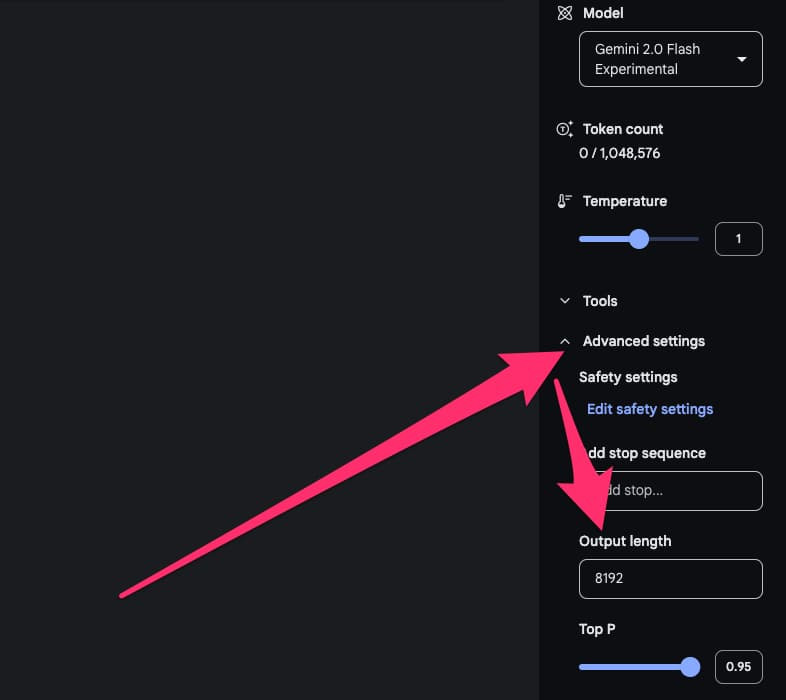
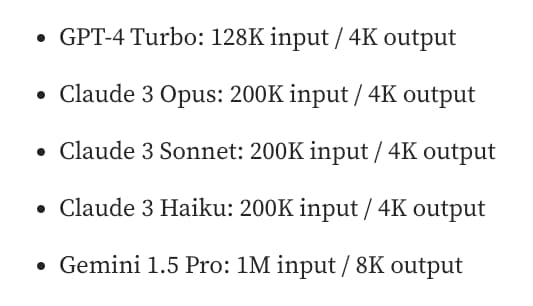

% 大语言模型的输出长度为啥都不长？
% 王福强
% 2025-02-15

aka. Why each LLM models' output length is short or NOT long enough?

其实我也分不清楚这个问题到底是太基础了还是太专业了，问了一圈，朋友圈就有一个AI行业的同学响应，但也只是说了一个特征和视角， 所以，今天彻底自己做了个调研，调研结果分享给大家，希望对大家有启发、又帮助。

为什么我会关心这个问题呢？

因为我在将一个大文件扔给Gemini之后，原本期望它直接返回对应的完整翻译结果给我，结果发现，直接截断...

这个结果直接给我干懵了， Gemini不是声称百万tokens上下文窗口吗？ 这点儿内容明显输入+输出的内容也不够塞满的呀？！

我就查看是不是什么地方设置不对，然后找到了这个配置项（默认折叠状态）：

然后想调高它，发现调高不了，最高就是8192

这tnd咋回事？

先问了朋友圈，响应了了，所以，自己调研吧，自己动手丰衣足食嘛～

调研后发现，你猜怎么着？ 其实大多数市面上流行的大语言模型，他们的输出长度（output length或者叫max_output_tokens）都不长：

不但都不长，而且，输入和输出的tokens数量是有巨大不对称性的。

为啥会出现这样的普遍现象呢？

综合调研结果，可以从产品和技术两个层面进行解读，这两个层面又可以进一步拆分，形成四个维度（当然啦，这几个维度和视角属于我个人总结）：

| 产品  | 技术  | 
|:-------------: |:---------------:|
| cost | 模型语料限制 | 
| timeout | 边界问题 | 

下面让我们展开来详细说下...

## cost（产品层面）

也就是，输出长度（output length或者叫max_output_tokens）有限制，首先是一个成本问题（cost）。

这个成本的概念从供应方和消费者两方面都成立：

- 作为供应一方， 过长的输出长度意味着更多的算力消耗
- 作为消费者，在产品设计层面如果不加输出长度限制，很容易账单超额

输出对应的是内容生成这段过程，生成长度越长，算力消耗越成指数级暴涨，反而输入阶段没有这么夸张。 这有点儿跟传统计算机系统里的读和写的概念， 在传统计算机系统里，读的成本其实不高，尤其加缓存（Cache）之后，写的成本很多时候反而会高，如果你是做技术出身的（但不是做模型和算法的），这样类比，或许更容易理解些吧！

## timeout（产品层面）

如果大模型托管到云上对外提供服务，访问一方肯定不希望长时间的等待，相对短周期的反馈，从产品设计层面来说，对用户体验来说很重要。

而过长的输出，不但需要消耗更多算力，还会拉长响应完整内容的时间。

你也不希望用户原本期盼的秒级响应，变成分钟级等待吧？ （当然，Deep Research类产品除外，他们可以通过异步通知的方式改善产品体验）

所以，设置一个短的输出长度配置，对于改善响应时延（latency）来说，是一个不错的选项，总比API调用超时强吧？

## 模型语料限制（技术层面）

很少模型会针对长输出进行训练，模型也会模仿语料的例子，比如通常语料中的例子多长，它也输出多长。

这就导致说，就算你想输出更长的内容，它的输出窗口也够长，假如模型受限于训练时候用的语料，那么，他就会进入循环输出模式， 这也是朋友圈孟さん提到的现象。

## 边界问题（技术层面）

大语言模型不像人一样可以直观判断什么时候应该停下，所以，设置一个明确的输出长度可以帮助它决定什么时候可以停下。

## 怎么办？

既然限制在这里，那么，遇到需要超过输出长度(output length)的输出内容应该怎么办？

至少有三种方式：

1. 我们可以通过聊天接口跟模型prompt： `go on`或者`continue`， 它们通常就会继续输出，我在aistudio中就是这样完成一个长文件的输出汇总的。
2. 预先对输入的内容进行分段处理（chunk），然后在一段一段的交给大语言模型去处理，后来我把长文件处理逻辑固化之后，就是这样处理的，当时也撂下一句“**大语言模型应用的构建还是需要很多外围的curate**”
3. 但也不是所有输入语料都可以分段处理，因为很多情况下，我们希望大语言模型可以预先整体过一遍，了解整体概况，然后再做具体工作，分段的做法就没法做到这一点，这个时候，我们就可以将多次输出的内容追加到下一次的输入内容后面，然后多次执行就可以了。 这样做的合理之处在于，大语言模型的上下文窗口在输入端通常是没有过多限制的，所以，将每次输出的短内容附加到下一次输入内容后面形成完整上下文，也可以持续多次获得完整输出，最后做个汇总就可以了（merge or join）。

> NOTE
>
> 超长的输入上下文跟相对较短的输出长度，形成了强烈的对比，有时候不禁在想，各个大语言模型厂商都号称“超长上下文窗口”或许更多是为了营销噱头，不做结构拆解，反正也不能说人家不对🤣

## 参考链接

- ttps://www.reddit.com/r/LocalLLaMA/comments/1f3s0qc/why_do_llms_have_output_limit/
- https://medium.com/@techsachin/longwriter-using-llm-agent-based-pipeline-to-scale-llms-output-window-size-to-10-000-words-33210d299e2b
- https://medium.com/@rakesharma21/maximizing-output-in-large-language-models-beyond-token-limits-7931952e664c
- [How to handle responses that don’t fit in the 4096 token maximum output size](https://community.openai.com/t/how-to-handle-responses-that-dont-fit-in-the-4096-token-maximum-output-size/864449)
- [Context Length in LLMs: What Is It and Why It Is Important](https://datanorth.ai/blog/context-length)
- https://www.vellum.ai/llm-parameters/max-tokens // 这个网站不错，有很多LLM参数的解释
- https://www.taivo.ai/__llm-latency-is-linear-in-output-token-count/

