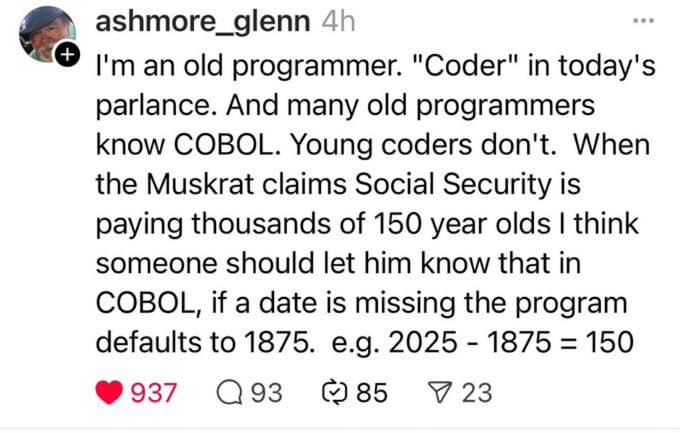

% 马斯克被怼了！
% 王福强
% 2025-02-16

事情的起因是，马斯克的DOGE团队在做美丽国政府数据审计的时候发现，有人150岁了还在领社保金。

但其实这个论断和对数据的解释是有问题的。

有人在X.com上直接针对马斯克的这个论点开喷：

大部分人可能到这里看看热闹就散了， 但福强老师这个犟种感觉背后应该会有更多的故事，所以就又深挖了一下。

挖完发现，背后走向其实还有反转。

首先， 马斯克说有人150多岁了还在领社保金肯定是错的，即2025-1875=150， 但怼马斯克的人说是因为COBOL的程序里因为没有日期和时间类型，所以COBOL用1875作为日期的起始（相当于Java里的1970），这个论断也是错的，COBOL不背这个锅。

COBOL语言虽然古老（我这个老程序员也只是听说而没有接触过），但它的规范里并没有1875作为日期起始的规定。

至于ISO1860应该也管不着那个时候的COBOL， 事实标准先于后立标准。

那这个1875到底怎么来的呢？

从 <https://retrocomputing.stackexchange.com/questions/31288/does-or-did-cobol-default-to-1875-05-20-for-corrupt-or-missing-dates> 这个地方的讨论来看，我觉得有人说的是合理的，也就是：

> There was a time when data structures were made to fit purpose, not compilers.
> ...
> So in a strict sense, it's not a COBOL issue, but data adapted to task.

其实也就是我们今天说的， 把业务逻辑编码到系统中，然后根据业务逻辑设置一个默认值。

1935年美国社保局才成立，配合缴费年限和个人年龄向前推 + 5年的buffer = 1875，所以才设置1875作为日期起始的默认值，我个人比较 buy in 这个逻辑。

至于怼马斯克的兄弟，个人感觉更多是宣泄情绪和炫耀自己的资深， 其实大可不必，既然是年轻的天才程序员，那么完全可以通过咨询和调研综合分析出一个合理的结论。

谁还不是从年轻时候过来的呢？ 😉

