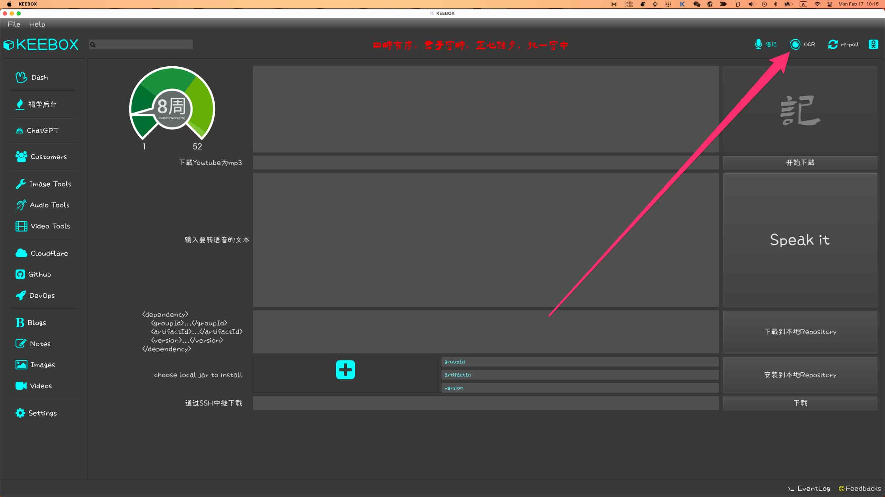

% 不可不知的三个GPT的Magic Moment
% 王福强
% 2025-02-17

## ChatGPT

2023年初ChatGPT刚发布的时候，我就开始欣喜若狂，然后在ChatGPT的加持下，编写了自己的第一个macos原生语言编写的图像识别程序（OCR程序）， 一直使用到现在都很稳定，至今已经两年多了：

之前我是对什么objective-C啦或者swift啦也仅限于知道（毕竟也是曾经的软件研发从业者嘛），但从来没有上手实操过，也没用它们写过什么程序，所以，对它们的语法啦、数据结构啦、基础类库啦，研发周边基础工具和设施啦，可以说是一窍不通。 但就是在这样的背景下，在与ChatGPT的一来一往中，这个OCR程序就那么神奇的诞生了。

KEEBOX只是在产品层面做了个交互友好的集成，点击OCR按钮，直接会从系统剪切板读取图片/图像然后开始识别，一键识别，算是产品层面的创新，但基础能力就是ChatGPT帮助下写的这个OCR程序。

今天，我们都知道了，ChatGPT是这一轮AI热潮的起点，但当时的体验却是那么神奇、那么惊喜🤓

## LlaMa

ChatGPT发布很长时间，国内AI圈都是静悄悄的，传统AI（比如机器学习和深度学习层面的研发和应用）在我们这里已经很成熟了，也成就了杭州滨江区两大监控摄像头上市巨头， 但GPT？ 还得等等...

直到Meta（也就是原来的Facebook）开源了`LlaMa 3.1 405B`(2023年2月24日), 我们就开始沸腾了，“遥遥领先”， “开源模型会越来越落后”

不管怎么说吧，LlaMa模型的开源算是GPT时代的第二个转折点，尤其对于东大的GPT产业来说。

从此，我们开始了繁荣的GPT“千模大战”

## DeepSeek

2025年春节前后， DeepSeek火爆了...

随着DeepSeek R1模型的开源，广大媒体和MaaS厂商春节都不打烊，连日上演DeepSeek春秋大戏。

但DeepSeek其实并不是只在R1发布的时候才开始干的，从幻方搞量化交易到前面V1、V2、V3这些模型的发布，R1也不是凭空出世的，为啥它一发布就火爆了全场呢？

究其原因有三个（个人观点）：

第一个就是老大哥加持，至于怎么加持，咱就不好说了，反正我猜厂商自己应该没怎么砸营销费用；

第二个就是开源之后，直接抢了很大一部分ChatGPT的蛋糕，不光自己抢，很多厂商也可以套上面罩一起抢，所以，大家都疯狂了🤣

第三个嘛，就是相对于国外GPT模型服务的价格， DeepSeek的定价却是更加便宜，更便宜的价格享受ChatGPT高端GPT模型同等能力的服务，不香吗？ 当然香啊，要不怎么会如此癫狂？🤣

一鲸落万物生

