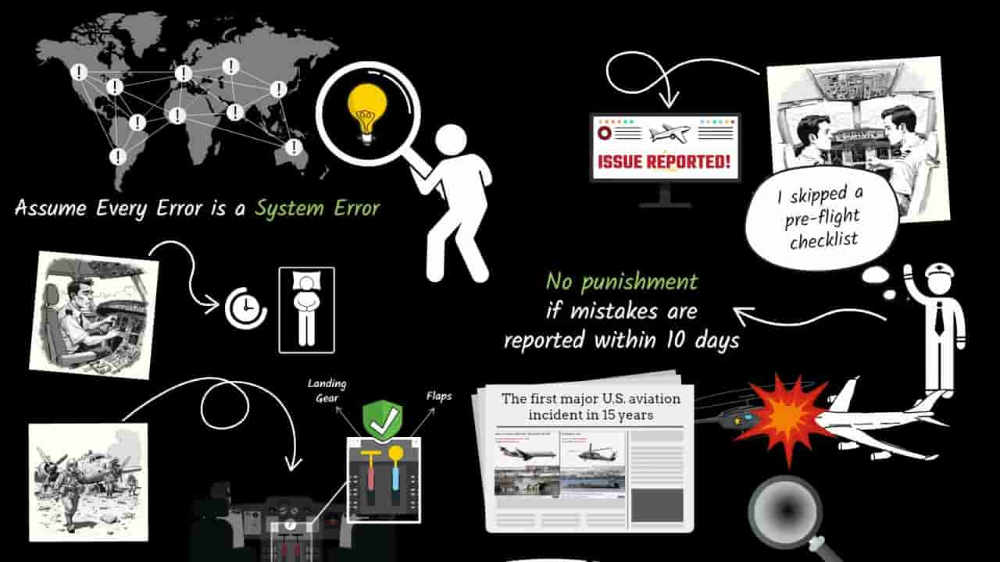
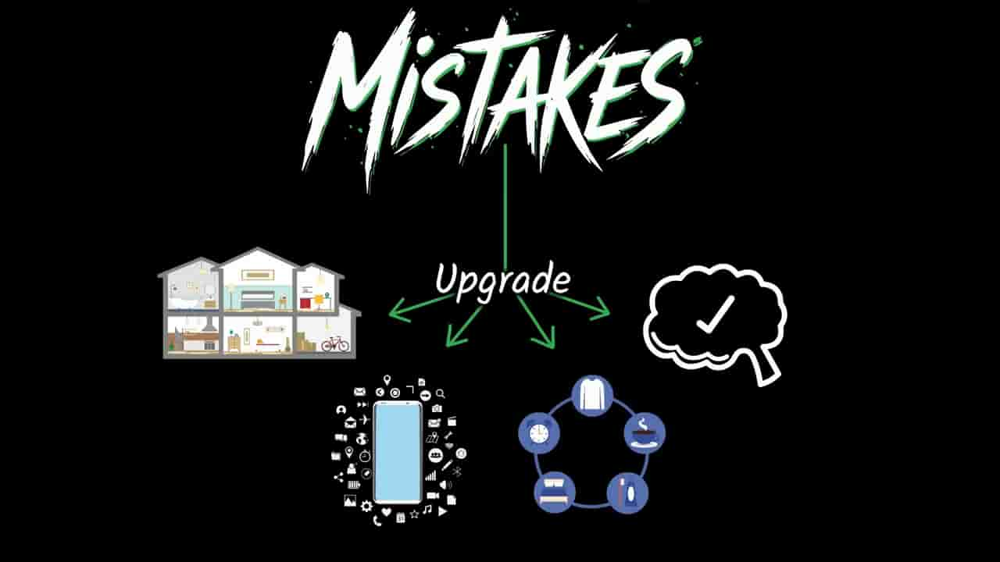

% 他们为什么就是不明白？
% 王福强
% 2025-02-19

之前看《马斯克传》的时候有个片段我还有印象，说的是马斯克的特斯拉用户有人开了自动驾驶之后出了车祸，导致特斯拉公关压力挺大。

马斯克就想不明白了，明明自动驾驶减少了整体车祸率，为什么他们（特斯拉用户）就非得揪着这个事儿不放呢？

其实，这不怪用户，怪马斯克没想明白（也可能很明白）。

今天看到这个图，说说这个事儿为啥用户没错儿：

其实，整体车祸率高不高，跟个人用户出车祸之后责任怎么定，完全是两个事儿。

没有自动驾驶之前，出了车祸，因为驾车的是人，所以通常是驾车人承担车祸责任。

但开了自动驾驶之后，假如出了车祸，那责任就是系统了（也就是自动驾驶的FSD系统），而系统不能承担责任，所以，最终责任一定就是系统的建造与运营者，也就是特斯拉公司。 

所以，开自动驾驶之后出了车祸，用户责难特斯拉公司是很正常的行为。

至于自动驾驶系统上线前后，整体车祸率是升还是降，跟责任界定没有半毛钱关系。

也可能马斯克不是不明白，而是故意在混淆概念， 但用户肯定明白，起码直觉上是没问题的。🤣

当然， 系统错误可以通过升级改进来消弭，系统错误往往也是机会：

littlefinger不早说了嘛：

> Chaos isn't a pit
> 
> Chaos is a ladder 

