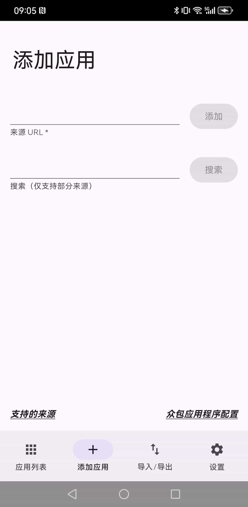
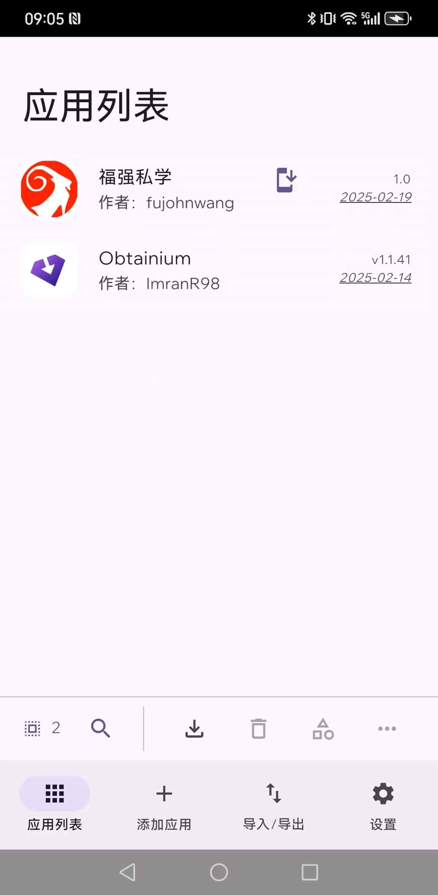

% 一款自主可控的应用商店APP
% 王福强
% 2025-02-21

发现这个好东西是因为我给「福强私学」包了个安卓APP，但因为这个业务比较小众，包个安卓APP也只是为了更小众的用户快捷访问（大部分用户还是走的PC桌面端访问更多），所以并不想发到国内各个安卓应用商店中，比如：

- 华为/荣耀（被收购后单独app store）
- 小米
- oppo和vivo
- 腾讯应用宝

一个是要上架国内的安卓应用商店需要花钱搞安全加固；

一个是现在上架也得搞软著（3个月能下来？）

总之就一个字，麻烦🤣

安卓原本就是个开放的生态（跟iOS不一样），无非就是下载到手机，然后直接装APK包就可以了。

所以，我就直接把[「福强私学」的APK](https://github.com/fujohnwang/kb-android)发布到了Github上，顺便开源，有担心安全问题的，也可以审计代码 😉

https://github.com/fujohnwang/kb-android

发布完之后，发现有一个安卓APP将这种APK更新追踪和安装的服务给延伸了，让开放的APK安装和维护更方便，每个人可以自己决定安装和更新什么APP，甚至可以导入和导出， 它就是 [Obtainium](https://github.
com/ImranR98/Obtainium)

我们可以通过[链接](https://github.com/fujohnwang/kb-android)将「福强私学」APP添加到 Obtainium 的追踪列表：

然后后续有更新也可以随时下载：

这相当于一款自主可控的安卓应用商店，想装什么，直接添加对应的链接就可以了。

当然，相对于各厂手机原装的应用商店，Obtainium 肯定显得比较geek， 大家可以根据自己喜好决定要不要用 😉

