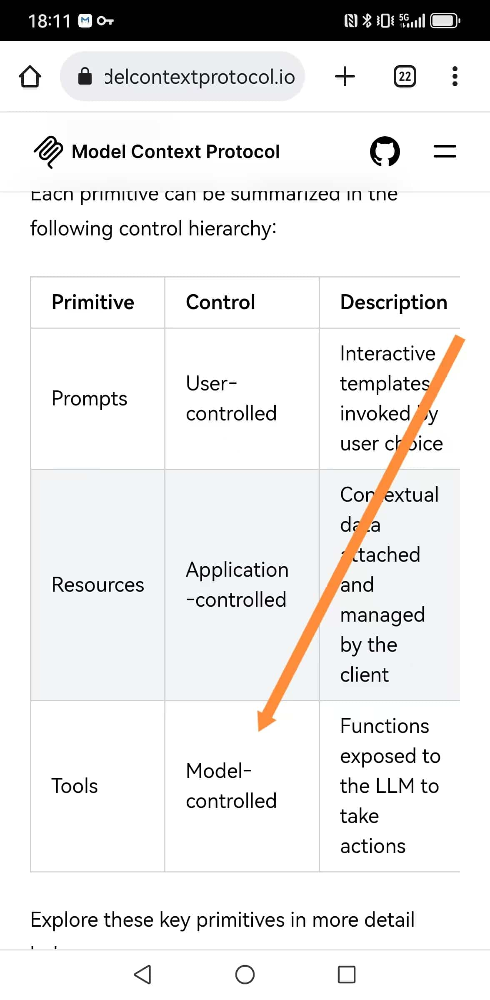
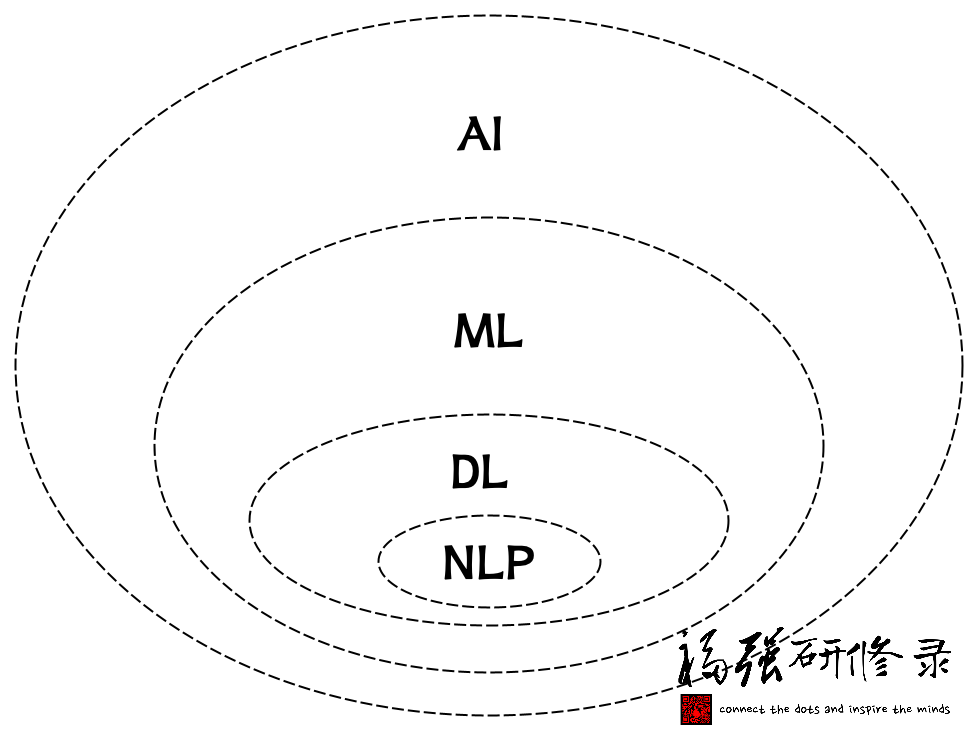
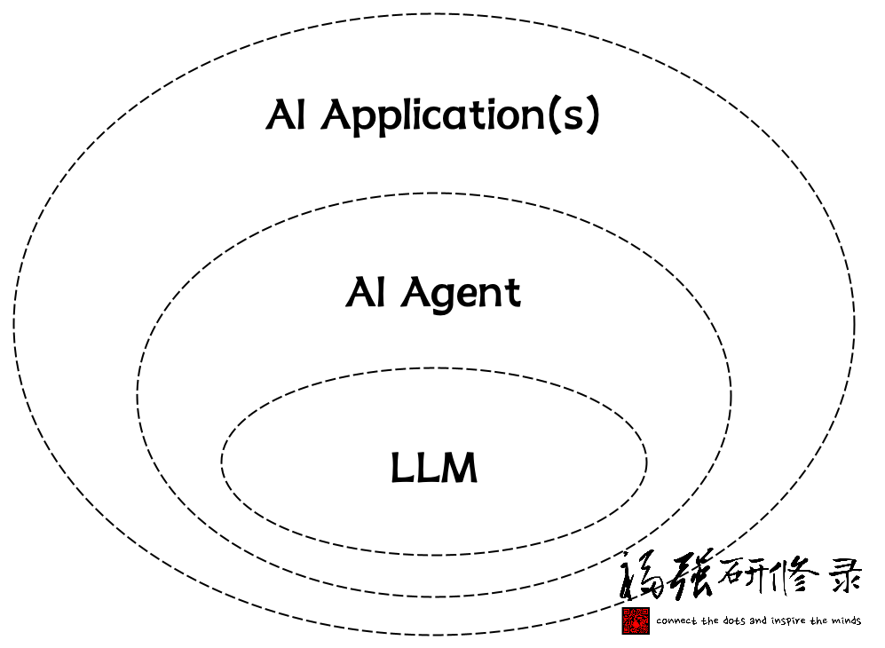
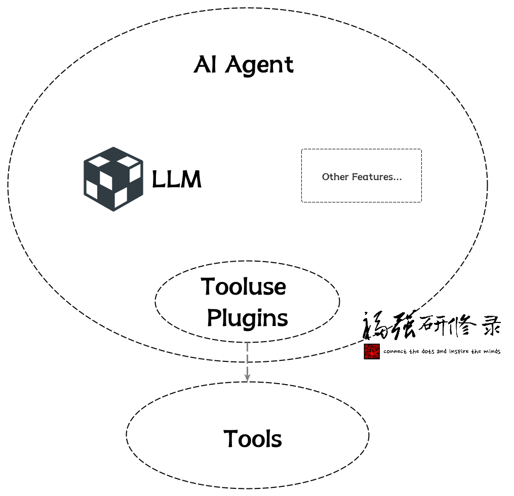
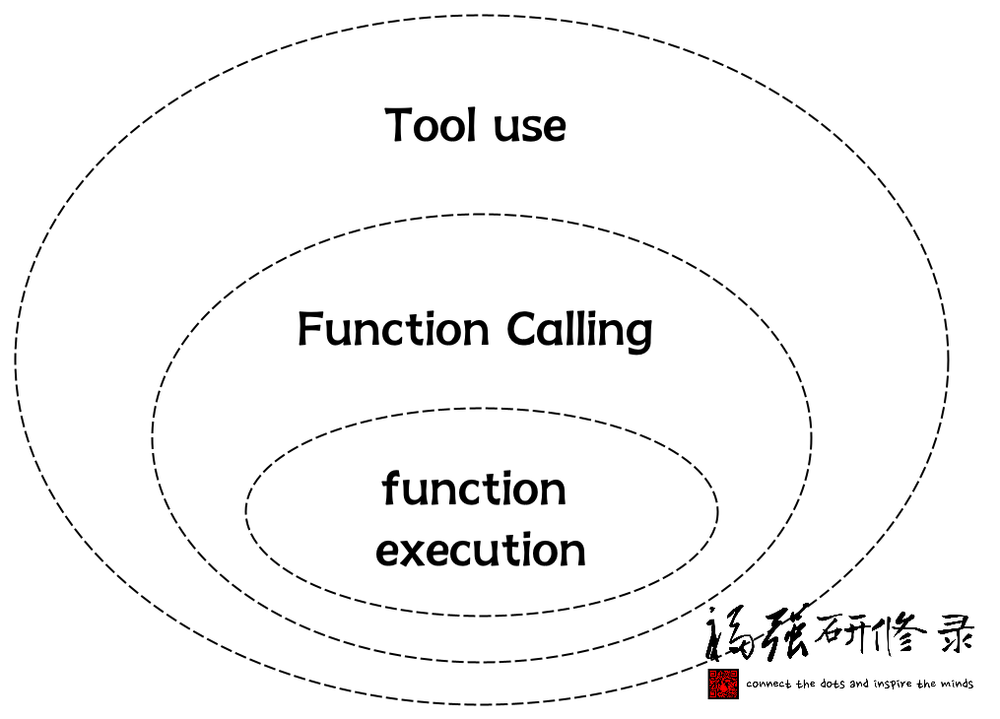
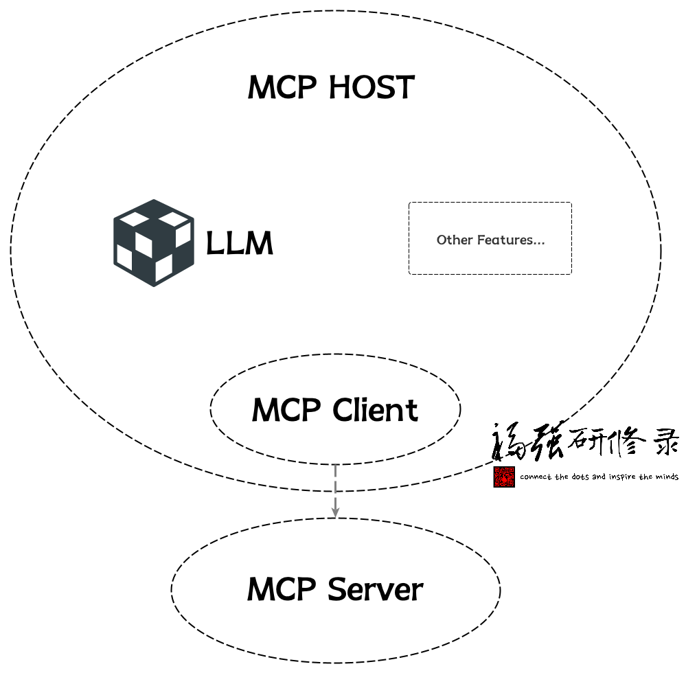

% 一篇看懂MCP
% 王福强
% 2025-02-26

就上一篇[「为什么只有这种MCP Server火了？」](https://afoo.me/posts/2025-02-26-why-tool-mcp-server-rocks.html)

有同学在「福强技院」群里跟我争论，我提到的Tool就是function calling， 怎么说呢，可以说是，也可以说不是。 

说是，是因为，mcp server这一端确实在实现机制上属于function execution；

说不是，是因为，上一篇我更多是想表达一种产品和逻辑视图层面的概念，属于简化概念，并不是要严格讨论技术底层原理。 毕竟，官方在解释MCP Server这个Tool能力的时候，也只是笼统的说是Model-Controlled，但其实详细揪出来讲，官方文档说的也有问题，更确切地说，应该算Agent Controlled：

不过，既然扯到这里了，我就尝试用一篇来详细讲讲MCP在整个AI的生态里到底是怎么一回事吧！

首先，大家一定看过类似下面这幅图，为了避免版权纠纷，我重新画了下：

也就是说，AI是最泛化的概念， ML（机器学习）是AI的一个子集概念， DL（深度学习）是ML的一个子集概念，再进而NLP（自然语言处理）又是DL的一个子集概念。

今天我们谈到大模型（大语言模型的简称，英文简称LLM，即Large Language Model）， 属于NLP领域的概念。

现在，让我们聚焦到今天更多围绕着大模型（LLM）展开的应用与研发图景中：

有人说2025年是AI Agent元年， 这里的AI Agent其实就是围绕着LLM打造的一种AI应用，只不过，AI应用这个概念可以很泛化， 所以， AI Agent算是AI应用的一种子集概念。

那一个AI Agent通常是由哪些部分组成的呢？

一个AI Agent首先会包含一个或者多个大模型做自然语言到最终结果的规划与决策， 这个一般是必须的。

另外一个比较典型的组件就是工具（tooluse），所以，任何agent开发框架在配置启动之前，都会给你一个机会给一个名字通常叫tools的参数传入参数值，其实就是告诉Agent它有哪些工具可以用。

至于其他的Agent组件或者功能，则可以根据情况添加，这些不在今天MCP主线上，所以抛开不提。

现在说Function Calling：

Function Calling算是某种tooluse， 它其实分两段（我给总结的，你可以不信😉）：

1. Function调用准备阶段
2. Function执行阶段

我们通常狭义上讲的Function Calling其实指的就是第一阶段（Function调用准备阶段）， 将函数描述通过tools参数（比如Open AI的API）扔给大模型，然后大模型在特定场景和意图识别到之后就可以返回函数调用的参数值， 然后，我们就可以拿着这个参数值去调用真正的函数让它执行了。

也就是说，函数的执行，通常不在大模型（LLM）之内，这个边界很重要，强调下😉

有了上面的铺垫，我们在看MCP的结构：

MCP结构里有三个主要角色或者职能方：

1. mcp host
2. mcp client
3. mcp server

mcp server相对比较独立，可以独立开发，独立部署，可以远程部署，也可以本地部署（今天很多AI IDE其实都是本地部署调用）。

那这些mcp server怎么用呢？

mcp host程序来用。

mcp host可以是某个AI IDE，也可以是你自己开发的AI程序。

mcp host内部通常也会有针对大模型的引用， 还有一个关键组件，也就是mcp client。

mcp client负责与mcp server通信，并调用mcp server的各项能力，比如我们提到的mcp server的Tool能力。

那谁又来驱动mcp client去调用mcp server呢？ 

答案是mcp host程序。

mcp host程序会调用mcp client拉取mcp server有哪些能力，然后在prompt大模型的时候把这些能力告知大模型，大模型就可以决定在什么时候使用这些能力了。

当然，到这里，从逻辑上来看，其实就是模型直接控制Tool的调用了（Model-Controlled）， 对吧？

也就是：

`prompt -> llm (with tools aware) -> tools`

但工程实现上我们说了，函数执行的事儿，大模型是不管的， 所以，在大模型决定用什么工具之后，其实，还是mcp host拿到指示，再去调用对应的mcp server执行指定的Tool。

所以，这确实也是一个function calling的过程，只不过，完整的function calling，侠义部分是mcp host + mcp client完成的，而函数执行部分，则是mcp host + mcp client去调用mcp server完成的。

至此，你应该很清楚整个MCP到底是怎么工作的了吧？

再回头看看前面AI Agent的结构图，跟MCP的结构图，不是很像？

像就对了！

最后，再强调下，我为啥一直强调要区分AI应用或者说大模型应用和大模型呢？

因为每家大模型服务提供商隐藏在API之后的，很大程度上其实也是一个AI Agent或者说AI大模型应用， 只不过，对外声称是什么模型，什么模型，但其实你根本就摸不着模型，只有他家自己包装一个模型服务给你用，而给你用的方式就是要么Web或者手机APP产品，要么就是API。

大模型有些能力确实是内化的（inline），但大部分时候，其实都是AI Agent在呵护着它们😉

大模型是真神，是你想见就能见的？🤣

> 更多MCP相关内容，可以参考[架构百科](https://jiagoubaike.com)中的[MCP条目](https://jiagoubaike.com/posts/mcp)。

