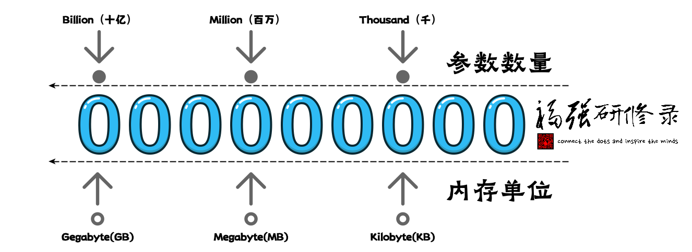

% 为什么我的机器跑不了满血版 DeepSeek？
% 王福强
% 2025-02-27

不知道你有没有类似的疑问，为啥我的机器跑不了满血版 DeepSeek？

在开始解释具体原因之前，先跟大家讲个朋友圈的真事儿...

朋友圈一朋友在 DeepSeek 出来不久，就晒了张 ollma 拉取那个 671b 的 DeepSeek 模型的截图， 我就评论问了一句，“你机器那么强悍吗？”

因为最高配的mac mini pro也就128G共享内存，单台要跑671b的模型肯定是跑不起来的（至于为什么，后面讲），所以我才多嘴问了一句（都有点儿怀疑自己了🤣）

事实证明，我是对的，他单机确实是高配128G内存，但最后还是得去拉取70b的那个版本的模型。

那我为什么敢判断说他单机跑不起来呢？

因为我有一个经验原则，或者说粗略估计的原则，类似投资里的72法则一样。 

这种原则或者方法在英文里一般称之为 **A rule of thumb**

大家如果看过《辐射》（Fallout）这个美丽国电视剧，一定对其中小女孩举着大拇指的那一幕并不陌生：

这个小女孩就是在使用她爹教给她的rule of thumb，具体到电视剧里就是，把胳膊伸直，竖起大拇指，如果大拇指能盖住原子弹爆炸的蘑菇云，那么，自己所在的位置暂时就是安全的，能跑远点儿最好； 假如大拇指盖不住，sorry， god bless you～

回到大模型参数量与所消耗的内存大小问题上， 我使用的rule of thumb是这样的： **有多少b的参数，大体上就需要多少G的内存**。当然，这个结论的前提是用的8位量化版模型，如果是FP16或者FP32，那么需要在此基础上再乘以2或者乘以4。

比如：

1. 70b的模型，如果是8位量化版， 那么，通常也需要70G多一些的内存才能跑； 如果是FP16，那么需要的内存通常要大于`70*2=140G`， 如果是FP32，那么需要`70*4=280G`。
2. 7b的模型，如果是8位量化版， 那么， 通常需要稍多于7G的内存才能跑起来， FP16版则是稍多于14G， FP32版则需稍多于28G；
3. 671b的模型，**至少**需要671G的内存，哪台机器那么强悍可以单机跑？ 所以我们看到国外小哥儿立马跑起来也是4台mac mini高配，也就是128G*4=512G， 虽然还是小于671b，但架不住你可以跑4位量化啊，这样就相当于`671G/2 = 335.5G` < 512G

那么，这个多少参数量对应多少G内存的 rule of thumb 怎么来的呢？

还记得我们前面讲模型参数的内容吗？

假如一个参数对应一个魔方的方块，那么，每个参数的存储就相当于一个方块那么大的空间，一个方块对应的空间对应到内存就是一个Float也就是32位，这是全精度，也就是一个参数会用一个FP32来存。

但我们可以通过模型量化，将每个参数的存储进行压缩，比如用FP16来存（半精度）或者进一步压缩，用8位来存（bit），或者用4bit来存，以此类推，比如，国内还搞了个 DeepSeek 的1.5bit量化版本。

因为8bit等于一个byte，比较好算，而且DeepSeek本身训练的时候也用的8位（朋友圈DeepSeek一在职高P说的），所以，我们通常就用8位量化版做基准，这样， 有多少个参数，就需要至少多少个byte来存（暂时忽略其它动态内存需求），那么就有了这样一副图：

也就是有多少b（Billion）的参数，每个参数用一个byte存储，那么，就需要至少多少G（Gegabyte）内存。

当然啦，之所以叫经验法则（Rule of Thumb），是因为它大体上可以快速估算一个评估结果，但不完全精确， 要精确计算一个模型需要多少内存（显存）来运行，除了考虑参数量和精度，还得考虑计算过程中的中间结果（激活值）以及缓存的键值对等数据（还只是说推理阶段，而不是训练阶段），所以，假如真需要精确结果，那么可以网上找找相应的工具或者自己用Cursor之类AI IDE写一个。

现在说回满血版 DeepSeek， 之所以叫满血版，其实就是说这个版本：

1. 参数量最大， 671b
2. 计算精度最高，FP8（训练阶段就是FP8）

所以，单机至少需要671G内存才能跑起来。

假如单机没有671G这么大的内存，大部分情况下就可以用量化版本了，也就是Q4或者1.5b：

- Q4的意思： Q 是 Quantization，即量化， 4是 4bit， 这样， 内存相对于FP8的模型就可以少一半；
- 1.5b量化版本就是把原来8bit的压缩到1.5 bit来存， 内存变成了原来所需存储空间的`1.5/8`， 十六分之3；

但量化后的版本肯定就不能说是满血版了，至于实际是不是，咱也不知道 😉

模型量化虽然可以减少模型运行所需的资源，但也会减少精度。

打个比方，假如FP32对应的是一张16开的纸，上面写满了文字；

现在， 对着这张纸，就变成了FP16， 但还是必须写满同等内容的文字；

再对折，就变成了FP8， 要写的文字依然不能少；

这样的结果是什么？ 眼神儿不好肯定看不清啊！

对应到模型也类似， 信息多少会给的没那么精确和丰富了。

有舍有得嘛，好在，模型量化后可以在自己机器上跑起来了🤣

