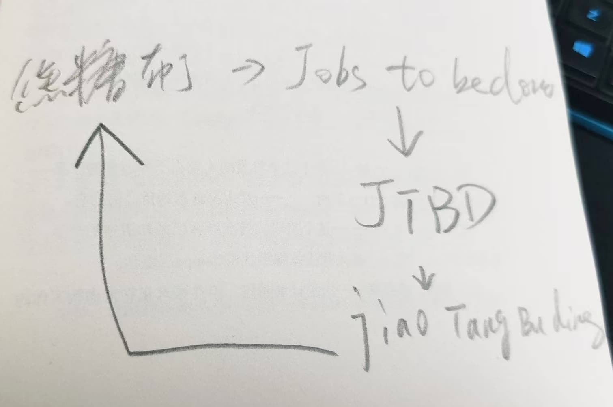

% “焦糖布丁”你妹！
% 王福强
% 2025-02-28

在产品以及营销领域经常听到一个词儿叫“焦糖布丁”理论，说的是，顾客买你家的电钻，不是真的需要电钻这个产品，而是为了在墙上钻个洞。 假如他是超人，能用手指头戳一个洞出来，那么，他也不需要电钻这个产品。

也就是，顾客买你的产品，其实是为了完成某项工作（达成某个目的）， 产品本身不是目的。

这个理论正式名称叫Jobs to be done，也就是“需要完成的工作”。

也不知道哪个大聪明把Jobs to be done先首字母缩写为JTBD，然后再用拼音搞了个联想，弄出来个焦糖布丁（jiāo táng bù dīng）理论，这tmd跟学渣背单词搞的小抄有啥区别？

最搞笑的是，tmd还流行起来了。

试问下各位做产品或者营销的同学，你们真的理解这“焦糖布丁”到底怎么来的嘛？ 这中间绕了起码3层...

你们不是天天声称Don't make me think吗？ 

我不think，我都搞不清楚这焦糖布丁跟jobs to be done怎么挂钩上，更搞不清楚这焦糖布丁跟它所谓的理论背后的内容怎么挂钩上。

也怪不得有人讨厌简体西文，学渣话语体系的东西（还tmd自诩叫说人话），能学到啥真材实料啊，都是套了又套，把你绕晕了正好可以浑水摸鱼？🤣

今天正好刷到一个短视频： 「换一种说法的不同结果」

> 以前土匪抢劫，抢劫这个词儿不好听，所以改叫劫富济贫；
> 
> 流氓杀人呢，杀人也不好听，所以改叫替天行道。

大概就是这么个生态吧～