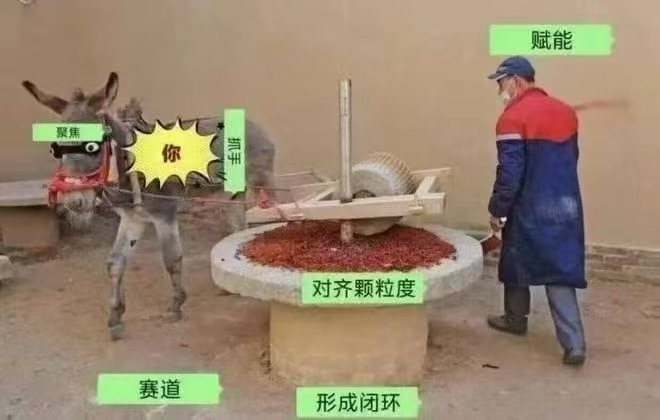
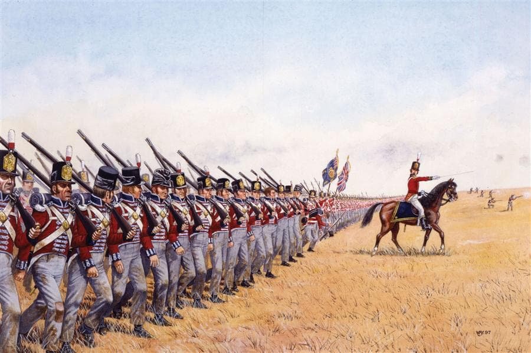
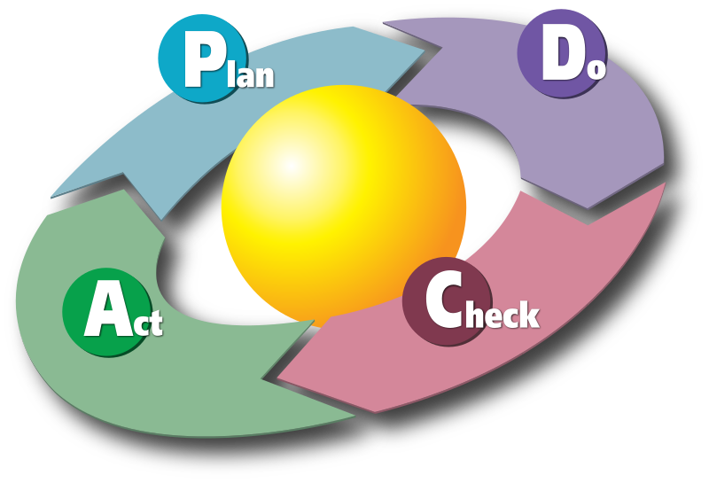

% 绝大多数人不懂的阿里黑话！
% 王福强
% 2025-03-02

在上一篇「“焦糖布丁”你妹！」下面，有同学留言：

> 抓手， 拉齐， 闭环

怎么说呢？ 我理解他想说啥意思，但这几个阿里黑话术语，其实还是可以从字面到背后的意思关联起来的，这焦糖布丁没两三层绕，是真联系不起来...

其实，上面三个黑话，都换成英文你就好理解了。

为啥是换成英文？ 

一个是因为英文对单词都是unique待遇，一就是一，二就是二，没啥歧义；

第二个就是，阿里也好，字节也罢，其实背后的做事机制，很多都是来自欧美，只有组织管理层面基于本土做了因地制宜。

## 抓手

一提到抓手，你们是不是脑子里马上浮现这幅图？

虽然是调侃，但其实也大查不查。

做事终归需要对过程和资源进行管控，要管控总得有些工具和手段， 这就是抓手。 与之对应的英文我个人认为是handle（注意，不是handler），至于你们觉得恰当不恰当，我就不管了，我的地盘我做主🤣

## 拉齐

拉齐或者对齐其实就是 alignment。

一个事情大家认识不到位，参差不齐，这个事儿基本也很难推进，所以要求大家拉齐、对齐认识和认知，然后才开始推进，这个没问题啊，拿破仑军队要平推，不也得排枪队一排排对齐了才能开干嘛🤣

## 闭环

我一上来给闭环按了个iteration的对应关系，有同学懵逼了...

这个怪我，其实，直接上iteration，相当于多进了一层。

直接上PDCA，你可能就更容易理解了：

看到环了吗？ 🤣

但是Plan-Do-Check-Adjust（我不喜欢Act这个解释，我的地盘还是我做主）这个事情是可以持续迭代，让事情的过程和结果可以螺旋上升的，所以，我用iteration来对应闭环，当然，这个升华的有点儿高，一上来可能确实对应不上。😉

## 小结

其它黑话其实也都有其效用和场景，就不展开讲了，毕竟，这种内容不会有啥流量，只是给少数上进的同学展开说说，大部分人都更喜欢喷这些黑话的内容，毕竟，那样的内容看起来更轻松，不用过多的用脑子。

昨天看到一个表格，说， 你写的内容只有五年级水平的人能看懂，你的内容才能被70%以上的人看， 显然，我写的以上内容得本科以上才能看，少于30%的人才能看🤣

最后，如果你正处于职场上升期，对组织管理也感兴趣，欢迎看看「福强私学」视频号付费合集里的「管理者从入门到精通」专栏。

啥？ 黑话对应英文怎么说？

Jargon？

