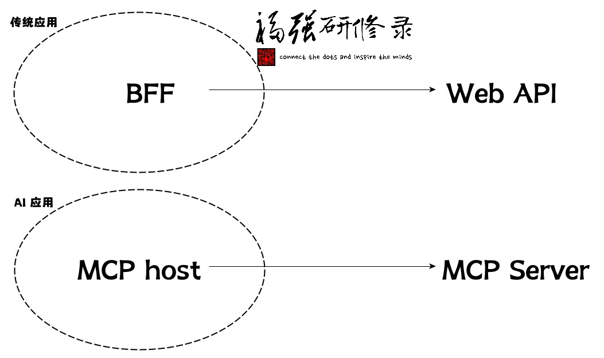

% 用Scala编写一个MCP Server
% 王福强
% 2025-03-02

aka. Build a MCP Server with Scala

接[一篇看懂MCP])(https://afoo.me/posts/2025-02-26-mcp-explained.html) [^mcp]， 我们今天讲如何实操。

[^mcp]: MCP = Model Context Protocol

## 基础知识

首先铺垫一点儿背景知识， MCP的通信采用JSON-RPC 2.0规范作为wire format（为啥用英文呢？比较精确些）， 交互嘛，就是Client-Server架构的RPC模式（远程过程调用，Remote Procedure Call）。


简单来说就是， 双方通信的时候该传什么数据格式，根据 JSON-RPC 2.0 规范指定。

比如， 我们如果用下面的schema定义： 

```json
{
  "type" : "object",
  "properties" : {
    "name" : {
      "type" : "string",
    },
    "age" : {
      "type" : "integer",
    }
  },
  "required" : [ "name" ],
  // ...
}
```

那么服务器和客户端之间传输的数据可能就是这样的：

```json
{
    "name": "Fuqqiang"
    // age 可选，不一定非要传
}
```

其次，与基于REST(ful)规范所用的多个endpoints的实践方式不同, JSON-RPC 2.0 用的是单一endpoint来承接所有请求（可以类比GraphQL，如果还有人记得它的话），只不过，因为MCP有两种Transport类型， 在使用SSE类型的Transport的时候（也就是HTTP），其实会设置两个endpoint来承接客户端请求，一个是常规的endpoint来承接所有请求，一个是建立SSE通道。


## 动手开干

有了上面两个铺垫之后，我们开始着手用Scala来编写一个MCP Server（其实用啥语言都可以，社区有用py的，有用ts的）。

我们使用Spring团队新近跟Anthropic团队（MCP背后的公司）一起合作搞的MCP Java SDK，将其加到项目的依赖中（哥用的老牌Maven）：

```xml
		<!-- https://mvnrepository.com/artifact/io.modelcontextprotocol.sdk/mcp -->
		<dependency>
			<groupId>io.modelcontextprotocol.sdk</groupId>
			<artifactId>mcp</artifactId>
			<version>0.7.0</version>
		</dependency>
		<!-- https://mvnrepository.com/artifact/io.modelcontextprotocol.sdk/mcp-spring-webmvc -->
		<dependency>
			<groupId>io.modelcontextprotocol.sdk</groupId>
			<artifactId>mcp-spring-webmvc</artifactId>
			<version>0.7.0</version>
		</dependency>
		<!-- https://mvnrepository.com/artifact/io.modelcontextprotocol.sdk/mcp-spring-webflux -->
		<dependency>
			<groupId>io.modelcontextprotocol.sdk</groupId>
			<artifactId>mcp-spring-webflux</artifactId>
			<version>0.7.0</version>
		</dependency>
```

后面两个，即mcp-spring-webmvc和mcp-spring-webflux， 根据自己喜好选就可以了，不用非得都要，一个提供同步 API，一个提供 Async 异步 API。

然后我们就可以开始编写主体代码了：

```scala
val stdioTransport = new StdioServerTransport(new ObjectMapper());
val mcpServer: McpSyncServer = McpServer.sync(stdioTransport)
  .serverInfo("my-server", "1.0.0")
  .capabilities(ServerCapabilities.builder()
    .resources(true, true) // Enable resource support
    .tools(true) // Enable tool support
    .prompts(true) // Enable prompt support
    .logging() // Enable logging support
    .build())
  .build();
Runtime.getRuntime.addShutdownHook(new Thread() {
  override def run(): Unit = mcpServer.closeGracefully()
})

val jsonSchemaGenerator = new SchemaGenerator(new SchemaGeneratorConfigBuilder(SchemaVersion.DRAFT_2020_12, OptionPreset.PLAIN_JSON).build())
case class Hello(var name: String)
val schema = jsonSchemaGenerator.generateSchema(classOf[Hello])

val demoTool = new McpServerFeatures.SyncToolRegistration(new Tool("hello", "say hello world", schema.toPrettyString), arguments => {
  val name = arguments.get("name").asInstanceOf[String]
  new CallToolResult(util.Arrays.asList(new McpSchema.TextContent(s"Hello ${name}さん")), false);
});

mcpServer.addTool(demoTool)
```

之后，打包： `mvn clean package`, 一个可以本地使用的MCP Server就准备好了。

你是放到Cursor里面用，还是Windsurf里面用，或者debug的时候用，直接配置如下启动命令就可以：

```bash
java -jar mcp-starter-1.0.0-SNAPSHOT.jar
```

## 后续改进

### json schema的构建

我们上面的演示代码中用了如下依赖在Java或者Scala代码中构建JsonSchema：

```xml
		<dependency>
			<groupId>com.github.victools</groupId>
			<artifactId>jsonschema-generator</artifactId>
			<version>4.37.0</version>
		</dependency>
```

不过，个人其实更喜欢Vert.x提供的DSL：

```xml
		<dependency>
			<groupId>io.vertx</groupId>
			<artifactId>vertx-json-schema</artifactId>
			<version>4.5.13</version>
		</dependency>
```

```scala
    import io.vertx.json.schema.common.dsl.Schemas._ // 各种类型
    import io.vertx.json.schema.common.dsl.Keywords._ // 属性限制

    val jsonSchema = objectSchema()
    jsonSchema.requiredProperty("name", stringSchema())
    jsonSchema.property("age", intSchema())

    println(jsonSchema.toJson.encodePrettily())
```

### 启动命令

如果要推广，而不只是自己用，那么，有必要降低用户环境的依赖门槛，比如，你不能指望每个用户都得预装Java SDK/JRE，这时候，可以考虑通过GraalVM的native-image将程序打包成特定操作系统独立可执行文件。（类似golang的编译结果）

### 关于Transport

我们上面只是提供了Stdio方式的Transport，也就是只能本地调用， 如果企业内部，可能基于HTTP/SSE的Transport应用范围更广（当然，安全治理成本估计也会更高）。


## 写在最后

如果说过去的计算机系统都是通过Web API来实现尽量通用的互联互通，那么，或许 MCP Server 将会是 AI 时代的Web API。



