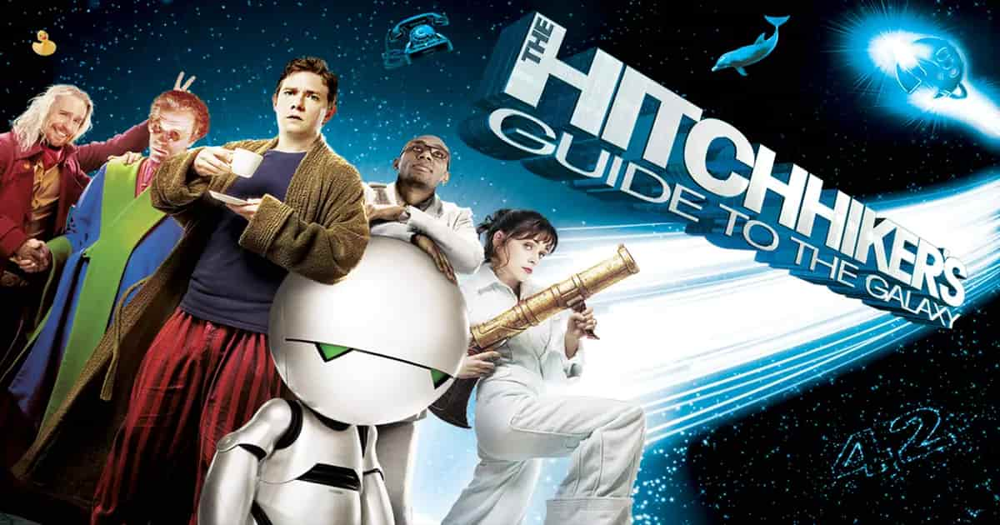

% 42 与 《银河系漫游指南》
% 王福强
% 2025-03-03

《银河系漫游指南》，又叫《银河系搭车指南》， 原名"The hitchhiker's guide to the galaxy"

这本书很有名，电影也是，还有电视连续剧，但我都没看过，我印象里跟它唯一有关系的就是它里面提到的宇宙终极奥秘， **42**

这就跟前一篇 「[“焦糖布丁”你妹！](https://afoo.me/posts/2025-02-28-jobs-to-be-done-in-zh.html)」里提到的焦糖布丁一样，

其实我并不知道这个42到底怎么个来头，也不知道这个42背后到底有啥深意， 它其实更多就是geek之间聊天的社交货币，跟焦糖布丁一样。

今天看到一本书里提到这个42的典故，才真正知道42到底意味着什么...

42表面是数字，但其实是谐音梗儿。

- 4 的英文是four，谐音单词是for；
- 2 的英文是two， 谐音单词是to；

所以，42其实是for(what)和to(where)，

也就是**为了（什么）， 去（哪里）**。

当然，这个to我又给延伸了，也可以是to(be what)， 也就是你想成为什么或者说成为什么样的人。

不过结合搭车漫游的背景，在书和电影里可能更多是“去哪里”的灵魂拷问。

是不是感觉跟保安的灵魂三问可以媲美？🤣

> “你是谁？” 
> 
> “你从哪里来？” 
> 
> “你要到哪去？”

