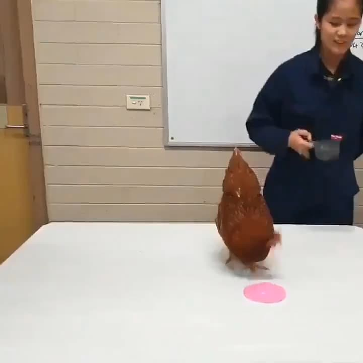

% 天才的宿命就是不被当世理解！
% 王福强
% 2025-03-06

今天估计都在熙熙攘攘Manus了，却少有人关注2024年图灵奖这个消息，

所以也不免感叹，天才的宿命，其实就是不被**当世**理解。

2024图灵奖这两位得主， Andrew G. Barto 和 Richard S. Sutton， 都是从上世纪八十年代（In a series of papers beginning in the 1980s）开始就在研究强化学习的主儿，从提出主要想法（idea， 其实也就是初始假设和思维）到构建数学基础，吭吭哧哧熬到现在，相当于三四十年之后，才得到一个象征性的肯定。

> 关于强化学习
>
> 对于普通人来说，这个小视频最能说明强化学习的想法，其实就是奖励正确，惩罚错误。
>
>  - https://weixin.qq.com/sph/Abx16A2da (这个是「福强私学」视频号的视频链接，估计得手机上才打开？！)

比较巧的是，昨天晚上正在看一本斯坦福大学社会学教授写的一本书，

他里面提到另一个人，也是类似的遭遇。

尤达⋅福克曼(Judah Folkman)原是波士顿儿童医院一名小儿外科医生,

假如他还活着的话，绝对是呼声最高的诺贝尔医学奖候选人。

1971年福克曼就提出了一个治疗癌症的想法和底层原理， 

他提出癌细胞会与宿主细胞产生相互作用，发出信号欺骗周边组织，形成适合肿瘤生长的环境。

他的想法是，只要设计一种全新的药物，阻挡癌细胞发出的讯息，就能摧毁生产肿瘤的管道。

换句话说，就是一种让肿瘤饿死的药物。

在接下来的岁月里， 福克曼的想法每隔七年就会经历一次起伏，直到2003年6月1日，也就是福克曼提出新型癌症治疗疗法的三十二年后，

杜克大学一名肿瘤学家揭示了抗癌药物Avastin（癌思停）的最新研究成果，Avastin展现了历史上最佳的癌症治疗效果，极大延长了大肠癌患者的预期寿命。

当然，为什么伟大的想法都是要经历时间的洗礼才会成真呢？

很多时候也是受限于思想与现实之间的差距。

毕竟，落地牵扯的因素和资源投入要更多的多。

但正确的思维和方向，依然十分重要。

这其实也是智慧与智商之间的关系。

**Caption leads, sailor sails**

