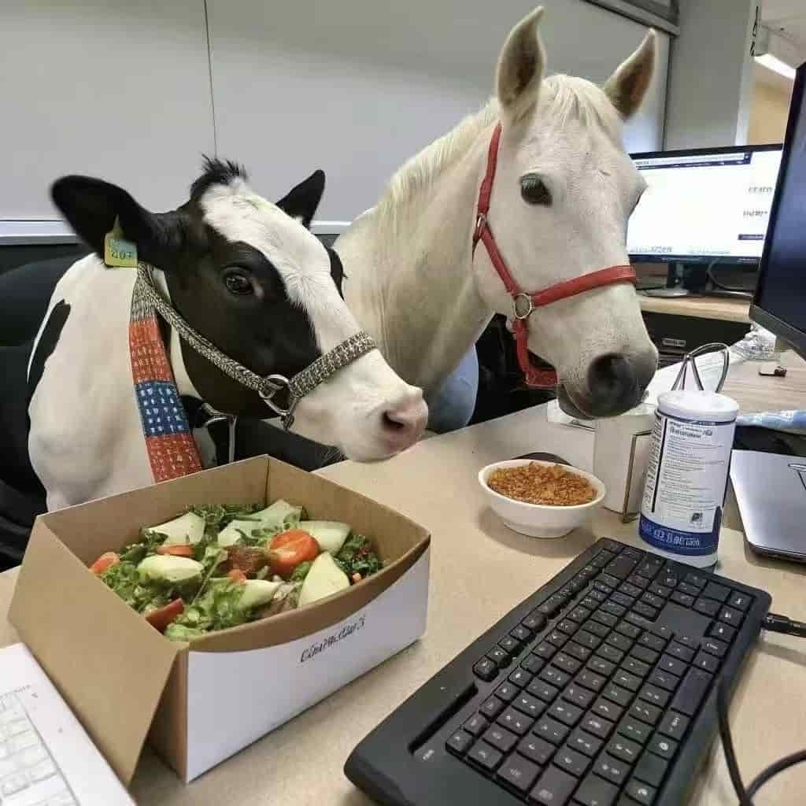
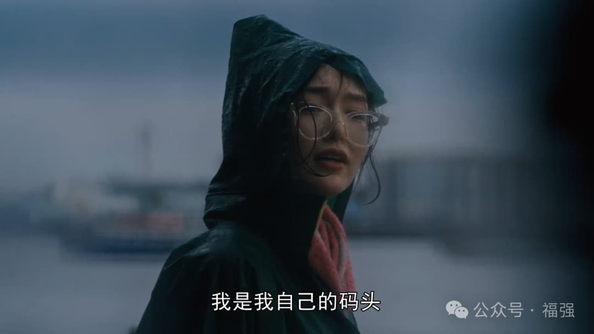

% 品牌兜底
% 王福强
% 2025-03-12

我有一个习惯，数据备份至少要三份，所有创作的视频内容或者课程内容也是。

今天，派上用场了。

昨天视频号让我自证，我也不知道它这自证是干啥，又是因为啥，就是让我自证。

自证的方式就是新拍十个视频。

嗯，给平台做牛马就这个德行，

要你干就得干，不干，哼哼

下架！

是的，我的所有付费合集都被下架了。

P都看不到一点儿，所有之前的文案，视频，物料，gone～

询问了其中购买过付费合集的用户

告诉我也看不到了

这相当于人家付过钱了，权益也得不到保障！

这算是渠道问题，还是我的问题啊？

用户肯定认为是我的问题啊

我才是最终品牌方不是吗？

之前在一个小平台渠道上架的产品

也是类似的命运

不过，这个是因为这个小平台方自己倒了

但购买过产品的用户还是会找到我这里呀

谁让我才是最终产品服务方呢？

所以，我就得给人家迁移，增补权益补偿（虽然我也可以甩锅给渠道，你找渠道去）

这其实也就是为啥「福强私学」是自己搞

更是今天把所有内容重新整理到 [Gumroad个人主页](https://wfq.gumroad.com/)

只有这两个平台才是可以保障持久的。

我又不是单纯卖货，一锤子买卖，卖完就走。

那样的话，直播带货，哪个平台不能搞啊，本来也不care什么品牌，单纯赚钱，骗完一波是一波。

这也就是为啥上次路上一TVP同路问我

某音和某号基础设施这么好，干嘛还自己折腾？

不自己折腾行吗？

我tmd又不是单纯玩流量带货

做时间的朋友，一个事情要做长久，整个pipeline上出了幺蛾子，还不是得我来兜底？

