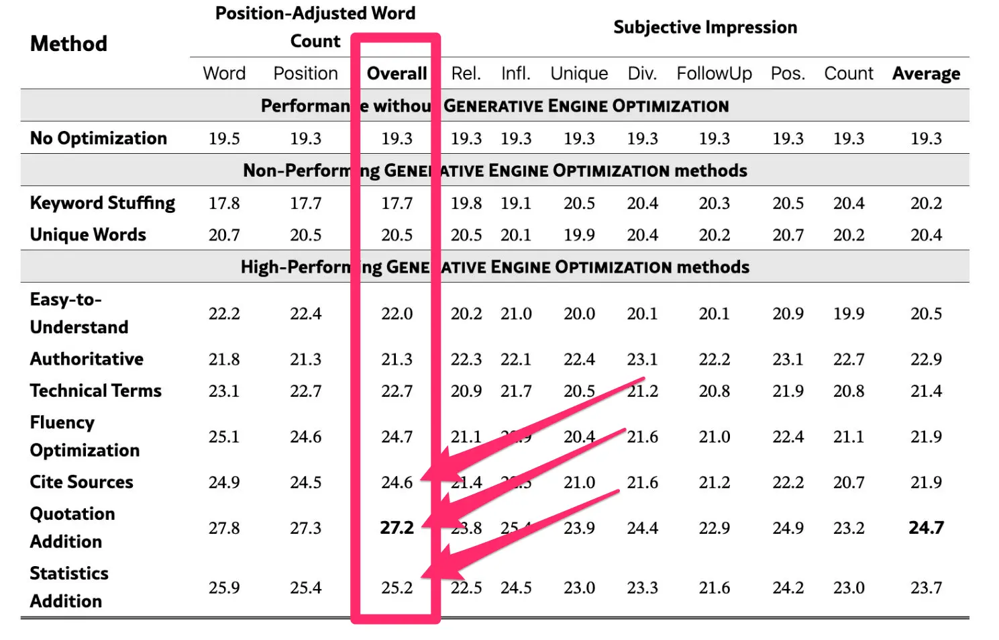

% 如何投喂大模型？
% 王福强
% 2025-03-14

大模型甚嚣尘上的今天，很多人早就开始考虑甚至已经开始实行投喂大模型的策略了。

毕竟，流量为王的时代，没流量就没生意、没转化、没收入， 搞流量，永远是第一位的需求。

搜索引擎时代有SEO，

大模型时代自然就有了GEO（Generative Engine Optimization）或者LLMEO（LLM Engine Optimization）

当所有人都在转向大模型寻求信息投喂的时候，

如何让大模型把我们希望的垃圾，哦，不对，信息， 投喂给用户，就成了搞流量人的首要任务。

那么，如何搞GEO以便更好的投喂大模型呢？

权重最高的做法是**在内容中加入可信的引用、数据统计和专家引言。**

为什么要这么搞呢？ 原因在于，生成式引擎（如大型语言模型LLM）倾向于优先选择看起来权威、事实丰富的内容。

研究表明，添加引用和统计数据可以将内容在AI回复中的可见性提升高达40%。

所以，我们在写一篇文章的时候，尽量要多引用权威来源，比如写一篇关于“AI发展趋势”的文章时，引用知名机构（如Gartner或MIT）的报告，或者加入具体数字（如“2025年全球AI市场预计达5000亿美元”）。

其次，我们要在创作内容多时候，用自然、对话式的语言编写内容，回答用户可能提出的具体问题。

因为GEO不像传统SEO那样只关注关键词密度，而是更看重内容是否符合用户意图和自然语言模式，因为生成式AI会模拟人类对话。

所以，针对“什么是GEO”这样的问题，直接写成“GEO是优化内容给AI搜索引擎用的，比传统SEO更注重语境和权威性”，而不是堆砌关键词。

再就是，针对自己领域和行业进行垂直优化。

研究发现，不同领域的GEO效果差异明显。比如历史内容适合用权威语气，法律内容适合加统计数据，技术内容适合加术语和案例。

所以，如果你写的是技术博客，可以多用专业术语（如“LLM”或“RAG”）并解释；如果是历史文章，就多引用原始文献。

还有就是一些比较基础的做法，比如：

- 确保网站对AI爬虫开放（如GPTBot），使用结构化数据（Schema markup）。
- 在社交媒体（如LinkedIn、X）或论坛（如Reddit）上分享内容，增加被AI爬取的机会。
- 定期更新内容，加入最新趋势或数据。

总之，GEO的最佳实践的核心是：

内容要权威、对话式、结构化，同时结合领域特点和多渠道传播。

它不是取代SEO，而是让你的内容在AI驱动的世界里更“讨喜”。

当然，GEO算是新东西，具体策略和做法也会随着大模型和AI的发展快速变化，所以，还是那句话， KEEp eVOLution，bro～

