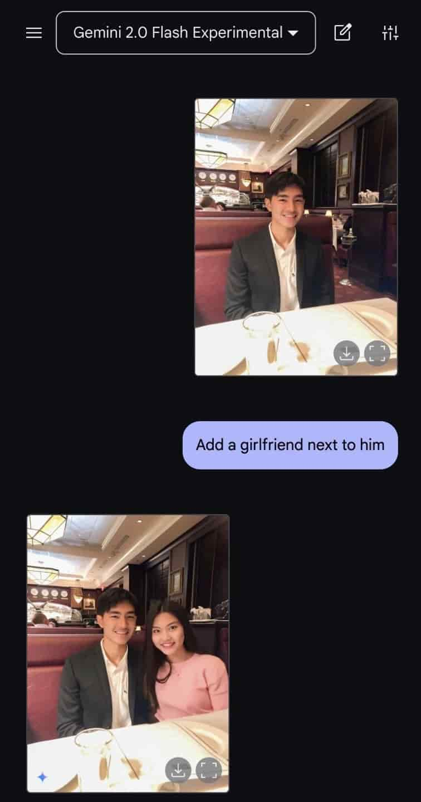
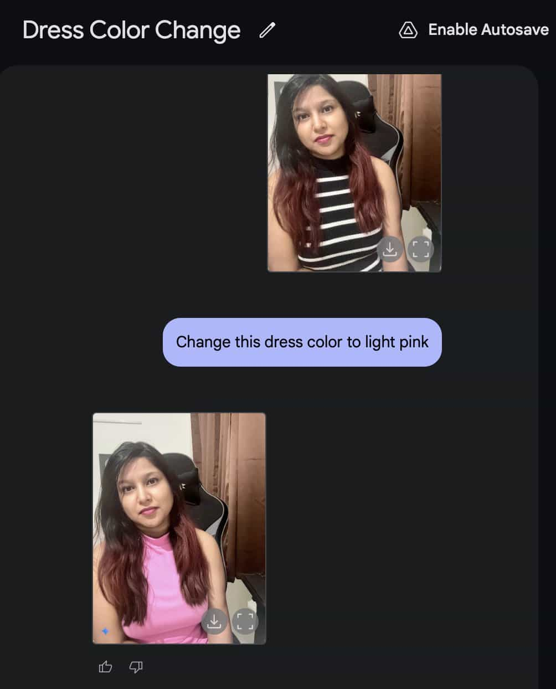
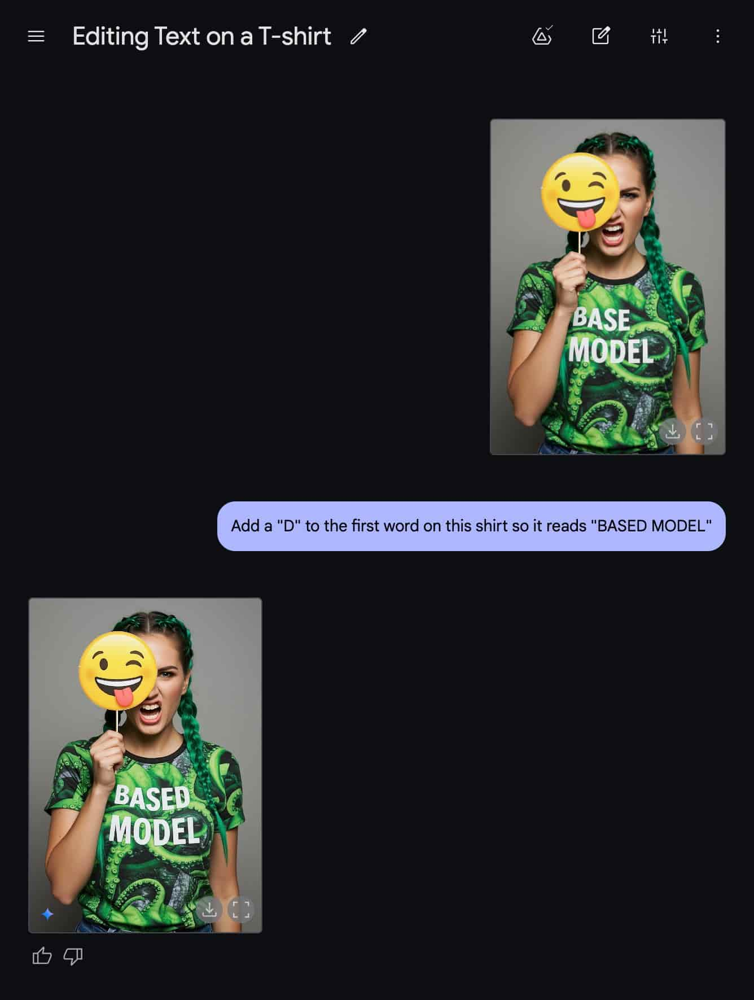
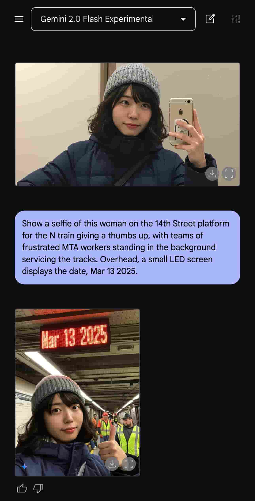
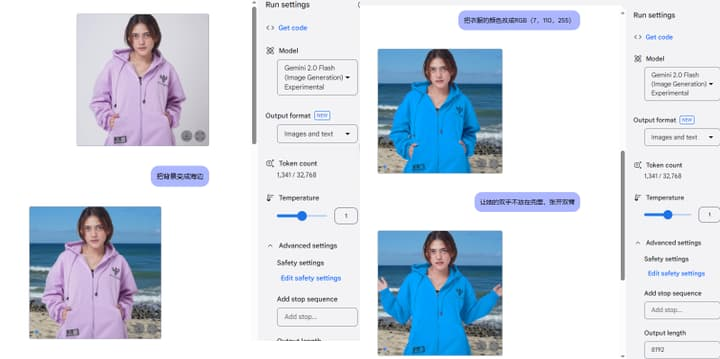
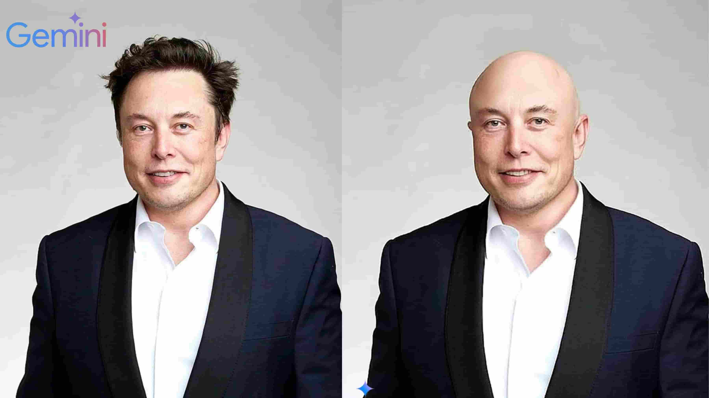
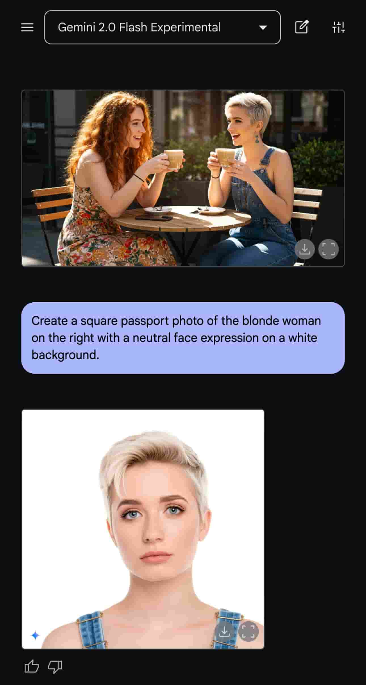
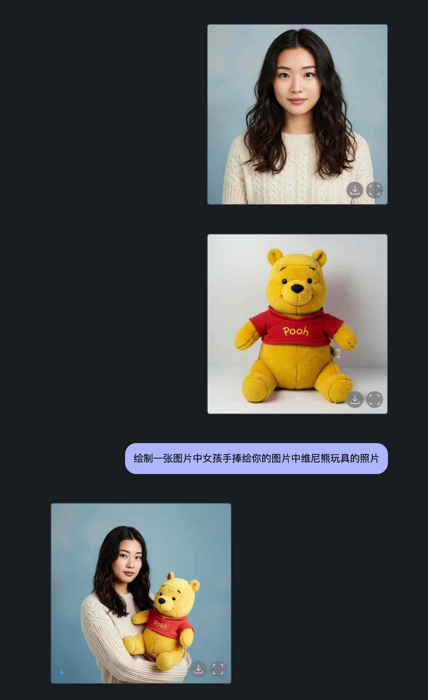
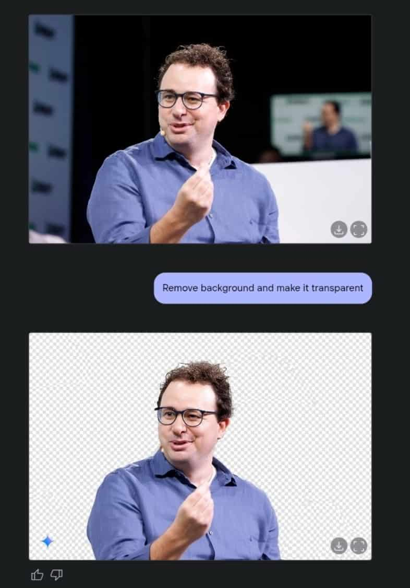
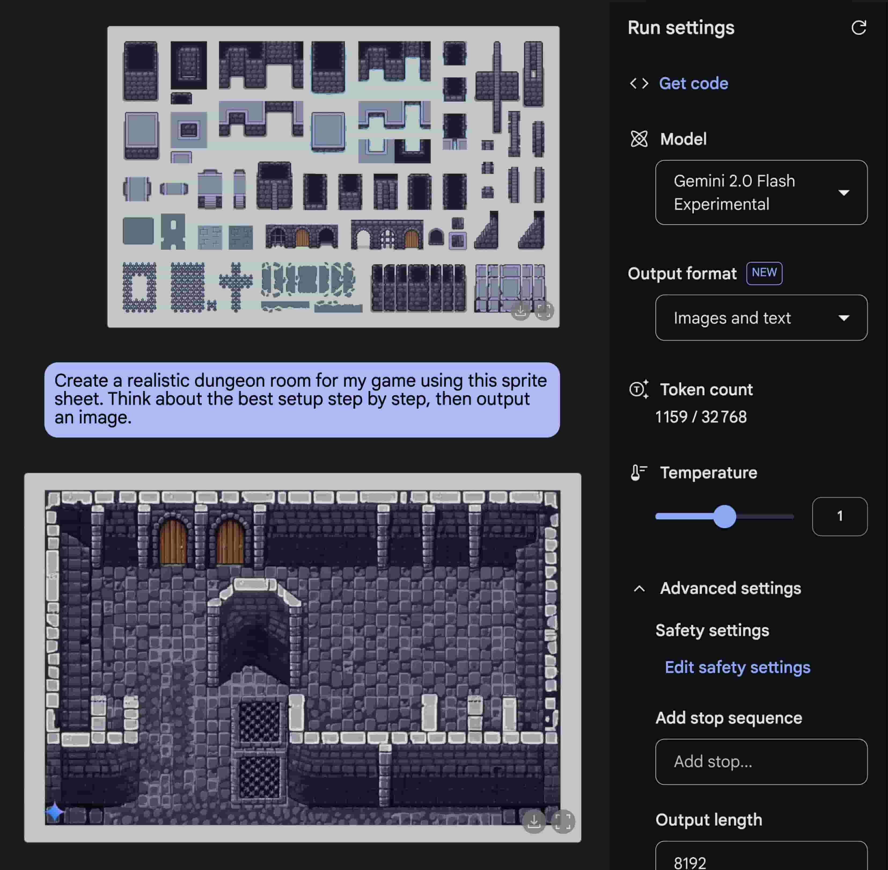

% P图从此不求人: 都玩疯了...
% 王福强
% 2025-03-16

Gemini 2.0 flash experimental这个模型在Google的 AI Studio一发布，就引起了不小的热潮。

尤其是它的图像编辑功能，都被大家玩出花了。

虽然2023年我在做[Stable Diffusion课程](https://wfq.gumroad.com/l/stablediffusion)的时候就已经介绍过pix2pix这样的功能，

但Gemini 2.0 flash experimental这次却在同样功能上累加了一个AIGC时代大家一直没很好的特性，

那就是角色一致性。

因为既然是生成式模型（Generative Models），

那么生成结果自然就有随机性。

但Gemini 2.0 flash experimental的图像编辑，却可以很大程度上维持角色的一致性，这对于很多场景来说就太香了：

1. 漫画
2. 游戏素材
3. 电商模特
4. 摄影摄像
5. 视频创作

总之，能在保证角色一致性的前提下进行编辑和更改，让创作的长度和宽度都变长变宽了。

下面是一些玩家的成果，供大家参考，从而玩出自己的风格和作品：

## 给帅哥加个女朋友

是不是感觉做白日梦更容易了？🤣

## 变换衣服颜色和风格

## 变换动作和姿势

上面这张对于电商来说相当于福音，搞素材的都懂。

## 让马斯克变秃头

## 制作护照照片

## 多物体合成

## 去除图片背景

过去用 [remove.bg](https://www.remove.bg/) 干的活儿，现在也可以一句话搞定。

## 游戏素材

[还有人](https://x.com/wavefnx/status/1900545410130715004)专门针对素材制作了一个sprite的生成器，而里面的素材生成就是使用gemini 2.0 flash experimental模型的角色一致性特点生成连续的帧，多帧合成起来就变成游戏动画了。

## 后话

有人担心 Gemini 2.0 flash experimental 会抢了美工等平面设计师等活儿，其实大可不必。

我还是那句话， ”**专业强化专业**“， 专业的人用好AI工具，只会更专业。

虽然很多AI产品会降低普通用户使用的门槛，但不意味着所有人都会做到专业水准和极致。

这个世界依然是二八分布，职能分工的。

