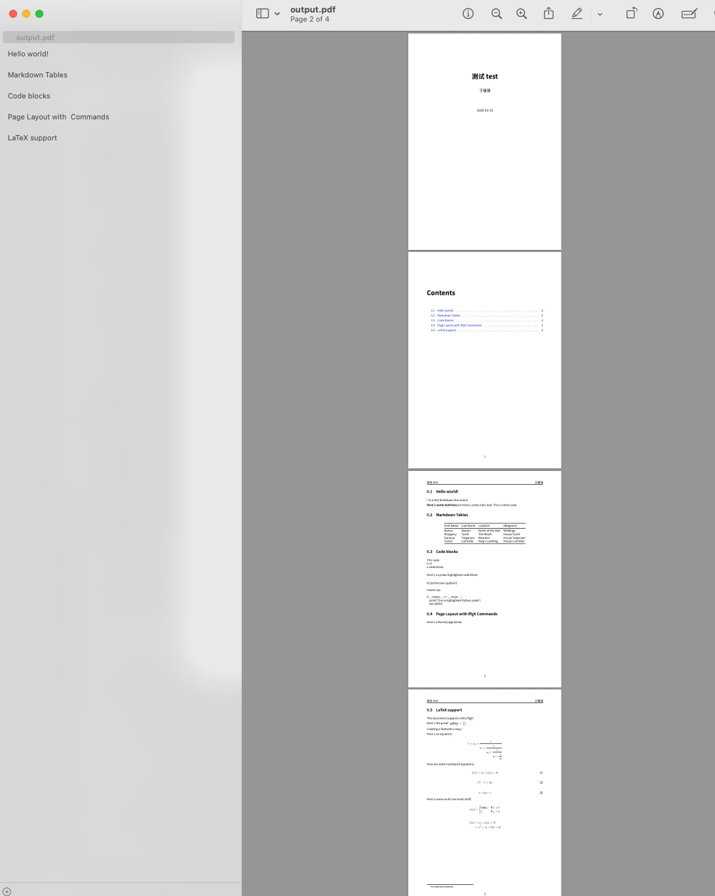

% 使用 AI 打造 pandoc 电子书生成 PDF 模板
% 王福强
% 2025-03-16

老胡估计这阵子在准备做知识付费，所以，昨天跟我抱怨说pandoc太复杂...

确实挺复杂的，尤其是用 pandoc 来转换/生成PDF的时候，很多年前我就领教过了。

其实pandoc转换为html还是挺简单的，比如当前这篇文章，其实就是通过pandoc转换为html然后再发布的（当然afoo.me整个网站的页面也是pandoc转换来的）。

但转PDF却牵扯两步，它会先转换为 (La)TeX 中间结果，然后再从 (La)Tex 转换为PDF。

而 (La)Tex 对于很多人来说都会比较陌生，除非你之前在学校写论文的时候经常用， 但对普通人来说，这东西没那么友好。

我是2009年左右在阿里的时候搞的第一个pandoc PDF 模板，但主要用来转换单篇article， 后来才参考github上有些人分享/开源的项目（比如 https://github.com/Wandmalfarbe/pandoc-latex-template），改了个自己勉强用的pandoc PDF模板（个人前期PDF格式销售的电子书都是这么来的）。 

但考虑到今天已经有AI加持了，这个事情应该会轻松很多吧？ 

所以就试了一下，不过，依然耗费了差不多50多分钟才搞出来一个能用的，而且，中间还从gemini切换到grok3之后才搞定。

不得不说，AI确实降低了这个事情的复杂度，但想要调试出一个满意的结果，其实还是会付出时间和精力的。

如果你对这个过程和结果感兴趣，下面是初始用的提示词（Prompt）：

```
能帮我编写一个pandoc的转换pdf的latex模板吗？

通过这个latex模板和pandoc的转换，我希望：

1. 生成的pdf风格跟manning press的电子书风格类似，简洁易读；
2. 转换后pdf结果中的图片可以根据长宽适配pdf的页面布局，比如图片是landscape的长宽比，那pdf里展示的时候就以pdf的width为准进行缩放，如果是vertical的长宽比，那么pdf里就是以pdf的height为准进行缩放，总之，保证图片在pdf中展示的适配性和完整性；
3. 支持中文字体；
4. 有封面页和ToC（table of contents）索引；
```

然后中间经过n多轮的来回debug， 最终得出一个可用的PDF模板（格式为.tex）：

```tex
\documentclass[11pt,oneside]{book}
\usepackage[utf8]{inputenc}
\usepackage[T1]{fontenc}
\usepackage{xeCJK} % 支持中文字体
\usepackage{geometry} % 设置页面布局
\usepackage{graphicx} % 处理图片
\usepackage{titling} % 自定义标题
\usepackage{titlesec} % 自定义章节样式
\usepackage{hyperref} % 支持超链接和目录
\usepackage{ifthen} % 条件判断
\usepackage{xparse} % 高级宏定义
\usepackage{longtable} % 支持长表格
\usepackage{framed} % 支持 Shaded 环境（代码块）
\usepackage{xcolor} % 支持代码高亮颜色
\usepackage{booktabs} % 支持表格样式（toprule 等）
\usepackage{amsmath} % 支持数学公式（binom 等）
\usepackage{fancyhdr} % 自定义页眉页脚

% 设置中文字体（需要安装 Noto Sans CJK 或其他字体）
% \setCJKmainfont{Noto Sans CJK SC}
\setCJKmainfont{PingFang SC}
\setmainfont{Source Han Sans SC} % Manning 风格常用现代无衬线字体
\setsansfont{Source Han Sans SC}
\setmonofont{Source Han Sans SC} % 代码字体

% 设置页面布局，模仿 Manning 风格
\geometry{
  a4paper,
  left=1in,
  right=1in,
  top=1in,
  bottom=1in,
  headheight=14pt,
  footskip=30pt
}

% 自定义页眉页脚
\pagestyle{fancy}
\fancyhf{} % 清空默认页眉页脚
\fancyfoot[C]{\thepage} % 页脚居中显示页码

% 自定义章节样式
\titleformat{\chapter}[display]
  {\Huge\bfseries\sffamily}
  {\chaptertitlename\ \thechapter}{1em}{}
\titleformat{\section}
  {\Large\bfseries\sffamily}{\thesection}{1em}{}
\titleformat{\subsection}
  {\large\bfseries\sffamily}{\thesubsection}{1em}{}

% 段落间距和缩进
\setlength{\parindent}{0pt}
\setlength{\parskip}{0.5em}

% 图片自适应缩放
\makeatletter
\NewDocumentCommand{\adaptimage}{O{width=\textwidth} m}{
  \settowidth{\@tempdima}{\includegraphics{#2}} % 获取图片宽度
  \settoheight{\@tempdimb}{\includegraphics{#2}} % 获取图片高度
  \ifthenelse{\lengthtest{\@tempdima > \@tempdimb}} % 宽 > 高 (landscape)
    {\includegraphics[width=\textwidth]{#2}} % 以页面宽度缩放
    {\includegraphics[height=0.9\textheight]{#2}} % 以页面高度缩放 (vertical)
}
\makeatother

% 超链接样式
\hypersetup{
  colorlinks=true,
  linkcolor=blue,
  urlcolor=blue,
  citecolor=blue
}

% 定义 Shaded 环境样式（代码块背景）
\definecolor{shadecolor}{RGB}{245,245,245} % 浅灰色背景，Manning 风格
\newenvironment{Shaded}{
  \begin{snugshade}\small\tt % 小号等宽字体
}{
  \end{snugshade}
}

% 自定义封面
\pretitle{\begin{center}\Huge\bfseries\sffamily}
\posttitle{\par\end{center}\vskip 1em}
\preauthor{\begin{center}\Large}
\postauthor{\par\end{center}\vskip 2em}
\predate{\begin{center}}
\postdate{\par\end{center}}

\begin{document}

% 封面页（无页眉）
\thispagestyle{empty}
\begin{titlepage}
  \centering
  \vspace*{2cm}
  {\Huge\bfseries\sffamily $title$\par}
  \vspace{1cm}
  {\Large $author$\par}
  \vspace{2cm}
  {\large $date$\par}
  \vfill
\end{titlepage}

% 目录页
\tableofcontents
\clearpage


% 正文页，设置页眉为标题
\fancyhead[L]{\sffamily $title$}
\fancyhead[R]{\sffamily $author$}
$body$

\end{document}
```

之后，我们就可以用命令： `pandoc -o output.pdf demo1.md --template=template.tex --pdf-engine=xelatex --no-highlight`，对源文件markdown内容进行转换, 输出结果效果如下：



当然，这个东西肯定不完美，后面有不同markdown元素的时候， 估计还得更新，比如，我们命令行加 `--no-highlight` 就是因为Grok3没法处理好依赖错误与代码高亮效果之间的矛盾。（当然，我也没闲心去处理🤣）


