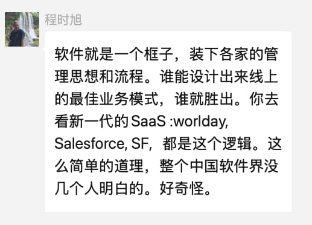
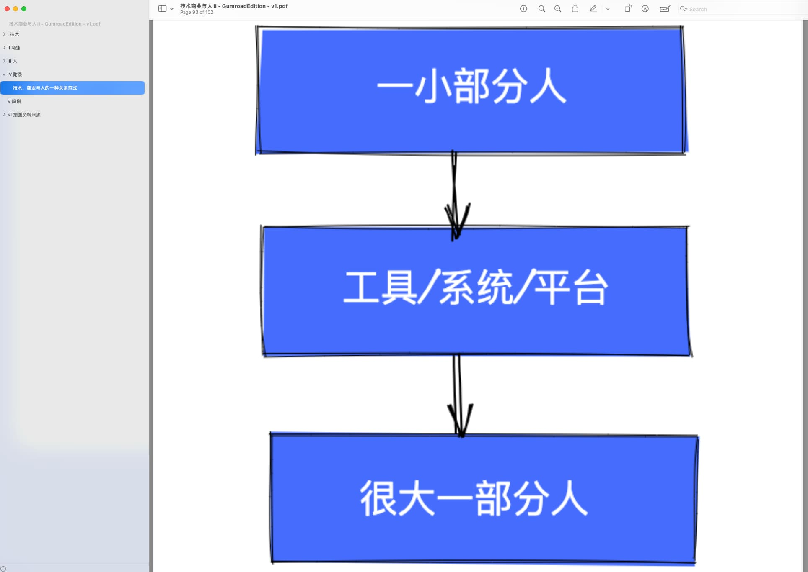

% 什么才是软件的关键价值？
% 王福强
% 2025-03-19

昨天在小群里看到程老师说了这么个话题：

征得程老师同意，决定就这个话题展开说说...

其实吧，不是没有几个人明白，而是有明白的，但通常**要么只做，要么不说**，为什么？

因为这种话题**既不会带来流量，更不会带来商业价值**， 它只会...

“既不会带来流量，更不会带来商业价值”这两个点其实挺有意思的，互为闭环，因为有流量，你才能听得多了，觉得有人“明白”（心理学上术语好像是叫“可获得性偏差”）， 但没流量的放商业付费墙后面，又不是大多数人会购买，所以，购买了的，明白了的，也不会公开说，从而公域里的感受就是没几个明白人。

我为什么在[《商业、技术与人II》](https://wfq.gumroad.com/)里放了这么一张插图呢？

就是因为早在2015年让团队做某个平台的时候，就把“**沉淀**”（我一般喜欢用 **consolidate** 这个单词来形容这事儿）到系统的思维让他们落地了。团队有没有理解我就不知道了，但心法我记得也就跟上海储总提到过，毕竟，付费客户，该掏干货得掏干货啊🤣

类似的事情还有2023年，苏总找我去跟某司做AI技术交流，车上说，中央还是有高人啊，很多人没有意识到软件系统的真正价值，嗯，我也就会心笑笑，互联网大厂那么一堆高P，可能老早就意识到的，只是不说罢了（或者也只是小范围交流），毕竟，能做到那个位置的，都是聪明人，谁也不比谁傻。

都不用说大厂了， SMB里很多老板对于什么是核心价值该抓在手里，什么无所谓，心里也是门儿清。

只不过，这些大多算是暗学，而不是显学。 

毕竟，自己深度思考和体验后悟出来的智慧，怎么会轻易示人呢？🤣 

都是血和泪，都是时间和学费，都是切切实实的用生命投入啊 😂

至于说国外软件公司干的事儿，那个成功其实更多还是商业环境的成功，国内也不是不懂，但商业环境不一样，古人早就说过了，

