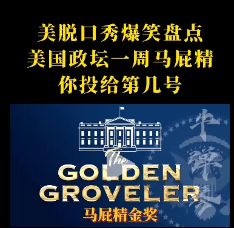

% 一个问题，一本书，两种选择
% 王福强
% 2025-03-20

昨天好几个地方看到有人转发这个视频（我个人这里是朋友圈看到，自己的「福报集团」群里有看到）：

愿意转发，想必是很认同。

但不知道有没有人针对这同一个视频，有着不一样的思辨呢？

个人看了这个视频之后（其实是扫+快进，因为浪费时间和attention），

脑海里浮现出近一段时间的一个问题和一本书

一个问题是上周有同学在付费咨询产品方案的时候顺便谈到的职场问题

一本书是我拖了好长时间才看完的社科类书籍

这两个东西其实都能对上面视频有一个不一样但合理的解释

尤其这是一本书

居然特意针对Trump的行为做了解读

当然，既然是在教斯坦福MBA总裁班

教授的解读与大众看到的应该是不太一样的

很多时候

不同选择造就不同的人生

当你在嘲笑别人的时候

其实别人可能根本就不屑

不过， 由这个视频，倒是有了个念头

要是搞个付费的在线研讨会（webinar）

不知道有没有人感兴趣啊？

斯坦福MBA总裁班动不动几十上百万的

线下搞也得大几千起

在线嘛， 200大洋就能搞，价值还不减

200大洋能改变自己的观念进而改变自己的人生

还有比这更便宜的入场券吗？

有意愿的微信上跟我说（没我微信的自己想办法）

红包200

凑够10人就发车

截止到本周日（2025-03-23）

人数凑不够，红包原路退回

Come on in~

> NOTE
>
> 前置条件： 到时候要自备梯子，没梯子的就别掺合了。

