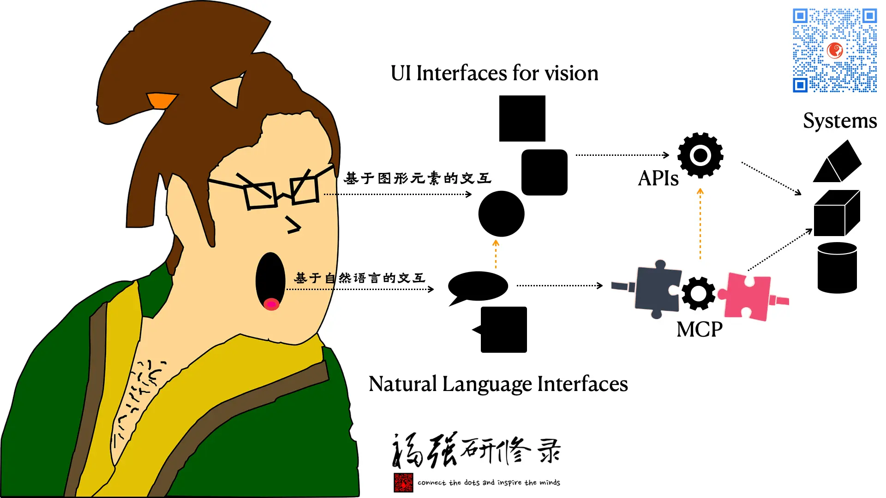

% MCP与NLP为我们带来了什么？
% 王福强
% 2025-03-26

## 术语解释

### MCP

Model Context Protocol，模型上下文接入协议，可以让现有系统及能力接入NLP与生成式AI应用。

### NLP

Natural Language Processing， 自然语言处理， 术语AI领域的一个子领域，主要专注于自然语言与计算机系统的交互， 相关术语还有NLU，也就是Natural Language Understanding， 自然语言理解。 

今天很多应用开始用自然语言作为与计算机系统打交道的手段，主要功劳就是NLP和NLU， NLU负责“理解”我们说了什么，NLP负责处理（比如生成内容）。

## MCP和NLP让应用开发产生了什么差异？

简单来说，主要是眼和嘴的差别。

过去我们与计算机系统打交道，一般是通过图形化界面（过去是命令行，也算是视觉）与计算机打交道。

图形化界面（UI）意味着以眼为主，以手为输入辅助完成与计算机系统的交互。

NLP和NLU已经达到相对可用的今天，可以通过自然语言与计算机直接交互了， 这意味着嘴为主，手作为输入辅助（打字也算间接的嘴）完成与计算机系统打交道。

MCP的主要作用，其实就是弥合自然语言交互的界面（Interface）与现有系统之间的gap。

MCP既可以直接调用现有系统的API，为自然语言输入的AI系统提供相关能力和数据与计算， 也可以直接在mcp server端自己重新建立新能力、新系统或者直接与旧有系统打交道。

## MCP为什么这阵子这么火？

我前面也写过一篇["为什么只有这种MCP Server火了？"](https://afoo.me/posts/2025-02-26-why-tool-mcp-server-rocks.html), 其实往简单了说就是“阻力最小”。

轻轻包一层封装就能将原有系统接入AI入口应用，何乐而不为呢？

相信越来越多的API endpoints会配备自己的MCP endpoints，毕竟，自然语言交互肯定比专业UI使用起来更自然。

虽然现在的NLU和NLP还远没有那么完美， 但要相信持续改进的可能性。

再说了， 两种方式又不是互斥的，不要好像用了一种就不能用另一种一样，其实这些方式都是对用户开放的。

只不过，将来可能还是会根据场景与频度这些因素，有侧重的提供那种交互，毕竟，都是成本啊！🤣

