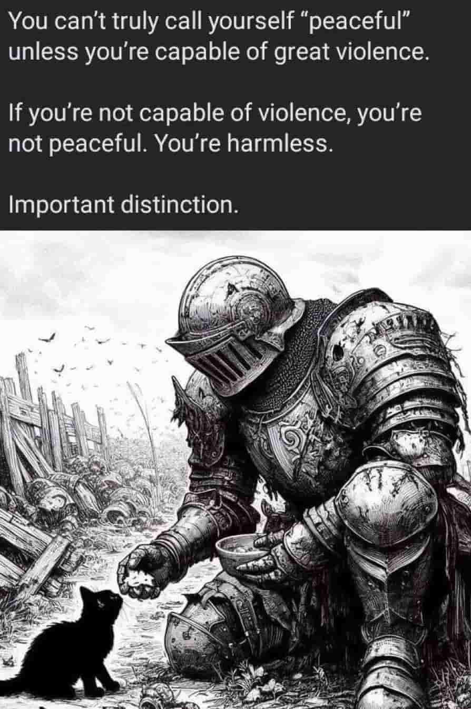

% 免费的原罪
% 王福强
% 2025-03-27

今天洪总发了篇公众号，申明了咨询的报价后，看下面评论有人直接评论 

> “我立刻取关，你们有钱人玩吧”

洪总赶忙解释：

> 没收粉丝钱啊。但是你的态度会决定你的人生走向的。不要厌恶钱，更不要默认讨厌有钱人，我以前文章写过，估计你没看到[偷笑]

哈哈哈， 其实这属于最典型的先免费导致的“原罪”。

简单想来，“先免费再收费模式”其实最典型的会招致以下几种情况：

## 个别用户的反噬

注意，是用户，而且是个别用户，就跟上面评论的这种。

他会认为免费是天经地义的，你开始免费就得一辈子免费，你就应该给我免费，而且还得是免费提供最好的东西。

这种情况其实很常见。

最好的做法就是忽略就好了， 因为他们原本就不是你的客户。

你应该专注的是自己的潜在客户，而不是这类免费用户。

当然， 如果你不喜欢这种评论，最简单的就是像我这样，一开始就收费 🤣

这叫什么？ **预期管理**！

我的付出是有价值的，所以，收费也是天经地义的。

只不过，很多时候，商家为了流量，往往采用免费先行，先彰显自己的诚意，以此换来同样有诚意的客户。

## 毫无忌惮

很多免费群人一多往往就广告满天飞，为什么？

没有付出成本。

前阵子「福宝集团」微信群里我踢掉了两个违规的人，后来想想，好像最初他们入群的时候也没有付出成本。 但既然违规了，而且之前也认识，那也不好意思，只能踢了。

这还是付费群。

但只要前期没有付出成本，对方就是可以肆无忌惮。

免费虽然可以带来流量，但洪水更多其实是祸事。

精准才是关键。

## 后话

这个世界上， 价值的获取无非三种途径：

1. 创造
2. 交换
3. 抢

交换是水平线， 创造是天际线， 假如有些用户连交换这个水平线都不尊重，那么，就让他们自己把自己交给其他价值途径的“获取”者吧！

