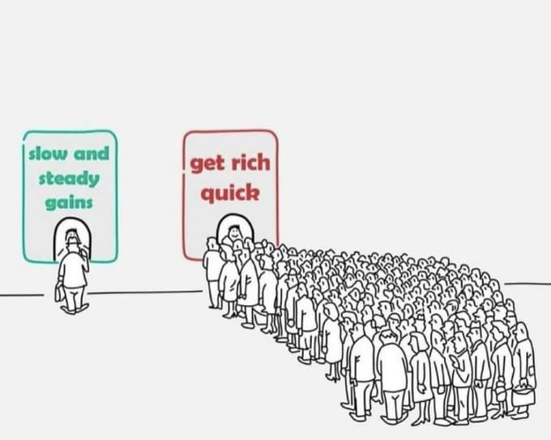

% 工具软件的战略路径演化
% 王福强
% 2025-03-28

今天聊聊个人在工具软件层面的思考...

## 战略

首先说说什么是“战略”。

什么是战略？ 

个人觉得，**战略，其实就是选择的智慧**。

这东西不是一成不变的

而是会根据变化随时调整的

所以才会有人说（好像是逍遥子说的？）

> 战略是打出来的。

所以， 战略这东西，天然跟演化关系紧密，因为什么都在变。

## 工具软件

工具软件也是软件

软件业务赚不赚钱呢？

有赚钱的，也有不怎么赚钱的

比如Intellij这种，就挺赚钱

但国内的软件，尤其是工具软件，就往往大面上不赚钱

我过去有说过一句话叫：

> 通用工具练能力，专有工具做盈利（赚钱币）

其实主要原因就是，SMB要靠通用软件赚钱，其实还挺难的。

在通用场景，大厂一旦砸钱砸人，对SMB来说就是毁灭性打击。

看看这几天AIGC的生成图像市场， ChatGPT4o一个Image Generation特性，基本上就灭了前几年很多团队的投入成果。

所以，工具软件赚钱，要活下去，就得抓专有垂直场景或者小众场景，要么太小大厂看不上，要么抓住了别人进不来（或者想进来也同样难）。。

有了利基市场，有了跟用户需求的强绑定，才是最终的护城河。

## 卖软件还是卖服务？

很多人想要卖工具软件，更多还是分发和复制的成本低，可以做规模效应

但其实换一种思路

假如客户群体对软件的价值不重视

那我们是不是可以不交付软件，转而交付服务更好呢？

让工具软件只作为自己团队和组织内部的作业工具就好了

工具软件的目的就是提升自己团队和组织的交付效率就可以了。

将软件研发、软件实施、软件应用、软件售后服务等全都打包为“服务”对外输出。

这样，客户只需要对打包后的服务埋单就好了，我们也可以适当做高毛利率/利润。

毕竟，客户其实很多时候只要一个结果，至于怎么做到，真的没那么重要。（特殊需求除外）

## 为什么选择做工具软件？

没有“足够的投入”实力。

否则，我们应该做的是系统、平台、生态， 🤣

