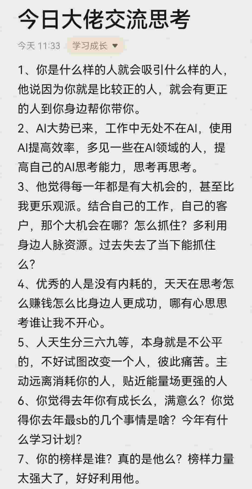
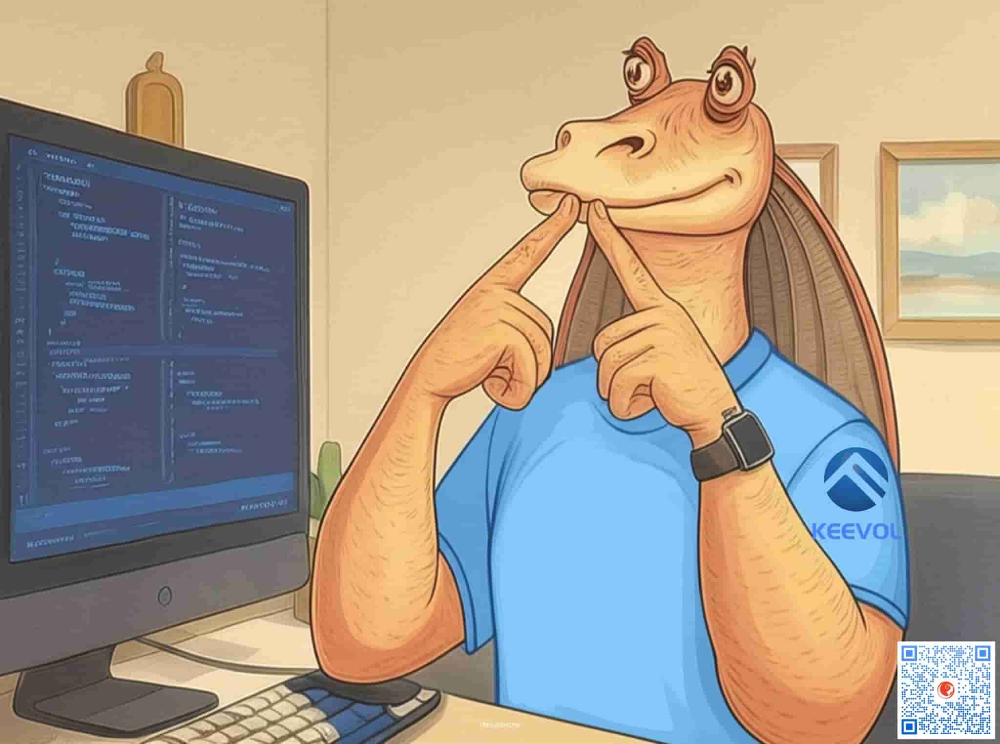

% 你自己的判断力才是你的核心竞争力！
% 王福强
% 2025-03-29

昨天在「福宝集团」群里分享了一张朋友圈看到的贴图：

有同学评论：

> G: 第一句话太重要了
> ...
> Z: 很好地解释了为什么我们能聚到福宝集团！[偷笑]
> ...

我不太想破坏气氛，所以有句话憋着没说 😂

其实正还是不正，不要太过于纠结于一端。

就像有人天天喊让你做个好人，却从来没人跟你喊让你做个坏人一样，但这个世界上就因此少了多少坏人了吗？ 没有。

做个普通的人就好了。 

我不太喜欢什么好人、坏人这种分法，即使要分，那你也分清楚了呀，发现很多人把好人与老实人、懦夫相提并论，这好像不是一回事吧？ 但限于中文通常都是意会，这种混淆也可以理解。

至于你会吸引什么人，有些时候也不是绝对符合你预期的，就像飞蛾扑火， 灯有动机和诉求吗？ 没有。（海底的发光鱼倒是有）

人是切片的（Slicing）。

就像你卖商品，你的用户是一群固定的人吗？ 不是，你的用户恰好是进入某种状态的某个人，就像一个瞬时切片一样，状态对了，发现你的商品对当前这个状态有用，就买了，但之后，状态切换，你再想促销拉复购，估计效果也不再有了。

这阵子经常刷到郎x平的短视频，发现有些观点是对的，但也不是所有观点都对（当然，也可能是彼此价值观冲突），虽然说九真一假危害最大，但从他的角度来说，他也确实没有必要对所有人的人生负责，信不信，还是听话的人决定的。 也就是常说的，“对方说啥不重要，你相信啥才重要”。

就跟上面插图的标题一样，标个“大佬”，你是不是就开始慕强了？ 🤣

