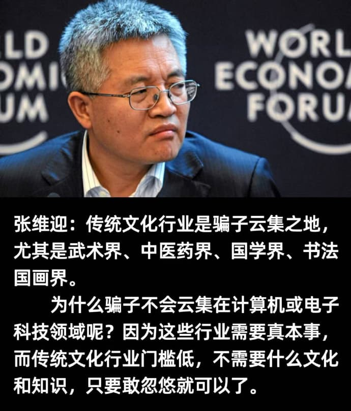
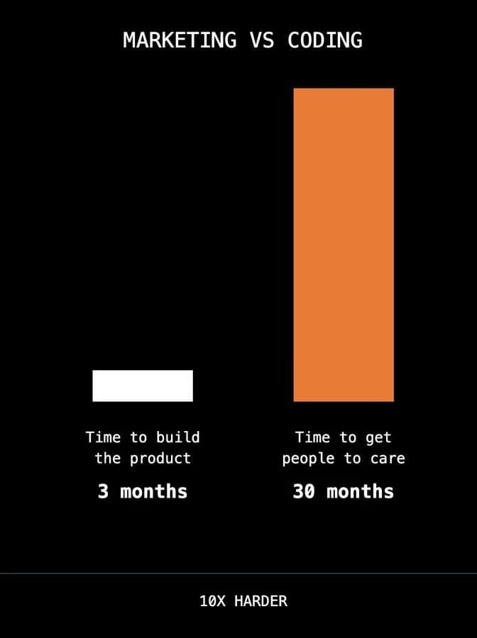

% 骗子
% 王福强
% 2025-04-01

骗子其实哪儿都有，比例和概率不同而已。

就跟你会觉得提高客单价，顾客的素质会高了吧？ 但马方的亲身经历告诉我们，其实也未必。

他在搞低客单价的时候被搞了，所以，提高客单价，服务老板这个群体应该就好很多了吧？ 

其实一样，还是会有那种不尊重契约精神的。

临近商务考察几天行程快结束了，突然来一句我不满意，我要退费，哈哈哈哈

这就跟饭局上都吃完饭了，还剩一口，说我吃的不满意，我要退费一样，简直就是嚼完的甘蔗，渣男，哈哈哈哈

但遇到这种你也没办法，往好了看就好了，毕竟，不是所有客户都这个德行。

至于张教授说骗子这个事情，其实，也是一样， 比例不同而已。

其实我们倒是可以换个角度看这个问题，假如比例真的是前面几个行业多，又是为什么呢？

假如我们从商业的投入产出角度看这个问题，其实感觉也说得通（但不一定就是根本原因）。

前面几个行业前期的投入其实很有限（或者可以控制投入比例）， 但牵扯研发类的，就不好说了（很多传统企业老板或者销售出身的老板，并购或者自己开始养研发的时候，直呼肉疼，就是因为之前不理解科技研发类的前期投入有多夸张）。

东西造出来是一回事儿，

东西卖出去又是另一回事， 

而这两个大头儿都需要投入。

张教授提到的前面几个行业，起码造东西阶段不需要太多投入了，毕竟，有内容金矿，还有几千年持续培育下来的市场人群，只要搞营销、搞流量就好了。

而搞流量、搞营销，肯定虚妄的东西要多一些，所以，显得骗子遍地也很正常 🤣

但我觉得这不是单一方面的问题

骗子能骗

不也是因为迎合了某类人群的需求嘛！😉

本来还想对国内财务软件巨头空降高管三个月就折戟沉沙这事儿说几句，想想也没啥意思，无非是无奈推着+虚妄拉着交织后的个人状态与现实黑暗森林碰撞后的结果，常态， 常态。

