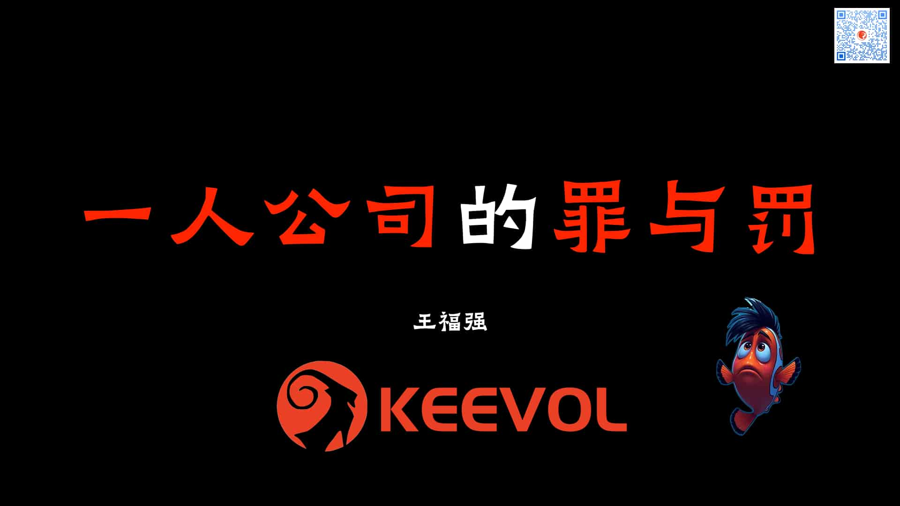

% 千万别把一人公司当避难天堂！
% 王福强
% 2025-04-05

我估计很多人会出于各种原因而去推崇一人公司，但作为已经干了7，8年的老头子，奉劝各位因为被动原因而选择做一人公司的同学，千万别把一人公司当避难天堂！

这世界就没有天堂！

实际上，一个人也称不上公司。

公司对应的英文单词是Company（或者Coperation，只是组织性质不同）， Company除了有公司的意思，其实还有如下意思：

>  公司；商号；陪伴；同伴；客人；[军]连；一群

总之，这个词儿的性质偏群体性概念，而不是单打独斗的“侠”。(one-man company按照国内翻译的“习俗”是不是得翻译成一人侠有限公司？哈哈哈哈)

其实，一人公司拆开看，重点既不是人，也不是公司，而是**业务**或者说**生意**。 假如不是因为监管与合规等因素限制， 可能公司这个工具都不需要。

你说一人公司有没有成功的？ 

肯定有，但我们做事得看概率和现实条件。

不能因为媒体一忽悠就忘了自己是谁了。

就像郭德纲说的，您敬我，是您有涵养，但我得知道自己是个什么东西啊🤣

做事还是得从自身现状出发，有梦想当然好，但依然得脚踏实地，尤其是中年人。

年轻人还有大把时间试错，中年人就有点儿尴尬了，虽然也有成功案例，比如遥遥领先集团的创始人，但14亿不也就出来这么一个嘛！你说雷军？ 别扯了， 雷总妥妥高富帅好吗？ 

所以，选择一人公司这条路可以，但最好以审慎的态度选择。

恰好打算明天(2025-04-06)晚上搞福强私享会第三期：

感兴趣也可以参与，不过还是老规矩：

1. 200元红包茶水费
2. 自备梯子
3. 10人起航

怎么报名？ 微信跟我说下就行， 没有我微信的，自己想办法🤣🤣🤣（反正我现在不随便加人）

