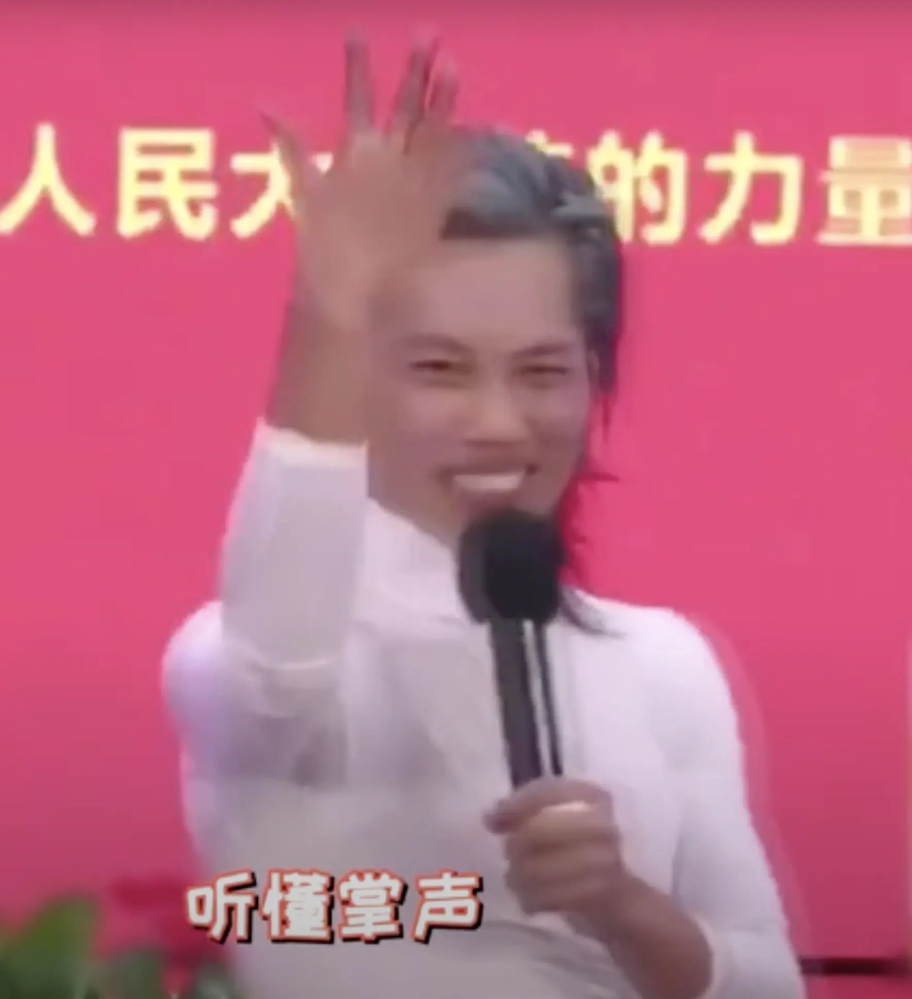

% AI 时代，你问对问题了吗？
% 王福强
% 2025-04-07

刷到刘润老师的一个短视频，「到底学什么最不容易被AI替代」， 

刘润老师重点强调数学，

但说实话，个人最头疼数学了

其它东西还可以说不会我可以学，

“干中学嘛”

但数学不会，是真的不会啊～

所以，我得换个问题

与其问“到底学什么最不容易被AI替代”

不如问“AI替代不了哪一类人？”

我可以说：

**AI替代不了有创新思维的人**

也可以说

**AI替代不了有自我动机的人**

还可以说

**AI替代不了[与时俱进](https://keevol.cn/)的人**

但这些都太虚了

估计大家都会嗤之以鼻

所以，我们还是回到底层逻辑吧～

其实

人生在世

无非两件事

人和事

人的底层逻辑是人性

事儿的底层逻辑是物理（当然，这里是“物之理”的意思，也就是外部世界的规律与原理，不是大家高中上的那个物理）

> 数学应该是人改造物理世界利用物理的一种工具（一个想法不一定对）

一个人能深谙人性、深扎第一性原理

大概率AI是替代不了他的

唯一能替代他的

可能就剩下时间了

当然

如果能把人和事洞明达练成一个“人事”

那就更牛掰了

最后

我觉得， 你不应该担心被AI替代，你倒是应该担心的是那些用AI来操控你的人

