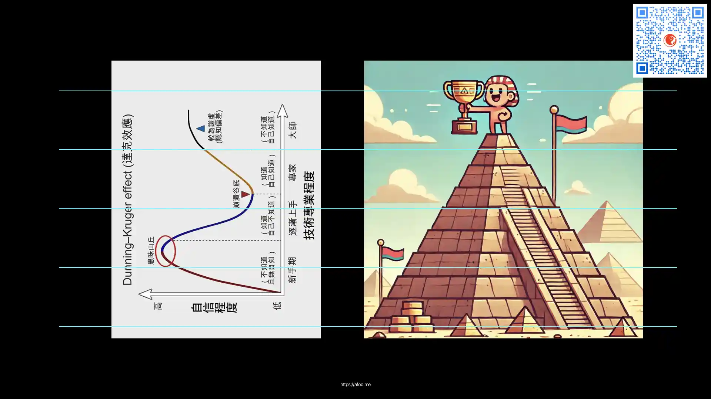

% Ego 难死
% 王福强
% 2025-04-11

今天跟某CEO聊天

让我帮忙介绍运营（出海增长方向）

期间谈到招人的事情

跟我抱怨说现在年轻人怎么怎么样

我想说的是

其实，大部分人

年轻时候都那个屌样儿，包括我

只是回头看

才看得清楚。

每个人都有自己的Ego

自负是一种Ego

谦虚也是一种Ego

他觉得不应该都谦逊好学吗？

这其实是用他的Ego去强求其他人的Ego

他的Ego是谦逊好学

可能更多是出身和家学比较好

但我看到的大多数人其实更多是自负与狂妄（要不我会在「福强私学」里搞了个[「愚蠢的自负」](https://kb.afoo.me/cognition/%E6%84%9A%E8%A0%A2%E7%9A%84%E8%87%AA%E8%B4%9F/)专栏呢）

其实

Ego就是每个人心中的那座最难爬过的山

历尽千帆

才发现

人生只爬到了达克效应的某一段...

