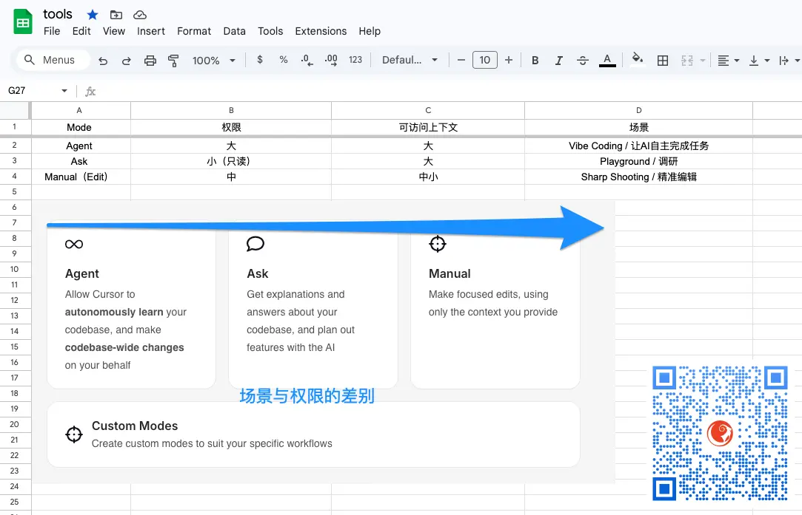

% 跨代鄙视链是怎么形成的？
% 王福强
% 2025-04-12

在我们技术行业有一个行业鄙视链

做底层技术的瞧不上做应用开发的

昨天阿朱提到他当时的前辈

内存都得按bit精打细算的一代人

瞧不上他这一代用Windows开发

甚至调调API的

照这个趋势下去

用古早手艺写代码的一代人

应该也有人会鄙视用Cursor和AI开发应用的新生代吧？🤣

其实

大家都是差不多生命周期的一个个线段

只不过错位摆放到了同一个时间线上

也同样在类似的年纪做着那个年纪所处阶层的事情

唯一的不同可能只是时代变量变了

基础设施变了

我记得很多年前（十年以上了）

去上海参加一个发布会

明道的创始人任向辉讲了一个观点我至今印象深刻

大意就是

“基础设施建完了就沉淀下来了”

当时心头一震

卧槽，这洞察比我强十万八千里啊

普通人还指望一个技能管一辈子呢

哪里想到，一代人有一代人的使命

建完了就是建完了

后面的人只是使用这些基础设计继续建造更高的楼层而已...

就像我们天天惊叹于今天的AI有多牛逼

其实

不也是从数据标注苦活脏活累活儿干完了

Web2.0数据采集的足够多了

大数据基础设施建设完了

所有这些东西都有了之后才有了今天的AI吗？

人跟人的智商其实都差不多

唯一的差别就是

要么生错了人家

要么生错了时代

🤣🤣🤣

