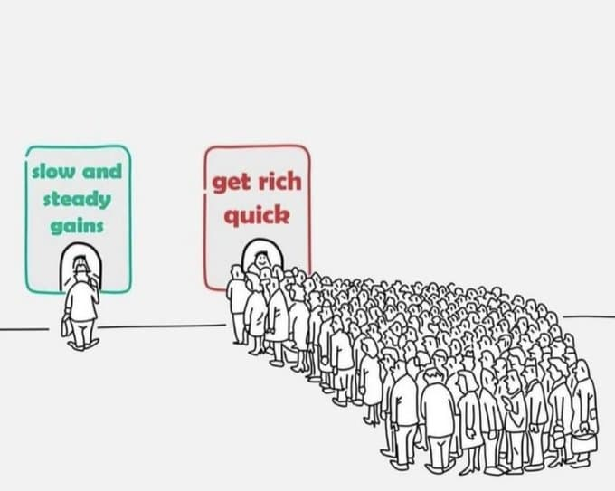

% 也谈三观
% 王福强
% 2025-04-14

读了阿朱写的[“何为三观？”](https://mp.weixin.qq.com/s/x_tb-mRXdH4QIK2zi2mzvg)，写得很好。

借着这个话题，也谈谈自己对三观的看法。

# 总观

有人可能会觉得三观有高低之分，其实，个人觉得三观更多是**不同**而已。

有人可能会觉得三观在一个人身上可能是不变的，但其实很可能在经历不同事情之后，三观也在**变化**。

三观之所以经常一起提，是因为它们之间其实也是**相互影响**的。

# 世界观

世界观即你怎么看待这个世界，everthing outside of you and around you.

比如，我觉得，这个世界天然是多样性的，只不过，某些地方因为特殊需要，多样性会被强制磨平或者屏蔽，让这些地方人觉得这个世界就一个样子，但其实不是。

这同时也是为什么，这些地方出来的人，一旦看过了世界真实的样子之后，会经常对这些地方没有见过真实世界的人喊：

> 你都没看过世界，谈什么世界观？！

物理世界与人的世界是两种世界， 这个事情，确实得佩服老子， 当然了，也说明有些东西其实说来说去就那么些东西，没啥好炫耀的。

人类的发展，更多是在物理世界上的开拓， 人性上没啥太大变化。

在人的世界里混，预期管理很重要。

预期管理的好，可以活在天堂；

预期管理不好，可能活在地狱。

# 价值观

价值观是说你对什么更加珍视，也就是你的preference是什么。

比如，有的人觉得“钻石很久远，一颗永流传”，有的人则觉得这傻逼玩意儿就是忽悠傻子的碳元素。

比如，有的人觉得别人对TA好就是真的好，有的人则觉得别人对TA好应该另有猫腻儿。

再比如，有人觉得国学或者中医是瑰宝，有人则觉得...

以利为利是一种价值观

无情但有义更是一种价值观。

有情有义，你得先有实力 🤣

从迎合人性、操控人性中获益，这是一种价值观

不迎合人性，帮助愿意突破自己的人成长，也是一种价值观

# 人生观

人生观是你选择怎么过完你的一生， 也就是你的style of life。

粗茶淡饭也坦然是一种人生观，

不为五斗米折腰是一种人生观，

傍大款走正道也是一种人生观，

吃喝玩乐更是一种人生观，

生还是不生，多生还是少生，也是一种人生观。

死后为世界留下点儿什么，更是一种人生观。

抛去历史和系统强制加给你的因素不谈，路怎么走，自己选的，自己愿意就好。

# 后话

个人有三观，企业也有三观， 企业的三观：

- Mission
- Vision
- Value 

即“使命、愿景、价值观”。

既然看到这里了，各位老板要不要[管理课程](https://wfq.gumroad.com/l/mgmt)来一套？ 🤣

