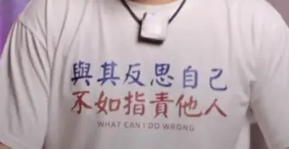

% 失业中年的愤怒是毒
% 王福强
% 2025-04-17

看到一个原地产公司的高管失业在家2、3年的抱怨视频，借这个视频说几句，不希望所有人都陷入他那种戾气状态，既对自己无益，也对周边人没好处。

开始我看他短视频数据还不错，以为是机构操盘，细看，应该纯粹就是Rage Bait引发的流量。

想从以下几个视角谈谈对他这种状态的看法...

## 个人职业生涯的影响

假如他还想重入职场的话，他发的这些视频看似流量很好，但其实对他是有害的影响。

但凡公司负责人看到他这种心态，没有公司敢用他的。

很多东西并不适合公开表达。

就算有流量，这些流量也可能是有毒的。

## 教育与就业

### 关于教育体系

视频里充斥着自己的不凡与对教育体系的批评，

怎么说呢？

国内绝大多数人对整个教育体系，并没有一个清晰的认知。

也很难有。

直到撞了南墙。

反正我也没法多说，如果你想了解更多，欢迎预约一对一咨询或者有线下课的时候可以报名。

### 关于就业

他周边的人都怂恿他去送外卖，他不想去送。

不送完全没问题啊，但理由和思路不太对。

你可以说自己有了这么高的教育背景和行业资历，应该做更有价值的事情，应该做长期有价值沉淀的事情，应该做替代性门槛更高的事情。

但觉得自己屈尊不想去，这个多少矫情。

脱不下长衫，理解。

但“要不要”与“应不应该”，这俩要分清。

网上很多自媒体貌似很鄙视的经常用“穷人的问题就是太喜欢技术或者是沉迷于技术”， 但其实：

## 心路历程

首先，我祝愿大家不要落入他类似的境遇和心境。

但假如你不幸进入了这种境遇，希望你提前预防，下面可能是要走过的心路历程，或许会很漫长、很痛苦，多长、多痛苦，因人而异。

fuck you 阶段属于怨天尤人阶段，传说中的“与其反思自己，不如指责别人”，其实说的就是这个阶段， 对外发泄怒气和戾气

当周围人都不屌你的时候，你想指责别人、抱怨别人的时候也找不到人了，你就进入了fuck阶段。

这个阶段你懊恼、烦闷无处发泄。

过了不知道多长时间，你慢慢进入fuck me阶段。

开始指责自己，贬低自己，过去你PUA别人或者别人PUA你，现在，你PUA你自己。

自信离你而去...

自卑随之而来...

内耗反复，反复，反复...

直到某一天，你遇到了比如这篇文章，知道了有本书叫《Unfuk yourself》，你读了它，开始整理自己、反思自己、重新上路...

这时候，你进入了fuck it阶段

无所谓，一切都无所谓， 物来顺应，未来不迎，接受能改变的，也接受不能改变的， 总之，主打一个顺其自然，该走走、该停停...

恭喜你，你走完了一个达克效应周期 😉

## 怎么办？

假如作为曾经的大厂高管真的进入人生低谷，应该怎么办？ 

大家都只关心怎么办，对吧？

我看到的周边情况是这样的：

- 大群里很多人说，在杭州碰到原来各个大厂的高管或者创业者都在开网约车
- 卖保险的，过去的大厂高管，CIO
- 猎头
- 培训
- 自媒体（但其实并不好干）

路怎么走，你得自己看着办，每个人现状不一样。

但有几个建议是成立的：

1. **降低欲望和预期**，下滑的心路历程可能很漫长
2. **待时而动**，不要用力过猛，身体是革命的本钱，锻炼身体，活在当下。
3. 花无百日红，人生起起落落很正常，看开点儿，低谷也可能是救你。

## 最后推荐两本书

- The Dip: A Little Book That Teaches You When to Quit (and When to Stick)
- Unfuk yourself

都是英文的，至于怎么找到，自己各显神通吧 😉

如果英文不好，可以考虑先扔给AI帮你翻译下

Anyway, Good luck~

