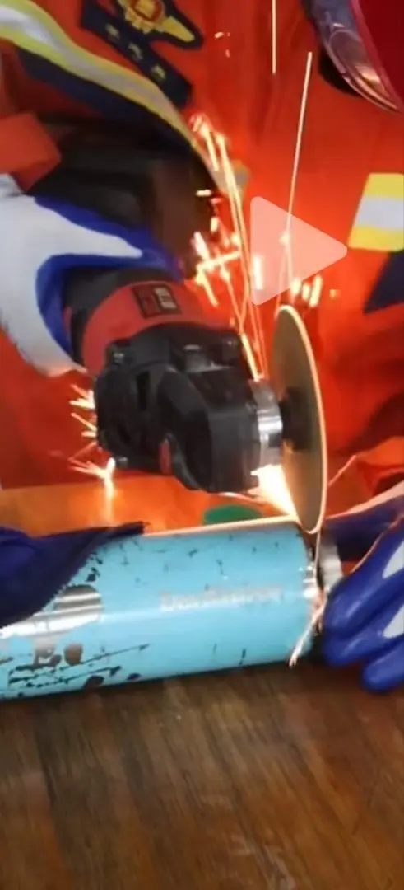
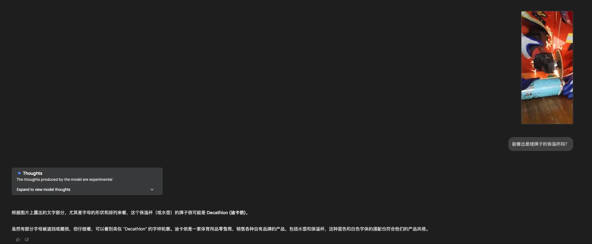
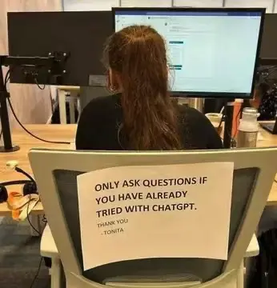

% AI 时代依然要善用工具！
% 王福强
% 2025-04-18

昨天刷到一个短视频，一个小女孩可能是贪玩，把自己的手卡在保温杯里了，只能找消防员帮忙。

消防员费了九牛二虎之力才给解救出来，过程中感叹了一句：

> 这保温杯质量真好...

然后评论区就炸了，纷纷问啥牌子的保温杯，几百条评论，愣是没有人搞清楚是啥牌子，最多有人截图如下（“我只能帮到这里了”）：

磨损严重不说，突破也不清楚，靠人眼是不行了，我就顺手把这图扔给了Gemini， Gemini是这么说的：

显然，多模态大模型的识图和推理能力已经很牛逼了，可信度很高吧？所以我也顺手就把这图贴评论区了， “我帮大家问过AI了”（不过，感觉应该向保温杯厂商要广告费，哈哈哈）

ChatGPT刚出来的时候，有张图我觉得挺好：

与其天天听看那些垃圾媒体制造焦虑，还不如自己上手直接玩。

过去遇到事儿或者不明白的东西，你还得身边有合适的人才能问到合适的答案，现在，有了AI这么个好东西，遇到不明白的，完全可以先问问它呀！

这也是我为啥会在小报童专栏[「福强老师的AI通识课」](https://xiaobot.net/p/aifd)里讲，根本没必要焦虑AI会怎么怎么样，能够把AI当工具，用好AI，就很可以了。**FOMO**(Fear of missing out) 完全没必要。

**人 才是目的， AI 只是工具。**

