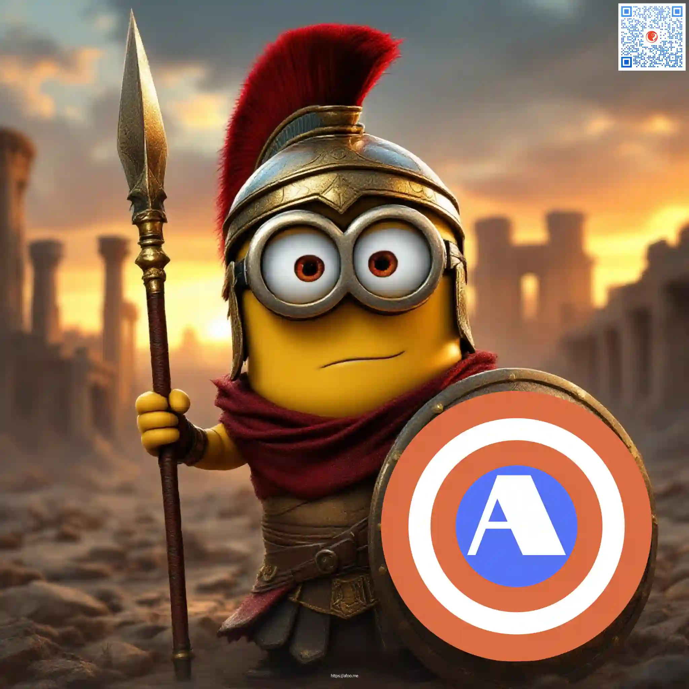
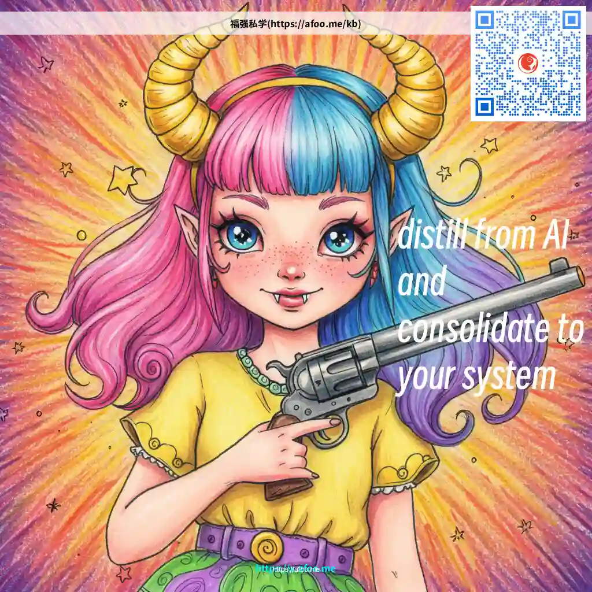

% 我是怎么用人工智能(AI)的？
% 王福强
% 2025-04-20

看阿朱提到这个话题，我也（再）聊下（为啥有个再？ 感觉我之前聊过🤣）

## 调研

对自己不熟悉、不太清楚的，先不管三七二十一，扔给Gemini或者Grok聊一下。

如果觉得不靠谱儿，起码聊个两三家才可以。

没有神仙索的时候，会手机上开下元宝切DeepSeek或者直接豆包用用。

但做到电脑前工作的时候，大部分时间都是Gemini或者Grok。

为啥不用ChatGPT？

麻烦，2023年出就用国外的SMS服务注册过账号，但封控一直比较严，懒得折腾。

包括Claude也是同样道理。

## 素材

文章插图类或者PPT插图类场景使用的素材，

我现在基本都是AI生成的。

大家也都知道我是国内最早做[Stable Diffusion课程](https://afoo.me/posts/2023-06-02-stable-diffusion-courses-all-ready.html)的，

但日常其实用的并不多。

还是嫌麻烦。

不过，对于专业类ToB类场景，从Stable Diffusion发展起来的workflow类产品以及微调与训练，依然是重要的商业需求。

## 代码

哥原本就是码字的人（码字， 代码 + 文字）

所以，写代码不杵的 😉

算是CEO（以及CTO）里会写代码的那一类，🤣

但现在对于不想写的非关键代码， 我其实都是让AI去生成了。

过去是靠 Google 搜索编程，现在靠的是大模型编程（PULL FROM LLM）。

至于编码能力比较强的大模型有哪些？

参考「福强私学」视频号里那个「编程大模型前三强」的视频。

还有就是，[「福强私学」](https://keevol.cn/kb/kb.html) 里也有两个跟AI编程有关都专栏：

- [大模型调教手册](https://kb.afoo.me/ai/104-%E5%A4%A7%E6%A8%A1%E5%9E%8B%E8%B0%83%E6%95%99%E6%89%8B%E5%86%8C/)，aka. **A Curator’s Guide to LLMs**
- [Cursor Cookbook](https://kb.afoo.me/ai/105-cursorcookbook/)

## 最后

其实使用AI的最高境界是没有AI或者叫感知不到的AI， 

把AI融入产品，让用户感知不到，才是最高境界。

比如，我为自己打造的KEEBOX工具里也有很多AI能力，但从产品交互层面，根本没有任何感知。

哦，对了，还有最后一种用AI的方式，就是 卖AI课 🤣

比如: 

- [「福强老师的AI通识课」](https://xiaobot.net/p/aifd)
- 视频号付费合集里的「AI进化赢」

