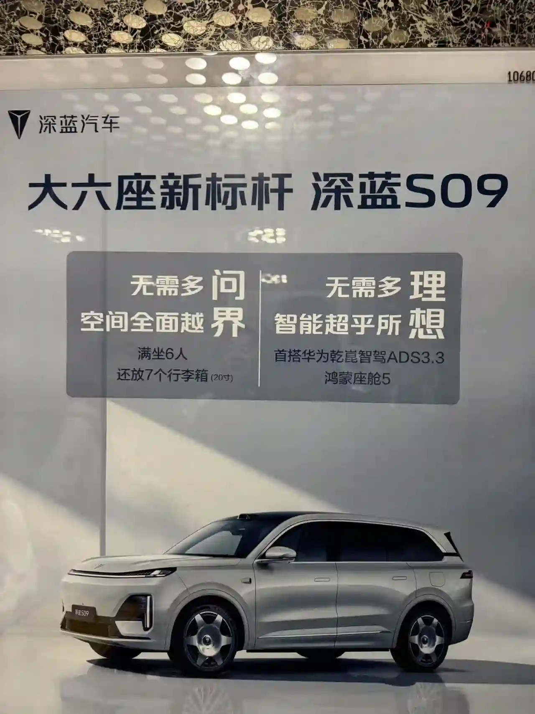

% 这负责人得开除！
% 王福强
% 2025-04-22

今天西门大官人在「福宝集团」群里发了一张海报，

大家看看，这张海报，你第一眼关注点在什么地方？

是不是突出的那两个汽车品牌？ 

你这不是给竞争对手递刀子嘛？ 

自己花钱投放，却给别人打了广告！

你说，这投放负责人该不该开出？ 🤣

你要是说具体执行的设计师可能会为了炫技，导致灯下黑

但作为投放负责人，最后一关的review总得把关好吧？

都当公司的钱不是自己的，反正花别人的钱不心疼是吧？ 🤣

这倒是让我想起一老兄弟经常跟我提到的一个案例

他当年做海淘的时候

当年小黄书也在做，

然后小黄书做了一次傻事儿，

投放的行业关键词

这给他直接带来泼天的流量

因为他的APP名字里有这个行业关键词 🤣

真是天上掉馅儿饼，运气来了挡都挡不住...

反观小黄书，忙活一场，钱花了，但却为他人做了嫁衣啊！ 🤣

惊喜不？ 

意外不？
