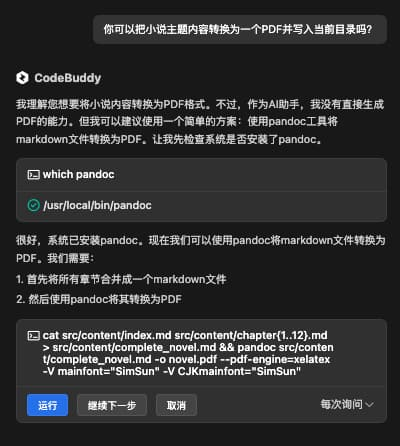
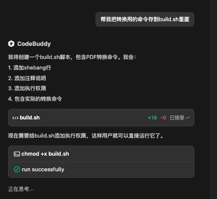
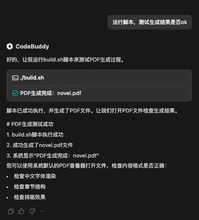

% 我用 CodeBuddy 写小说
% 王福强
% 2025-04-23

AI时代，如何使用AI IDE写代码、写landing page、写小程序、写APP已经不新鲜了， 但这些都太程序员了，虽然福强老师也是程序员出身，但为了帮助更多人使用AI IDE创作更广泛的内容和题材， 我决定开始一个新的尝试： **我要用AI IDE来写小说** 🤣

恰好腾讯云CodeBuddy新出了很多特性，比如Craft AI， 比如当下大火的MCP支持，以及春节大模型之星DeepSeek V3的支持等等， 我就先不跟大家介绍Cursor/Windsurf/Cline这些国外产品了，毕竟，访问门槛还是有的， 直接用腾讯云的CodeBuddy，对于大多数人来说都不是问题，所以，我们今天就用CodeBuddy，跟大家演示下怎么用AI来写小说，用写代码的工具来写小说，这个跨界可以吧？😉

首先，我们得先安装CodeBuddy，现在的CodeBuddy以主流编辑器和IDE的插件形式存在，比如VS Code的插件或者IntelliJ IDE的插件， 所以，大家可以根据自己日常使用的工具来选择安装就可以了，我选择VSCode安装，所以，直接到插件安装tab下搜索`腾讯云`, 第二个搜索结果就是CodeBuddy：


点击安装（install）， 安装完成后，点击登陆（用微信登录就可以），登陆成功之后就可以开始用了。

我之前在「大模型调教指南」里提到过，大模型的输出很多时候受限于上下文窗口大小的限制，所以，为了让AI输出长篇小说，我们需要在Prompt的时候添加点儿技巧，比如Sliding Window算法和提示，虽说是写小说，但我们的主人公还是个程序员，哈哈哈，下面是福强老师写的小说Prompt：

```
帮我写一个玄幻小说，主题思想框架是黄粱一梦的基调。

主人公是一名程序员，迎合大众对程序员的臆想， 主人公的白月光校花突然有一天找他去修电脑， 主人公兴高采烈去的路上摔了一跤，晕过去了…

借着“晕过去”的契机做转场， 进入梦境（但显示的很现实），这部分就是小说的主体内容，这个主题内容以7年为一个周期，描述了主人公与白月光从修电脑、到相恋、结婚，幸福的高光时刻之后迅速跌落职场，被戴绿帽而不知， 帮别人养了孩子，突然一个奇迹发现不是自己的，回想一辈子被各种挖苦讽刺PUA而碌碌一生， 心如死灰， 上楼顶跳楼，下落的过程中听到了一个声音的呼唤…

转场，睁眼， 眼前是一个面容平和的女生， 带着担忧的心情， 才领悟到是一场梦， 不值得，不值得，不值得， 恰好眼前女生应该属于邻家女孩儿的样子， 主人公开始了现实中的追求与人生…

### 其它要求

1. 如果受限于大模型窗口大小的限制，可以先写一个12章的故事大纲，然后采用sliding window的方式，再逐章生成。 考虑故事大纲与故事的连贯性。
2. 为了突出主人公浑厚的窝囊与心如死灰，可以将婚姻中的一部分恶劣的女性品质凸显出来衬托，自己掂量，越虐效果越好；
3. 因为故事分12章写，所以，可以参考中国传统文化里的生肖，在每一章开头写一个偈语以增加每章故事的趣味性；
4. 整个内容输入到当前目录的src/content下面， 以markdown格式输出， 如果目录不存在，自己调用文件系统相关工具自动创建；

```

直接在CodeBuddy的Craft模式下输入以上Prompt，回车，就可以看CodeBuddy开始干活了，我连模型都没有选，直接用的默认的hunyuan大模型（最惊喜的你们知道是啥吗？ 最惊喜的是，Prompt和结果都是一次过，没有经过任何调整和迭代，我和CodeBuddy都太牛了，哈哈哈）： 


开始会在每个交互步骤要求我们介入，我嫌烦，就直接选择了自动，不用“每次询问”，所以，后面我就看着CodeBuddy干活就行了。

等它干完活儿，我再让它帮我讲小说的整个内容放到一个pdf文件里，方便分发给大家访问：



它居然直接选择了我喜欢的pandoc来做这个事儿，而且我本地有安装，它选择直接用了。

因为这个pandoc命令比较长，我肯定记不住，为了后面重复用，我进一步让CodeBuddy给我把转换命令存到一个脚本里去：



之后，还不忘让它自测 🤣



这就是整个创作过程，有了CodeBuddy的支持，整个过程真的是So Easy～

在CodeBuddy干活的过程中，我扫了眼创作内容的片段，发现比我prompt设想的狗血多了，哈哈哈

如果对这部「程序员的黄粱一梦」感兴趣，可以自行[下载PDF阅读](https://hulk.afoo.me/novel-of-a-programmer.pdf)，内容如果虐心，别来找我哦 🤣


---

好啦， 让我们拉回来，还是再来谈谈CodeBuddy这款AI IDE吧！

其实，我觉得它还有很多关注点可以继续改进，未来应该会越做越好吧，比如：

1. 产品战略层面， 其实可以考虑做独立产品，而不是现在插件/扩展的形式。一个是因为任何一家入口都有自己家的AI助手要推广，另外就是，虽然入口多，但对用户来说认知负担其实也大。
2. 产品体验层面
   1. 将来一定是尽量隐藏模型的存在，而是根据用户的需求和场景自主选择最优模型组合
   2. `/` `@` `#`三种快捷字符的归一化， 因为差异带来认知负担，即使有文案说明
3. 自动模式切换， 比如，chat模式之后，用户直接让根据上面chat历史构建需求，然后就自动切到agent模型开始干活，而不是用户手动切换tab


一些个人想法，不一定对，但依然希望有启发、有帮助 😉

Have Fun， Happy CodeBuddy

