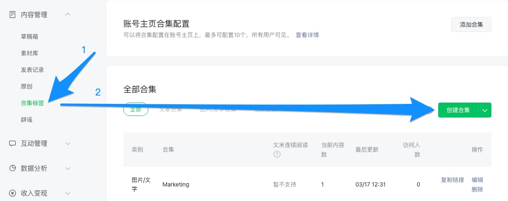
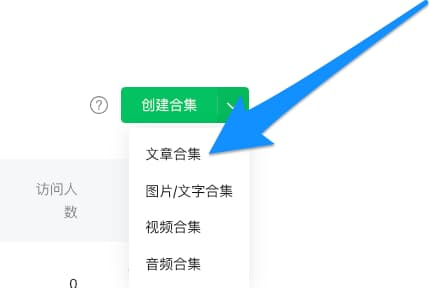
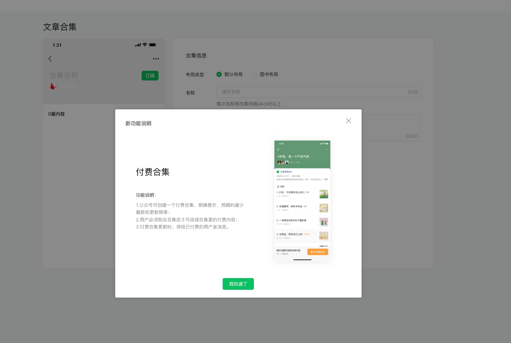
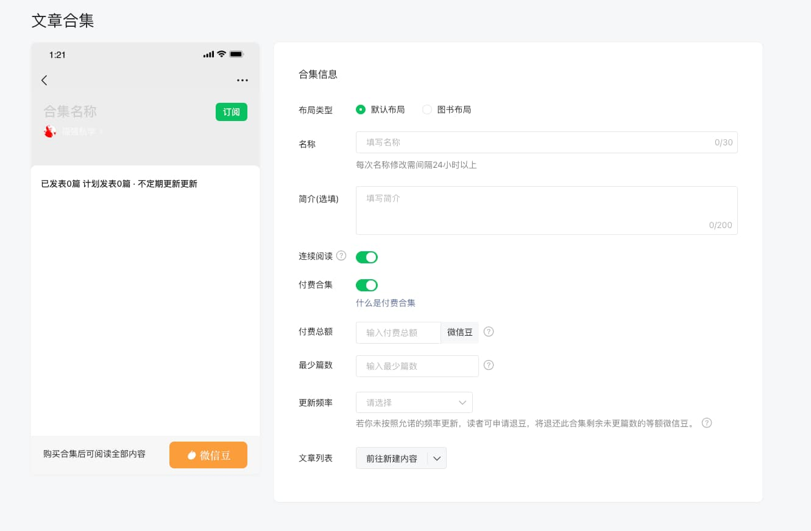

% 公众号也有「付费合集」功能呀？！
% 王福强
% 2025-05-08

今天刷到一个短视频

才发现微信公众号也有「付费合集」功能

之前以为

就视频号有这个「付费合集」功能呢

对于有镜头恐惧症的同学来说

貌似可以考虑下用这个微信公众号「付费合集」功能作为变现渠道之一哦

（aka. 码字的同学变现渠道之一）

那怎么开通呢？

进入[微信公众号后台](https://mp.weixin.qq.com/)

点击左侧栏「内容管理」下的「合集标签」

然后点击右侧详情页面的「创建合集」

记得选「文章合集」哟

其他类型好像没有这个「付费合集」功能 🤣

之后，会弹出提醒对话框：

> 1.公众号可创建一个付费合集，明确售价、预期的最少篇数和更新频率；
> 
> 2.用户必须购买合集后才可阅读合集里的付费内容；
> 
> 3.付费合集更新时，将给已付费的用户发消息。

点击「我知道了」进入下一个页面

打开「付费合集」这个开关就可以了

剩下的就是为「付费合集」创建新内容或者添加以有内容

重点谈谈钱有关的几个点：

1. 用的微信豆支付，这个我以前提到过（可能是在视频号付费合集里提到）， 微信豆把支付金额膨胀了10倍，其实不利于用户支付，因为直觉上会将其与实际金额挂钩， “贵了”
2. 每月15号结算上一个月订单，个人和企业都可以用这个功能，但企业的账期其实更长，个人可以到时候直接体现；
3. 因为「付费合集」创建要选择更新数量和频度等指标，所以，如果创作过程没有完结之前不符合这些指标（比如更新频度），那么，用户可以要求退还剩下的微信豆。（所以，最保险的做法是，「最少篇数」这个指标最好能达成，这样，更新频度指标就不再起作用了）

好了，剩下的就到了考验你粉丝支持度的时候了😉

