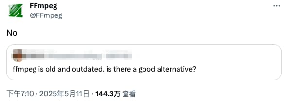
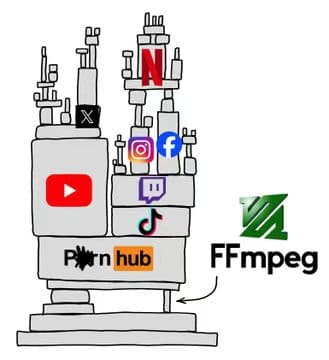
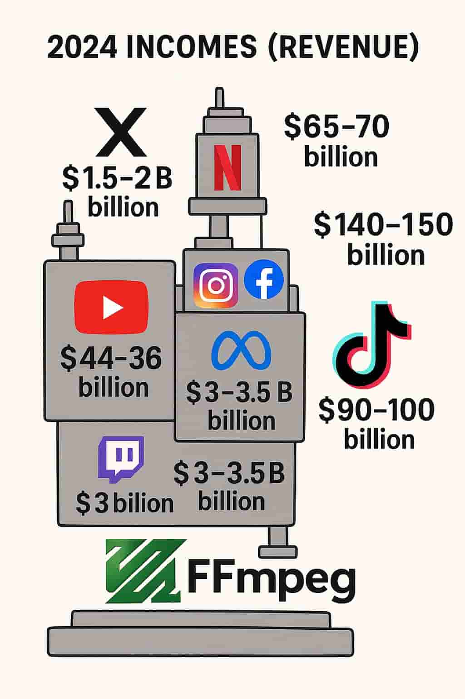
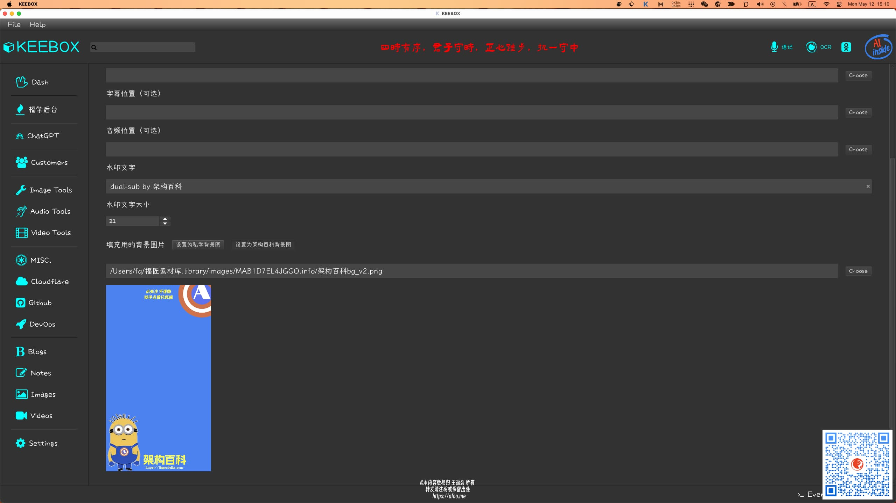

% FFmpeg已死？ FFmpeg永生！
% 王福强
% 2025-05-12

今天有人在twitter上吐槽FFmpeg太老了，有没有更好的替代品：

然后FFmpeg官方账号很硬气的回了一个 **No** 🤣

确实，

FFmpeg虽然历史悠久看起来很古老

但它依然是视频内容时代最重要的那块“承重墙”

多少百亿、千亿美金市值公司的基础设施都是基于FFmpeg搭建起来的：

即使是我这样的Solo

也依然要依托FFmpeg打造自己的作业工具来“迎合”视频时代的内容消费者

过去有句话叫：

> 越先进的，往往也是越落后的。

这句话在FFmpeg身上有着最好的体现。

开个电车开出了优越感

其实也是挺搞笑的事情🤣

