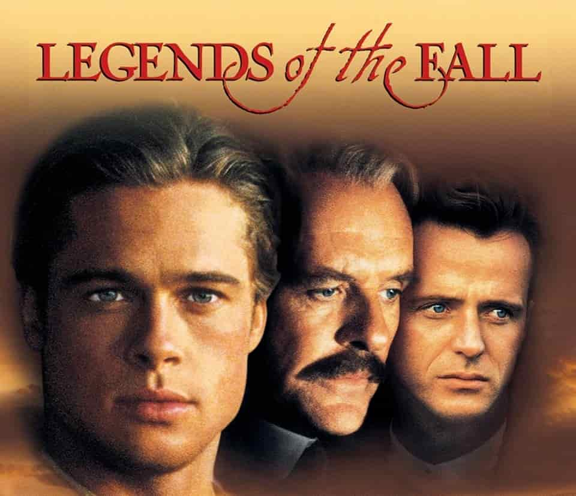

% 倡导、关系与激情岁月
% 王福强
% 2025-05-16

## 倡导

> 写在纸上不一定是，就如同每个企业都爱把一些东西上墙，越做不到越贴墙上

企业文化之所以倡导，是因为**现在没有做到，而希望大家将来可以做到**， 

中文没有过去时、现在进行时和一般将来时这些明确的区分，所以导致大家别人说啥信啥

凡事分个**先后**

再者就是， 人群永远八二分，占大头儿的都是做不到或者说不想做到的，人性本懒嘛

所以企业才要倾斜资源，加大对那百分之二十甚至百分之二的[激励](https://afoo.me/mgmt.html)

钱给够了，总会有人做到的 😉

## 关系

大部分人眼里的“关系”确实不是啥好词儿

因为骨子里就认为是贬义的

包括我

但其实很多人鄙视[关系](https://kb.afoo.me/business/%E6%8A%80%E6%9C%AF%E5%95%86%E4%B8%9A%E4%B8%8E%E4%BA%BA/2/#%E8%B5%84%E6%BA%90%E5%85%B3%E7%B3%BB%E4%B8%8E%E8%83%BD%E5%8A%9B)

不是因为关系本身

而是因为关系带来不平等的机会

如果这个关系是他的，他自然也就不会鄙视了，哈哈哈

要不为啥说，某个地方的所谓平等是我有你没有呢，🤣🤣🤣

但话说回来

我觉得这个观点是make sense的：

> 关系也是利益，长期关系保证安全
>
> 不用妖魔化关系

除了娘胎里带的

很多关系需要主动付出努力去建立

而另一方也得付出精力去筛选

没有经过筛选和考验的关系，

又有什么价值呢？

## 激情岁月

早上看「福宝集团」群里有同学分享了个截图

貌似某银行研发部加班的配图和文案

可能是leader想写点儿激情昂扬的文案吧

但说实话

拍的照片调性和文字不匹配

还不如不配图，哈哈哈哈

当然，可能是[发给领导表忠心的](https://mp.weixin.qq.com/mp/appmsgalbum?__biz=MzIzNzkzODU5Mg==&action=getalbum&album_id=3982133366559604743#wechat_redirect)，那就无所谓了

要是发给自己和团队的

到时候可能回忆的不是美好🤣

激情岁月应该是自己无怨无悔的那段日子。

